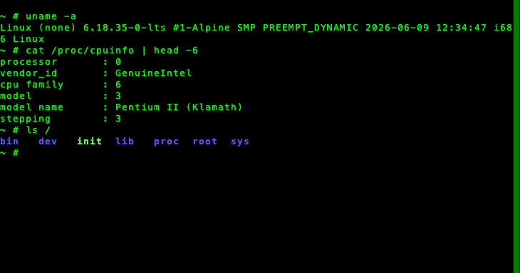
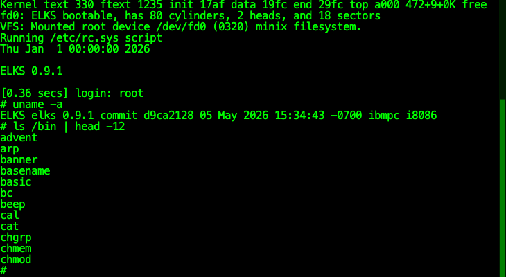
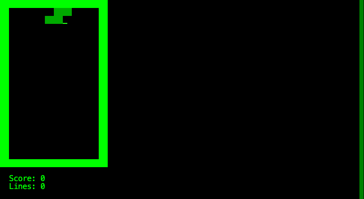
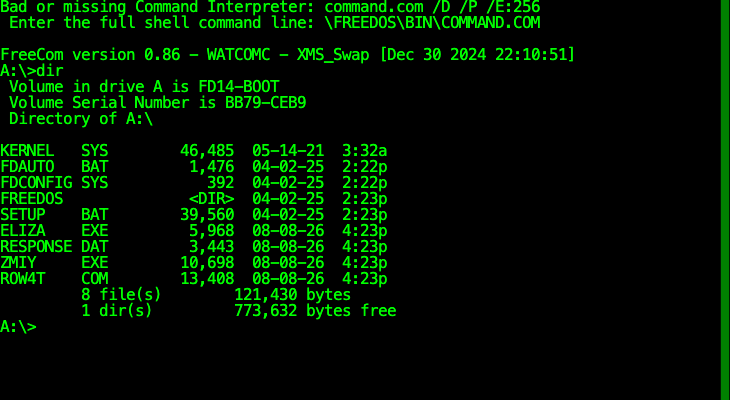
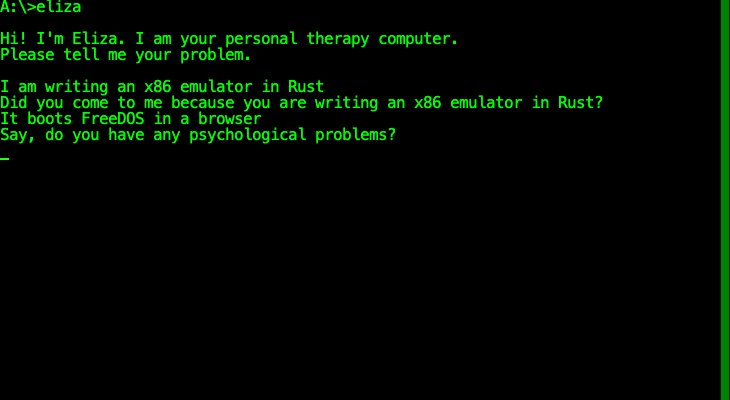

# rustx86

Rust製のx86エミュレータ。リアルモード8086から始めて、プロテクトモード、
ページングと歴史の地層を順に登る。同時に**現代PCの成り立ちを辿る教材**でもある。

📚 **[ドキュメント](docs/)** — Diátaxisの4つの棚: 理解する (アーキテクチャ図・JITの仕組み・罠の型) / 手を動かす / 引く (台帳) / 判断の記録 (ADR)。
「なぜブートセクタは0x7C00なのか」「割り込みをOSが乗っ取るとは何か」といった
問いから読める。

## ゴール

**32bit Linuxがブラウザで起動し、busyboxシェルが操作できること。**

途中に「動くもの」を必ず置く。CPUは完成したが動かすものがない、という状態を作らない。

1. ブートセクタの Hello, World が出る ✅
2. **16bit UNIX ([ELKS](https://github.com/ghaerr/elks)) のシェルがブラウザで叩ける** ✅
3. **FreeDOS が `A:\>` まで起動し、DOSアプリが動く** ✅
4. **32bit Linux が起動し、busyboxシェルが操作できる** ✅ ← 当初の完成ライン
5. **そのLinuxから本物のホストに `ping` が届く** ✅ — さらに `wget https://` で
   実物のファイルまで引ける (2026-08-14)。1993年のFreeDOSからも ping が返る

ネットワークを最後に置いたのは、**タブの中で完結するものを先にやる**と決めたため
([ADR-0005](docs/adr/0005-local-first-roadmap.md))。ネットワークだけは踏み台の
用意が要る。

x86_64 (ロングモード) は**このリポジトリのゴールに含めない**。
やるならこのリポジトリを fork して `rustx86_64` を作る。
16bitと32bitの地層を登りきることを完成と定義し、終わりを持たせる。

## 動いている様子

どれも**ブラウザのタブの中**で動いている。写真はcanvasから取り出した画素そのままである
(VGA機はテキストVRAM `0xB8000` の直描き、Linuxはシリアル端末)。

### 32bit Linux — ブラウザで起動してシェルが使える (ゴール達成)



Alpine の Linux 6.18 (LTS)。`uname -a` が本物のカーネルバージョンを答え、
`/proc/cpuinfo` には自己申告どおり **Pentium II (Klamath)** が並ぶ。
プロテクトモード+ページングの上で busybox が動き、`snake` や `vi` も遊べる。
選ぶと起動済みスナップショットから数秒で復帰し、「再起動」で**自己解凍
ステブから走る本物のフル起動** (bzImage、約23秒) をやり直せる。
速さ比較用の vmlinux 直接ロードは `?kernel=vmlinux` ([docs/reference/perf.md](docs/reference/perf.md))。

### 16bit UNIX (ELKS) — ログインしてシェルが叩ける



`uname -a` が `ibmpc i8086` と答えている。ELKSは8042とテキストVRAMを
**直接**叩くOSなので、BIOSはほとんど通らない。

### 同梱のテトリスが遊べる



ブロックが**背景色を付けた空白**で描かれている (文字コードは 0x20)。
文字だけを見る確認表示では画面が空に見えるので、一度これに騙された。

### FreeDOS 1.4 — DOSプロンプトまで自動で進む



左メニューで選ぶだけでここまで来る。起動時に F5 を打って CONFIG.SYS と
AUTOEXEC.BAT を飛ばし、聞かれるシェルの場所を答える、というDOSの定石を
機械にやらせている。`A:` なのはフロッピーから起動しているため。

ELKSと違って**画面もキーもディスクも全部BIOS経由**なので、こちらはBIOS層の
検証になっている。実際これを動かして、BIOSの穴が **9個**見つかった。

### ハードウェアスクロール


スネークの `zmiy` は、**50行の盤面をVRAMに描いて、見える25行の窓を蛇に追従させる**。
窓を動かしているのはCRTCの表示開始レジスタで、**メモリは1バイトも書き換えていない**。
80年代の機械が遅いCPUで滑らかにスクロールできたのはこの仕組みによる。

この写真は下へ走らせた後で、状態表示が画面の上へ流れていったところである。

### DOSアプリも動く (テキストモードなら)



1966年の対話プログラム ELIZA。**画面・キーボード・ファイル読み出しが全部
通らないと、この受け答えは出ない**ので、総合試験としてよくできている。

なお写真は撮り直せる。開発サーバーに受け口があるので、
ページから `POST /shot/<名前>` に canvas の内容を投げれば
`docs/images/` に落ちる ([`web/serve.py`](web/serve.py))。
## ロードマップ

[docs/roadmap.md](docs/roadmap.md) で管理する。READMEには書かない —
現在地は頻繁に動くので、原本を1つにする。

## 実行

### 用意するもの

**Rust だけあればコアは動く。** ブラウザで動かすときだけ道具が2つ増える。

```bash
# 1. Rust (安定版でよい。edition 2021)
curl --proto '=https' --tlsv1.2 -sSf https://sh.rustup.rs | sh

# 2. ブラウザ版を作るとき
rustup target add wasm32-unknown-unknown   # wasm を吐けるようにする
cargo install wasm-pack                    # JSとの繋ぎを自動生成する道具
```

`core` は**外部クレートに依存していない**ので、`cargo test` はこれだけで通る。

**何が起きているかまで知りたいときは [ビルドの最小構成](docs/howto/build.md) を参照。**
`--target web` を選んだ理由、wasm-pack が生成するもの、wasm特有の落とし穴
(メモリが伸びるとJSのビューが死ぬ / panicの中身が消える) を書いてある。
NASM は `asm/*.asm` を書き換えるときだけ要る (`.bin` はコミット済み)。

Unicorn との突き合わせ (`cosim`) はビルドに数分かかるため、
既定のテスト対象から外してある。

### ディスクイメージを取ってくる

```bash
tools/images/fetch-images.sh          # ELKS と FreeDOS (ゲーム入り)
tools/images/fetch-images.sh elks     # 片方だけでもよい
```

**イメージはリポジトリに含めていない。** 再配布が禁じられているからではなく
(ELKSもFreeDOSもゲームも自由ソフトウェア)、理由は2つある。

- GPLのバイナリ配布には**ソースの提供義務**が付く。守れない話ではないが、
  エミュレータの教材が他人のOSの再頒布者になると、その責任が恒久的に付いて回る
- **手で組み立てたイメージは再現できない。** 実際、手元でゲームを載せたイメージと
  他の人が持っているイメージの中身が食い違って「アプリが入っていない」が起きた。
  リポジトリに置いても、置き忘れれば同じことが起きる。
  **スクリプトなら中身が一意に決まる**

出来上がるもの:

| ファイル | 中身 |
|---|---|
| `images/fd1440.img` | ELKS 0.9.1。`tetris` `invaders` `ttypong` `sl` `matrix` が最初から入っている |
| `images/fd14boot.img` | FreeDOS 1.4 の素の起動フロッピー (8086ビルド) |
| `images/fd14games.img` | 上に `eliza` `zmiy` `row4t` を載せたもの |

**テキストモードのゲームしか入れていない。** この機械の画面はテキストだけなので、
CGAグラフィックスを要求するものは Tier 6 まで動かない
(要求されたモードは記録に残るので、白い画面の理由は分かるようにしてある)。

### ブラウザで動かす (これが主役)

```bash
tools/build/build-web.sh        # wasm を焼く
python3 web/serve.py 8001
# http://localhost:8001/ を開き、左からマシンを選ぶ
```

URLのつまみ (Linuxの機械):

| | 何が変わるか |
|---|---|
| `?kernel=vmlinux` | 自己解凍ステブを飛ばす近道 (計測・経路比較用) |
| `?initrd=<名前>` | initramfs を差し替える (`web/` の隣に置いた物を名前で指す) |
| `?ram=<MB>` | 機械のRAM (既定128MB、16〜2048) |
| `?net=off` / `?net=<wsのURL>` | NICを挿さない / 指定のSLiRP backendへ繋ぐ |

**大きい initramfs には相応のRAMが要る** — 展開した中身がそのまま tmpfs に載るので、
例えば gcc を焼いた 35MB のイメージ (展開77MB) は 512MB で回した:

```
http://localhost:8001/?initrd=initramfs-gcc&ram=512
```

- **`tools/build/build-web.sh`** は wasm-pack の包み紙。キャッシュ対策は
  `serve.py` の `no-store` が全部引き受けるので、**かつてあった `?v=番号` は
  廃止した** — 手で番号を上げる方式は、上げ忘れ・片方だけ上げるという
  新しい事故を生むだけだった
- **`--target web`** を選んでいるのは、生成物をそのまま `<script type="module">` で
  読めるからである。bundler向けの出力にすると webpack などが要る
- **`python3 -m http.server` ではなく `web/serve.py`** を使う。前者はキャッシュを
  効かせるので、**wasmを作り直しても古いものが読まれる**。実際これで
  「直したのに変わらない」に何度も時間を溶かした。`serve.py` はキャッシュを切る
- `file://` では開けない。ESモジュールもwasmもHTTP越しでないと読めない

左メニューで **ELKS** と **FreeDOS** を切り替えられる。FreeDOSは
**プロンプト (`A:\>`) まで自動で進む** — 起動時に F5 を打って CONFIG.SYS と
AUTOEXEC.BAT を飛ばし、聞かれるシェルの場所を答える、というDOSの定石を
機械にやらせている。

### CLIで動かす

**直す作業はこちらが速い。** どこで止まったかを繰り返し見たいときは、
grepもdiffも効くCLIに分がある。

```bash
# テスト (co-sim を除く)
cargo test

# 画面に文字列が出るのを待って、キーを打つ。第2引数は命令数の上限で、空でよい
#   (既定は50億。**当てる数字ではなく暴走を止める番人**で、
#    実際に何命令かかったかは実行時に表示される)

# ELKS を起動してログインし、tetris を動かす
cargo run --release --example boot -- images/fd1440.img '' \
  "login:" 'root\n' "ELKS 0.9.1" 'tetris\n'

# FreeDOS をプロンプトまで進めて dir を打つ
#   sc:3f,bf は生のスキャンコード (F5)。文字を持たないキーを送るための書き方
cargo run --release --example boot -- images/fd14games.img '' \
  "FreeDOS kernel" 'sc:3f,bf' \
  "full shell command line" '\FREEDOS\BIN\COMMAND.COM\n' \
  'A:\>' 'dir\n'

# デバッガ (gdb風)
cargo run --release --example dbg -- images/fd14games.img

# ブートセクタ1つを実行
cargo run --example run -- asm/hello.bin

# 実行速度の計測 (--release 必須)
cargo run --release --example bench -- asm/bench.bin
cargo run --release --example bench_raw -- asm/bench.bin   # CPUだけの速度

# ブートセクタのビルド (要nasm。.bin もコミット済みなので通常は不要)
nasm -f bin -o asm/hello.bin asm/hello.asm
```

### デバッガ

`dbg` は gdb 風の対話デバッガで、**実機のデバッガに無いものを足してある**。

```
$ cargo run --release --example dbg -- images/fd14games.img
rustx86 デバッガ。`help` で一覧、`q` で終了
           0: 0000:7c00  eb 3c 90 46 52 44 4f 53

until FreeDOS kernel
"FreeDOS kernel" を検出 (1033830 命令)

w 0x450
書き込み監視 0x00450

c
→ 0x00450 が 0x0e から 0x0f に変わった (書いたのは f000:0010、1033870 命令目)
```

最後の行が要点で、**「誰がこの番地を書いたか」に命令の位置で答える**。
0x450 は BDA のカーソル位置で、ここを更新していなかったために
FreeDOS で Tab がカーソルを先頭へ飛ばすバグが出ていた。

ブラウザでも同じものが使える。ツールバーの **デバッガ** を押すと子ウインドウが開き、
レジスタ・メモリ・見張りをそのまま覗ける。**ワーカーの中で回るLinuxも同じ顔で覗ける**
(覗き見RPC — Tier 3f)。プロテクトモードでは CR0/CR3/GDTR と隠しレジスタ、
ページング越しのカーネル空間ダンプまで出る。

```
→ ポート0x0020 へ 0x20 (0330:7fb1)     ← ELKSのタイマ割り込みがEOIを打った瞬間
```

`window.open` が塞がれる環境では**ページ内のパネルに落ちる**。
「デバッガが開かない」で終わるのは道具として失格なので、中身は同じものを出す。

エミュレータならではの命令が3つある。

| 命令 | すること |
|---|---|
| `goto <命令数>` | **その命令数まで巻き戻す**。決定的なので最初から流し直せば必ず同じ状態になる |
| `until <文字列>` | **画面にその文字が出るまで**走らせる。OSの起動を追う単位はこれ |
| `save` / `load` | スナップショット。分岐点で保存して何度でも試せる |

`panic` した場所は犯行現場ではないので、順に進めても犯人には辿り着かない。
要るのは**時間をさかのぼる**ことと**誰が触ったか**である。

見張るものを何も置かなければ、フックは真偽値1つの判定で抜ける。
実測でも `375.9 → 375.2 MIPS` (best-of-3、ばらつきは±10%) で**差は測れない**。


引数は **「この文字列が画面に出たら」「これを打つ」の対**である。
何命令目で打つかではなく**画面を見てから打つ**のは、起動にかかる時間が
環境で変わるためで、人間が画面を見て打つのと同じ手順になっている。

止まったときは、画面・カーソル・割り込みの回数・最初のCPU例外・
`0x66` が付いたオペコード・要求されたビデオモードが自動で表示される。
**「なぜ止まったか」がその場で分かる**ようにしてある。

### ベンチマーク

`asm/bench.asm` が測定用ワークロードで、**命令数が固定** (約3.7億命令) になっている。
装置や割り込みを足した後に同じものを流せば、劣化がそのまま見える。

```
369095178 命令 / 8.10秒 = 45.6 MIPS   (2026-08-10、16bit経路の現在値)
```

Tier 2 時点の 90 MIPS から半減しているのは劣化の放置ではなく、**32bit化の税**である
— ディスパッチが増え、16bit経路はデコードキャッシュの対象外 (32bit専用) のまま。
16bit機の体感には十分で、投資は32bit側 ([docs/reference/perf.md](docs/reference/perf.md)、79 MIPS) に
寄せている。

#### 「HLTで必ず止まる」が破れていた (2026-08-10 の教訓)

このワークロードは終端の `hlt` で止まる設計だが、BIOS相当が回す PIT の
タイマ割り込みがHLTを起こし、IRETは **hltの次の番地**から再開する。その先は
データとゼロ埋め — IPが64KBを一周してワークロードを最初からやり直し、
上限の**20G命令まで走り続けていた**。この間の歴代の測定値は、固定ワークロード
369Mではなく別物を測っていたことになる。修理は終端で 8254 の制御語だけ書いて
カウンタを止め、`hlt; jmp` で起こされても寝直す形。**「命令数が決定的だから
比較できる」という前提は、終端が守られていて初めて成り立つ** — 決定性は
仕組みではなく、守り続ける約束である。

**基準線 (Tier 2 完了時点の記録。当時は上の税を払う前):**

| 測定 | MIPS | 1命令 |
|---|---|---|
| `Machine::step()` (通常) | **90.1** (90.0 / 90.0 / 90.1 / 90.1 / 90.3) | 11.10 ns |
| `cpu::step()` のみ (`bench_raw`) | **103.0** (103.0 / 102.9 / 102.8) | 9.71 ns |

参考: Tier 1 時点の測定は 110.7 MIPS だったが、**静穏を確認していない環境**の値である。

**ばらつきは静かな環境では1割ではなく 0.3% しか出ない。** 以前ここに
「同じ条件でも1割ほどばらつく」と書いていたのは、裏で動いていたものを
測っていたためだった。裏を止めれば5回流して 90.0〜90.3 に収まる。
**1割のばらつきは装置の性質ではなく環境の汚染だった**ので、
最良値どうしを比べる作法は残しつつ、まず環境を静かにすること。

#### 「機械であること」の値段

`bench` と `bench_raw` の差 (90.1 対 103.0、**12.4%**) が、
`Machine::step()` が命令ごとに払っているコストである。中身は5つ。

1. 保留中のハードウェア割り込みの確認 (`pending_irq` と IF)
2. 装置のカウントダウン (`tick_countdown`。tick自体は64命令に1回)
3. HLT中かの確認
4. BIOS HLEの入口判定 (`CS == BIOS_SEG`)
5. トラップフラグの読み取りと確認

**これは劣化ではなく、CPUが機械になった分の値段である。**割り込みを受け付けられること、
装置が時間を刻むこと、BIOSに入れること — ELKSの起動に必要だったものが
そのまま 1.39 ns/命令 として出ている。Tier 3以降で `step()` に何か足すときは、
`bench_raw` との差が広がっていないかを見ること。

1命令のループは回さない。`inc ax` を延々回すようなループは分岐予測にも
命令キャッシュにも都合が良すぎて、実際のOSの実行速度とかけ離れるためである。
ALU・メモリ読み書き・シフト・スタック・比較・分岐を混ぜた10命令の本体を回している。

### ブラウザ側のベンチUIは畳んだ (2026-08-10)

かつてはメニューに「実行速度ベンチ」があり、Tier 2 時点で
**WASMはネイティブの約90%** (81.5 対 90.3 MIPS) という大事な見通しを得た。
その役目を終えたので畳んである — 今の速度の見張りは:

- **CIのOS起動回帰が毎回 Linux ブートの MIPS を測って記録する** (壊滅検出の下限つき)
- ネイティブは `cargo run --release --example bench -- asm/bench.bin`

ブラウザの数字はタブのスロットリングに汚染されやすく (下記の罠)、
定点観測には CI の方が向く。

### 測り方の罠

数字より、ここを外すと結論を間違える。

**ブラウザで測るならタブを前面に。** 非表示のタブはブラウザにスロットリングされ、
**値が半分以下になる** (実測: 表示時 104〜106 MIPS に対し非表示時 34〜50 MIPS)。
かつてのブラウザベンチはこれを `document.hidden` で検出して ⚠ を付けていた。
この交絡は追試の途中で実際に踏んだ。

**1回目は遅く出るので空転させてから測る。** 既定で1回まるごと捨てている。
原因は特定できていないが、切り分けで2つ分かっている。

- **メモリ確保ではない。** 確保だけを済ませる「軽い」空転 (1000命令) では
  まったく直らない (1回目 41.1 MIPS のまま)。だから空転は1回まるごと必要
- **ネイティブでも同じ形が出る** (1回目 101.8、以降 107〜110)。ただし落ち込みは
  7%程度。ホスト側のCPU立ち上がり (周波数制御やコア割り当て) が
  少なくとも一部を占めている

**1回が短すぎる測定は低く出る。** 同じワークロードでも5000万命令 (約0.6秒) では
3.7億命令 (約3.5秒) より2割ほど低い。数秒かかる長さで測ること。

**裏で他の負荷を動かさないこと。** 動画再生などが走っているだけで、同一条件の測定が
69〜87 MIPS に散らばる。この幅は普通の変更の影響より大きいので、
**何を測っているのか分からなくなる**。実際にこれで Tier 1d の劣化測定を一度捨てた。

ブラウザ側には `document.hidden` のガードがあるが、**ネイティブ側にこれに相当する
検出は無い**。黙って無効な数字が出るので、負荷を止めるのは人間の責任になる。

## 検証戦略

- ブートセクタ実プログラムによるE2Eテスト (`core/tests/`)
- **Unicorn co-sim** (`cosim/`): Unicorn Engine (QEMUのCPU部) をオラクルに、
  同じ初期状態を両方に与えて1命令実行し、レジスタ・フラグ・メモリを突き合わせる。
  命令テンプレート + 境界値混じりのランダム生成で、EFLAGS意味論 (特にAF/OF/PF) を
  機械的に潰す。x86には網羅テストROMが存在しないため、これが主要な検証手段になる
- 未実装オペコードは即panic (静かに壊れない方針)

```bash
cargo test                    # ブートセクタE2E (高速)
cargo test -p rustx86-cosim   # co-sim (Unicornのビルドに数分かかる)
```

### co-simは「バグを検出できること」を確認済み

緑のテストは、それ自体では検証能力を証明しない。意図的にバグを注入して
検出されるかを確かめている (変異テスト)。

ADCのAFフラグ計算からキャリー加算を落とすと、即座に検出された:

```
[ADC r/m8,r8] code=[10, d4] regs=[8000, 19ff, ...] flags_in=CF|PF
  FLAGS: ours=PF|SF oracle=PF|AF|SF (差分 AF)
```

一方、DAAの境界値を `0x99` から `0x9A` にずらす変異は、ランダム生成では
3000ケース流しても**検出できなかった**。ALがちょうど 0x9A になるケースを
踏み損ねるためである。十進補正命令はALとCF/AFだけで分岐が決まり状態空間が
小さい (256 x 3 x 4) ので、総当たりに切り替えた。今は一発で捕まる:

```
co-sim mismatch [DAA] code=[27] AX=009a flags_in=-
  AX: ours=00a0 oracle=0000
```

**状態空間が小さいならランダムより総当たり**、という使い分けが要る。

Tier 1c で足したセグメントレジスタとスタックの観測窓も、同じやり方で
検出力を確かめてある。

| 注入した変異 | 検出されたか |
|---|---|
| `CALL far` の積む順序を CS→IP から IP→CS へ | ✅ スタック窓の該当4バイトが入れ替わって出た |
| `LES` が ES ではなく DS に書く | ✅ `ES: ours=0fff oracle=9fcb` / `DS: ours=9fcb oracle=0000` |

### 実例: 仕様書の疑似コードが間違っていた (`ENTER`)

Tier 1c で `ENTER` を実装した際、co-simが1件だけ差分を出した。

```
[ENTER imm16,level] code=[c8, 02, 00, 02] regs=[..., 2ff8, 2ff8, ...]
  SP: ours=2ff4 oracle=2ff0
```

`ENTER` はスタックフレームを作る命令で、最後にSPを `imm16` バイト分下げる。
実装はIntel SDMの疑似コードをそのまま写していた。

```
BP ← FrameTemp;
SP ← BP − Size;      ← ここ
```

ところがこれが正しいのは **`level=0` のときだけ**である。`level>0` では
ネストした手続きの表示 (display) を `level` 個積んでおり、その分
SPはすでに下がっている。`FrameTemp` から引き直すと、積んだ分が帳消しになる。

AMDのマニュアルは同じ箇所を「**現在の**SPから引く」と書いており、
QEMUの実装もそちらに従っている。実挙動はAMDの記述の方だった。

疑似コードを読んで写経した実装は、読んだ本人には正しく見える。
**仕様書を疑うきっかけは、動くオラクルとの突き合わせでしか得られない**。
`level>0` はPascal系のネスト手続き用で現代のコンパイラはまず出さないため、
実OSを動かして踏む可能性も低い。co-simを置いた甲斐があった一件である。

## コード構成

**ファイルの一覧と行数はここに書かない。** 書いた翌日にはズレるし、
`ls` と `wc` で分かることを二重に持つ意味が無い。ここには
**なぜその形になっているか**だけを置く。

- **振り分け表 (`cpu/onebyte.rs` / `twobyte.rs`) は振り分けに徹する。** オペコードを
  読んでどの処理へ渡すかまでが仕事で、実際の計算は `operand` / `alu` / `shift` /
  `string` / `decimal` が持つ。デコード済み命令キャッシュ (`cpu/dcache/`) は
  **速い写し**で、実行は同じ共通部品を呼ぶ — 意味論は二重実装しない
- **命令ごとにファイルを分けるやり方は採らない。** x86は命令が数百あり、
  ALUグリッドのように48命令が1ハンドラで処理される構造を壊してしまう。
  `match` が1箇所に集まっていること自体が「この命令はどこで処理されるか」に
  即答してくれる価値になる
- **BIOSは `bios.rs` に分けてある。** 実機ではBIOSは別のROMで、CPUでもマシンでもない。
  同じ理由で、装置は `dev/` に1つずつ置き、**保存と復元も各装置が自分で持つ**
  (PICのマスクの形式を知っているのはPICだけでよい)
- **`core` は外部クレートに依存しない。** 教材なので、読んだときに
  「この行が何をしているか」がクレートの向こう側へ消えないようにしている

整理は**Tierの切れ目でまとめてやる**。作業の途中で構成をいじると、
動かしている最中のものが動かなくなる理由が増える。

## 設計メモ

- レジスタは最初からu32で保持 (386拡張を見据える)。リアルモードは16bitビューで操作
- x86のオペコードグリッド (規則的な部分) はrustboyで確立した「ビットで畳む」方式で処理し、
  歴史的な不規則部分だけ個別実装する

決定の経緯と代償は [ADR](docs/adr/) に記録している。
