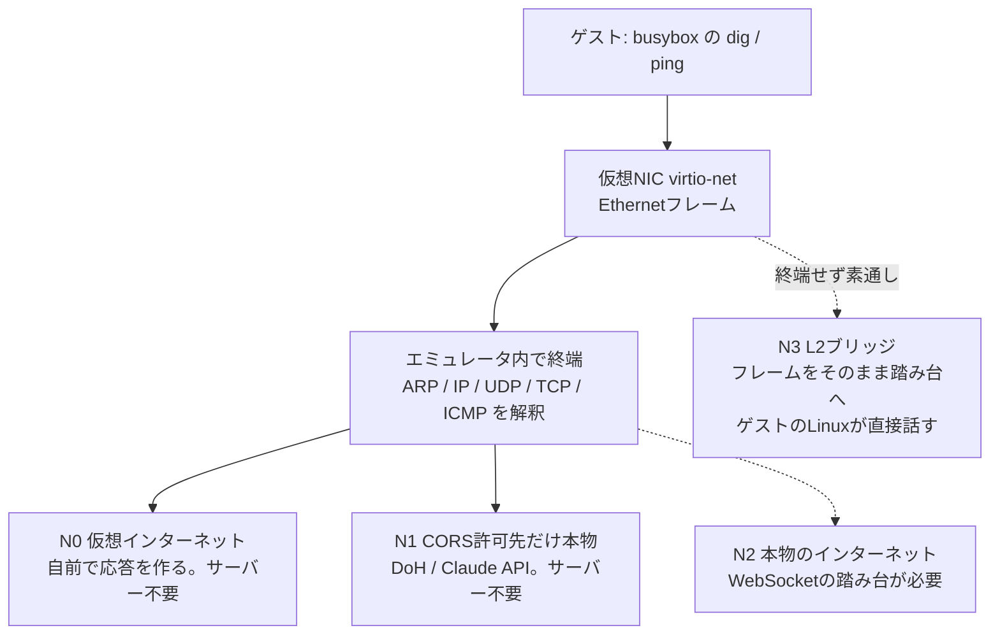
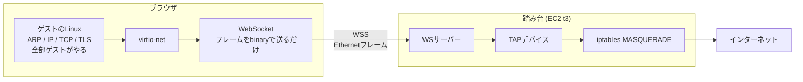

# ADR-0003: ブラウザ内でネットワークをどこまで本物にするか

- ステータス: 提案 (2026-08-07)
- 前提: [ADR-0002](0002-devices-and-16bit-unix.md)

## 背景

最終的にブラウザでLinuxを動かす。そのとき当然「ネットワークは使えるのか」が問題になる。
到達目標を具体的に置くと、**busybox の `dig` でIPが引けて、`ping` に応答が返ること**である。

ここでブラウザのサンドボックスが壁になる。ブラウザから出せる通信は次に限られる。

| 使えるもの | 使えないもの |
|---|---|
| `fetch` (HTTP/HTTPS、CORS許可先のみ) | rawソケット |
| WebSocket (相手がWebSocketを話す場合) | ICMP (pingそのもの) |
| WebRTC / WebTransport (要シグナリング) | 任意のホスト・ポートへのTCP/UDP |

つまり**ブラウザ単体では、ゲストOSが吐いたIPパケットをそのまま外へ流す方法が存在しない**。
サーバーを使わないなら、どこかで必ずエミュレータ側が終端し、ブラウザの語彙へ翻訳する必要がある。
(逆に言えば、サーバーを1台置けばこの制約は外れる。決定4で扱う)

一方で、OSI の1層と2層 (物理・データリンク) は難所ではない。
virtio-net の仮想NICを実装してゲストにEthernetフレームを読み書きさせるだけで、
実体はメモリ操作である。**壁は3層以上の出口にある**。

もう一つの背景として、本プロジェクトは教材であり、
**「リンクを開けば誰でも試せる」ことに価値がある**。サーバーの運用を前提にすると
その価値が落ちる。

## 決定

### 1. 仮想NICは virtio-net を実装し、ゲストには普通のEthernetを見せる

ゲストOSから見て特別なことはしない。標準的なドライバがそのまま使える形にする。

### 2. 既定ではTCP/UDP/ICMPをエミュレータ内で終端する (ユーザーモードネットワーク方式)

QEMUの `-net user` (SLIRP) と同じ発想で、ゲストのパケットを解釈し、
ホスト側の通信手段に翻訳する。ゲストにはIPアドレスとゲートウェイを配る
(DHCPも自前で応答する)。サーバー無しで動かすにはこれしかない。

ただしこの方式は**ゲストのTCPスタックを我々の実装に向けて喋らせる**ことになる。
「ゲスト側のネットワークスタックがどこまでやれるか」を測る目的には向かない。
その用途には決定4のL2ブリッジを使う。

### 3. 公開版は3段階に分け、**既定はサーバー不要**とする



N0〜N2は「エミュレータ内で終端する」という同じ土台の上の段階だが、
**N3だけは土台が違う**。終端せず、Ethernetフレームをそのまま外へ運ぶ。
図で `STACK` を経由していないのはそのためである。

- **N0 仮想インターネット** — DHCP応答、ARP応答、ICMP echo応答、簡易DNS応答を
  すべてエミュレータが作る。`ping 10.0.2.2` が返り、`dig` も答えを返す。
  相手は実在しないが、**サーバーは一切要らない**
- **N1 CORSを許可している相手だけ本物** — ゲストのリクエストを横取りし、
  ブラウザの `fetch` に翻訳する。**サーバー不要**。届く相手は
  CORSヘッダーを返すサービスに限られるが、それが意外と使える:
  - **DNS over HTTPS** — `dig google.com` が実際のAレコードを返す
  - **Claude API** — `anthropic-dangerous-direct-browser-access: true`
    ヘッダーを付けるとCORSを通る (SDKの `dangerouslyAllowBrowser` が
    設定するもの)。**ブラウザ内のLinuxからLLMを叩けるようになる**
- **N2 本物のインターネット** — WebSocketの踏み台(リレー)を経由して
  実際のTCP接続を行う。**ここで初めてサーバーが要る**

### 4. 「ゲストにスタックを支配させる」実験は L2ブリッジ (N3) で行う。個人運用に限る

このプロジェクトには、教材とは別にもう一つ知りたいことがある。
**ブラウザの中で動くLinuxは、ネットワークスタックをどこまで自分で支配できるのか**。

これはN0〜N2では測れない。あの方式では我々がTCPを終端してしまうため、
ゲストのTCPが話す相手は「我々がRustで書いたTCP実装」になる。
測っているものの半分が自分のコードでは、限界を測ったことにならない。

そこでN3を置く。**踏み台をバイトの土管として使い、Ethernetフレームをそのまま運ぶ**。



この構成の要点は、**エミュレータ側がTCPを1行も実装しない**ことである。
仮想NICがフレームをWebSocketに流すだけで、あとはゲストのLinuxが本物の
インターネット相手にARPを打ち、3ウェイハンドシェイクをし、TLSを張る。
N2 (踏み台が `connect()` を代行する方式) より**実装量が減るのに、
ゲストの支配範囲は最大になる**。

| | N2 リレー越しTCP | N3 L2ブリッジ |
|---|---|---|
| 踏み台の仕事 | `connect(host, port)` を代行 | フレームを素通し |
| TCPを実装するのは | エミュレータ | **ゲストのLinux** |
| TLS | エミュレータが終端できず詰む | ゲストが張るので無関係 |
| エミュレータの実装量 | 再送・順序制御・ウィンドウ管理 | **仮想NICのみ** |
| CORSの制約 | (fetch方式なら) 受ける | **無関係** |

#### 踏み台はEC2 (Linux) 1台に置き、経路はWSS一本に統一する

構成を選択肢で分岐させない。**踏み台はEC2、接続はWSSのみ**とする。
ローカルにも踏み台を置く案は検討したが採らない (代替案を参照)。

一本化すると次の3つが同時に消える。

- **macOSのTAP問題** — macOSにはTAP (L2) デバイスが無い。`utun` はL3の
  ポイントツーポイントでEthernetフレームを扱えず、kext版のtuntaposxは
  Apple Siliconと現行のSIPで動かない。踏み台がEC2なら素のLinuxなので
  `ip tuntap` がそのまま動き、**この問題自体が発生しない**
- **ユーザーランドNW実装の不確実性** — Docker Desktop等を挟むと
  ゲストのICMPが外へ抜けるかが環境依存になる。EC2なら疑う必要がない
- **エミュレータ側の分岐** — 下記のとおり接続先文字列が1本になる

#### なぜWSSに統一できるのか

**`wss://` は `http://` のページからも `https://` のページからも張れる。**
ブラウザが遮断するのは「安全なページから安全でない接続」の向きだけなので、
WSSにしておけばページの配信方法を問わない。
`ws://` を許すと「localhostからだけ」という条件が付き、
エミュレータに分岐が生まれる。**WSS一本の方が単純である**。

#### 踏み台本体はTLSに触らない

前段にリバースプロキシ (Caddy等) を置き、TLS終端を任せる。

```
relay.example.net {
    reverse_proxy 127.0.0.1:9000
}
```

証明書の取得も更新も自動で、WebSocketは素通しされる。
**リレー本体はループバックの平文wsを喋るだけ**でよく、
TLSのコードを1行も持たない。

名前は自前ドメインのサブドメインを Elastic IP に向ける。
ドメインを使わない場合は `<GIP>.sslip.io` のようなIP埋め込みDNS名でも
証明書を取れる (要確認)。

なお **Let's Encrypt の証明書は Certificate Transparency ログに載る**ため、
踏み台のFQDNは公開される。決定5と衝突するように見えるが、
実際の防御はセキュリティグループの接続元制限と共有シークレットであり、
**名前が知られることと入れることは別**である。

**運用は個人用に限る。**踏み台の実装もインスタンスも公開しない。
N3は宛先を秘匿する装置そのもの (決定5) であり、しかもL2を通すため
N2よりさらに汎用的な迂回路になる。接続元を自分のIPに制限し、
WSSに共有シークレットを要求する。

### 5. 踏み台は公開しない。実装もインスタンスも個人用に留める

N2/N3の踏み台は実質的にオープンプロキシであり、公開すると濫用の的になる。
理由はもう一段深い: **踏み台は通信の宛先を隠してしまう**。

- N1 (直接fetch) では、通信はブラウザから相手のドメインへ直接出ていく。
  DNSフィルタもプロキシもCASBも通常どおり見える
- N2/N3 (踏み台経由) では、外から見える宛先は踏み台のドメインだけになる。
  本当の相手は隠れる

つまり踏み台は、任意の通信を中継できるだけでなく**宛先を秘匿する**装置でもある。
N3に至ってはL2をそのまま通すので、TCPに限らず何でも運べる。
公開すれば汎用の迂回路として濫用されうるので、**公開版は N0 + N1 に留める**。

一方で、**技術的な限界を知るために自分で作る価値はある**。
「ブラウザのサンドボックスはどこまでが本当の壁で、どこからが工夫で越えられるのか」
はこの教材の中心的な問いでもある。したがって:

- 踏み台の**実装もインスタンスも公開しない**。リポジトリにも置かない
- 接続元をセキュリティグループで自分のIPに制限し、WSSに共有シークレットを要求する
- 得られた知見 (後述の「N3で分かること」) は文章として公開する。
  **道具は公開せず、学びだけ公開する**

### 6. APIキーを実装に埋め込まない

N1でClaude APIのような認証付きサービスに繋ぐ場合、キーはブラウザ内に置かれ、
開発者ツールを開けば誰でも読める (SDKがこの経路を `dangerously` と
名付けているのはこのため)。公開する教材にキーを埋め込むことは、
公開した瞬間にキーを配布することと同じである。
利用者が自分のキーを入力する形にし、実装側では保持しない。

### 7. 公開版では本物のホストへのICMPを諦める

ブラウザにICMPを送るAPIは存在しない。公開版で `ping 8.8.8.8` が本当に
Googleへ届くことはない。N0のecho応答で「pingが動く」体験までを提供する。

なおN3では話が変わる。ゲストが吐いたICMPパケットがそのままTAPに出て、
踏み台の `MASQUERADE` が conntrack でechoのIDを付け替えて外に出す。
**本物の 8.8.8.8 から本物の応答が返る**。ブラウザにICMP APIが無いことは
関係ない。運んでいるのはEthernetフレームであってICMPではないからである。

### 8. N3の設定は「起動前に踏み台のURLを入れる」だけにする

N3はエミュレータ側に翻訳処理が無いため、**外から与える情報は踏み台のURLだけ**で足りる。
ブート前に次を選ばせる。

| 設定 | 効果 |
|---|---|
| ネットワーク OFF (既定) | **仮想NICをゲストに見せない** |
| ネットワーク ON | `wss://…` と共有シークレットを入力。virtio-netを生やす |

決定4でWSSに一本化したため、**入力欄は文字列1本で分岐が無い**。
値は localStorage に保存する。

OFFのときNICを見せないのは、NICだけ在って誰も応答しないと
**Linuxが起動時のDHCPで数十秒タイムアウトを待つ**ためである。
装置ごと消せば、ゲストは最初からネットワークが無い構成として起動する。

#### ゲスト側の設定も踏み台が配るので、エミュレータは触らない

- **IPアドレス・ゲートウェイ・DNS** — 踏み台の dnsmasq がDHCPで配る
- **MTU** — 同じくDHCP option 26 で配る。TCP over TCP 対策の調整は
  踏み台側の設定変更だけで済み、エミュレータの再ビルドが要らない

結果としてエミュレータ側のN3実装は、**virtio-netのフレームを
WebSocketのbinaryメッセージに出し入れするだけ**になる。

## 結果

### 得られるもの

- **目標がサーバー無しで達成できる**。`dig` は N1 で本物のAレコードを返し、
  `ping` は N0 の応答で動く。100%ブラウザ内で完結する
- 教材として「リンクを開くだけ」が維持される
- ネットワークスタックを自分で書くことになるので、
  ARP・DHCP・ICMP・DNSのパケット構造を実物として学べる。
  これは教材の題材としてむしろ好都合である

### 代償

- ゲストから見た「インターネット」は歯抜けである。
  N1でDNSは本物のIPを返すが、**そのIPへ実際に繋ぐことはできない**
  (dig の結果を使って ping や curl をしても届かない)。
  一方でCORSを許可しているClaude APIには繋がる。
  「名前は引けるが繋がらない、なのに特定の相手とは話せる」という
  **この非対称は利用者に明示する必要がある**
- N1はCORSを許可している相手方の仕様に依存する。
  DoHエンドポイント (Cloudflare / Google) もClaude APIの
  ブラウザ直接アクセス許可も、先方の判断で消える可能性がある
- TCPの終端を自前で書くのは手間がかかる。N2に進む場合、
  再送・順序制御・ウィンドウ管理を扱うことになる

### N3で分かること (個人実験の成果として公開する)

N3は「動かして終わり」ではなく、**測定装置**として置いている。
ゲストが本物のスタックを回すからこそ観測できる現象がある。

- **TCP over TCP の破綻**。ゲストのTCPは、WSS (= TLS over TCP) の中を通る。
  外側のTCPが再送している間、内側のTCPも独立にタイムアウトして再送を始める。
  再送が再送を呼び、輻輳制御が二重にかかってスループットが崩れる。
  VPN実装が UDP を選ぶ理由がここで実測できる
- **MTUの押し出し**。Ethernet 1500バイトのフレームをWebSocketフレームに包み、
  TLSレコードに包み、TCPセグメントに載せる。外側のMTUを超えると分割が起き、
  片方が落ちれば全体が落ちる。ゲスト側のMTUを下げる必要があり、
  **どこまで下げれば安定するかが「支配できる範囲」の実測値になる**
- **レイテンシの正体**。フレーム1枚ごとにブラウザのイベントループを経由する。
  RTTのうち何割がネットワークで何割がイベントループかを切り分けられる
- **ゲストのLinuxは何も気づかない**。ドライバから見れば普通のEthernetなので、
  ARPもDHCPも輻輳制御も本番と同じコードが動く。
  「WASMの中のLinux」と「実機のLinux」の差がどこに出るかが観測できる

### N3の代償

- **EC2の運用が発生する**。個人負担として t3.nano/micro 1台。
  料金はリージョンと転送量で変わるので実測する
- TAPデバイスの作成に root / `CAP_NET_ADMIN` が要る。
  `MASQUERADE` を使うので送信元IPはインスタンスのIPに書き換わり、
  ENIの source/dest check は有効のままでよい (無効化が必要なのは
  NATせず素のルーティングをする場合)
- EC2はデフォルトで **outbound の TCP 25 (SMTP) がブロック**されている。
  メール系の実験はここで頭打ちになる
- 踏み台を落とすと N3 は丸ごと死ぬ。公開版が N0+N1 で完結しているのは
  この単一障害点を教材に持ち込まないためでもある

## 検討した代替案

**最初からWebSocketリレー方式にする**: v86 や JSLinux が実際に採っている方式で、
本物のインターネットに繋がる利点は大きい。だがサーバー運用が前提になり、
「リンクを開くだけ」が崩れる。またオープンプロキシの管理責任が生じる。
**公開版の既定にはしないが、個人実験のN3として採る** (決定4)。

**N3でもエミュレータ側でTCPを終端する (N2の踏み台版)**: 踏み台に
`connect(host, port)` を代行させる方式。一見こちらの方が「作った感」があるが、
ゲストのTCPが話す相手が自作スタックになるため、**知りたいことが測れない**。
しかも実装量は増える。TLSも終端できないので w3m での閲覧が成立しない。採らない。

**踏み台をローカル (Mac) にも置き、EC2と2フェーズにする**: 外から到達できないので
開放プロキシのリスクが構成上ゼロになり、費用もかからない利点がある。だが
**macOSにはTAP (L2) デバイスが無い**ため踏み台をLinux VM/コンテナに入れる必要があり、
さらにDocker Desktop等のユーザーランドNW実装を挟むとゲストのICMPが外へ抜けるかが
環境依存になる。`ping` が到達目標に含まれる以上そこを疑いながら進むことになる。
加えて `ws://` と `wss://` の両対応がエミュレータに分岐を生む。
**構成を1本にした方が単純**なので採らない。二重NAT越しの実測値が
家庭用ルーターの都合で濁る問題も避けられる。

**WebRTCのデータチャネルを使う**: UDPに近い通信ができるので
TCP over TCP の破綻を避けられる利点があり、N3の改良案として筋が良い。
ただしシグナリングサーバーが必要で結局踏み台が要る。
まずWSSで動かし、破綻を実測してから検討する。

**ネットワークを実装しない**: 教材としては割り切りもあり得るが、
「なぜブラウザからpingが打てないのか」はサンドボックスを理解する
良い題材であり、実装しないと説明できない。
