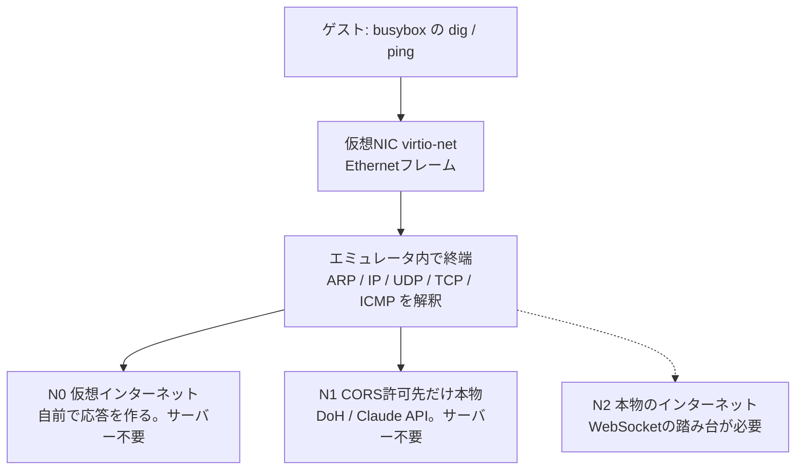

# ADR-0003: ブラウザ内でネットワークをどこまで本物にするか

- ステータス: 提案 (2026-08-07)
- 前提: [ADR-0002](0002-devices-and-16bit-unix.md)

## 背景

最終的にブラウザでLinuxを動かす。そのとき当然「ネットワークは使えるのか」が問題になる。
到達目標を具体的に置くと、**busybox の `dig` でIPが引けて、`ping` に応答が返ること**である。

ここでブラウザのサンドボックスが壁になる。ブラウザから出せる通信は次に限られる。

| 使えるもの | 使えないもの |
|---|---|
| `fetch` (HTTP/HTTPS、CORS許可先のみ) | rawソケット |
| WebSocket (相手がWebSocketを話す場合) | ICMP (pingそのもの) |
| WebRTC / WebTransport (要シグナリング) | 任意のホスト・ポートへのTCP/UDP |

つまり**ゲストOSが吐いたIPパケットを、そのまま外へ流す方法が存在しない**。
どこかで必ずエミュレータ側が終端し、ブラウザの語彙へ翻訳する必要がある。

一方で、OSI の1層と2層 (物理・データリンク) は難所ではない。
virtio-net の仮想NICを実装してゲストにEthernetフレームを読み書きさせるだけで、
実体はメモリ操作である。**壁は3層以上の出口にある**。

もう一つの背景として、本プロジェクトは教材であり、
**「リンクを開けば誰でも試せる」ことに価値がある**。サーバーの運用を前提にすると
その価値が落ちる。

## 決定

### 1. 仮想NICは virtio-net を実装し、ゲストには普通のEthernetを見せる

ゲストOSから見て特別なことはしない。標準的なドライバがそのまま使える形にする。

### 2. TCP/UDP/ICMPはエミュレータ内で終端する (ユーザーモードネットワーク方式)

QEMUの `-net user` (SLIRP) と同じ発想で、ゲストのパケットを解釈し、
ホスト側の通信手段に翻訳する。ゲストにはIPアドレスとゲートウェイを配る
(DHCPも自前で応答する)。

### 3. 段階を3つに分け、**既定はサーバー不要**とする

- **N0 仮想インターネット** — DHCP応答、ARP応答、ICMP echo応答、簡易DNS応答を
  すべてエミュレータが作る。`ping 10.0.2.2` が返り、`dig` も答えを返す。
  相手は実在しないが、**サーバーは一切要らない**
- **N1 CORSを許可している相手だけ本物** — ゲストのリクエストを横取りし、
  ブラウザの `fetch` に翻訳する。**サーバー不要**。届く相手は
  CORSヘッダーを返すサービスに限られるが、それが意外と使える:
  - **DNS over HTTPS** — `dig google.com` が実際のAレコードを返す
  - **Claude API** — `anthropic-dangerous-direct-browser-access: true`
    ヘッダーを付けるとCORSを通る (SDKの `dangerouslyAllowBrowser` が
    設定するもの)。**ブラウザ内のLinuxからLLMを叩けるようになる**
- **N2 本物のインターネット** — WebSocketの踏み台(リレー)を経由して
  実際のTCP接続を行う。**ここで初めてサーバーが要る**

### 4. 公開デモでは踏み台を運用しない。ただしローカル実験用には作る

N2のリレーは実質的にオープンプロキシであり、公開すると濫用の的になる。
理由はもう一段深い: **リレーは通信の宛先を隠してしまう**。

- N1 (直接fetch) では、通信はブラウザから相手のドメインへ直接出ていく。
  DNSフィルタもプロキシもCASBも通常どおり見える
- N2 (リレー経由) では、外から見える宛先はリレーのドメインだけになる。
  本当の相手は隠れる

つまりリレーは、任意のTCPを中継できるだけでなく**宛先を秘匿する**装置でもある。
公開すれば汎用の迂回路として濫用されうるので、公開版は N0 + N1 に留める。

一方で、**技術的な限界を知るためにローカルで作る価値はある**。
TCPの終端 (再送・順序制御・ウィンドウ管理) を自分で書くことになるし、
「ブラウザのサンドボックスはどこまでが本当の壁で、どこからが工夫で越えられるのか」
はこの教材の中心的な問いでもある。実装と手順は用意し、
**各自がローカルで立てる前提**にする。

### 5. APIキーを実装に埋め込まない

N1でClaude APIのような認証付きサービスに繋ぐ場合、キーはブラウザ内に置かれ、
開発者ツールを開けば誰でも読める (SDKがこの経路を `dangerously` と
名付けているのはこのため)。公開する教材にキーを埋め込むことは、
公開した瞬間にキーを配布することと同じである。
利用者が自分のキーを入力する形にし、実装側では保持しない。

### 6. 本物のホストへのICMPは諦める

ブラウザにICMPを送るAPIは存在しない。`ping 8.8.8.8` が本当に
Googleへ届くことはない。N0のecho応答で「pingが動く」体験までを提供し、
本物が要るならN2のリレー越しに代行させる。

## 結果

### 得られるもの

- **目標がサーバー無しで達成できる**。`dig` は N1 で本物のAレコードを返し、
  `ping` は N0 の応答で動く。100%ブラウザ内で完結する
- 教材として「リンクを開くだけ」が維持される
- ネットワークスタックを自分で書くことになるので、
  ARP・DHCP・ICMP・DNSのパケット構造を実物として学べる。
  これは教材の題材としてむしろ好都合である

### 代償

- ゲストから見た「インターネット」は歯抜けである。
  N1でDNSは本物のIPを返すが、**そのIPへ実際に繋ぐことはできない**
  (dig の結果を使って ping や curl をしても届かない)。
  一方でCORSを許可しているClaude APIには繋がる。
  「名前は引けるが繋がらない、なのに特定の相手とは話せる」という
  **この非対称は利用者に明示する必要がある**
- N1はCORSを許可している相手方の仕様に依存する。
  DoHエンドポイント (Cloudflare / Google) もClaude APIの
  ブラウザ直接アクセス許可も、先方の判断で消える可能性がある
- TCPの終端を自前で書くのは手間がかかる。N2に進む場合、
  再送・順序制御・ウィンドウ管理を扱うことになる

## 検討した代替案

**最初からWebSocketリレー方式にする**: v86 や JSLinux が実際に採っている方式で、
本物のインターネットに繋がる利点は大きい。だがサーバー運用が前提になり、
「リンクを開くだけ」が崩れる。またオープンプロキシの管理責任が生じる。
将来の選択肢としては残す。

**WebRTCのデータチャネルを使う**: UDPに近い通信ができるが、
シグナリングサーバーが必要なので結局踏み台が要る。相手もWebRTCを
話す必要があり、汎用のインターネットアクセスにはならない。

**ネットワークを実装しない**: 教材としては割り切りもあり得るが、
「なぜブラウザからpingが打てないのか」はサンドボックスを理解する
良い題材であり、実装しないと説明できない。
