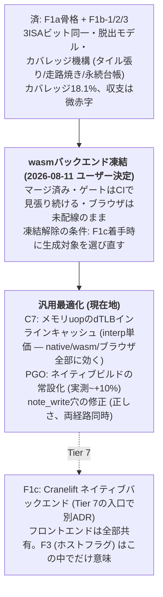

# ADR-0008: テンプレートJIT (F1) の設計方針

- 状態: **決定** (2026-08-11 ユーザー決定: 割り込み受付点は**案A** — 毎命令の受付点を維持)
- 日付: 2026-08-11
- 関連: [ADR-0007](0007-cpu-optimization-steps.md)、[perf.md](../reference/perf.md)

## 背景 — なぜJITしかないのか

100 MIPS作戦 (ADR-0007追記) の実測が出揃った。

- 取れた: B1/B2 (デコードキャッシュ)、B4 (ブロック連結 -43%)、C1 (lazy flags -3〜4%)、
  C4/C4b (控えの薄切り -17%) — **13→78 MIPS**
- 全滅した: B3 (ペア融合 +20〜28%悪化)、B5 (ブロック=連続配列化 +8%悪化)、
  C5 (tick一括払い +10%悪化)、D2 (TLB/エントリ表のサイズ調整 差なし)

全滅組の共通点は「**インタプリタの構造の中での再配置**」であること。
M1のアウトオブオーダ実行・分岐予測・ストアバッファは、毎命令の照合も帳簿も
既に隠蔽できており、それらを手で削っても壁時計は動かない (むしろ悪化する)。
1命令 ≒ 40サイクルの正体は、ディスパッチ+オペランド解決+ヘルパ呼び出しという
**命令ごとに毎回通る配管そのもの**であり、これを消すには実行そのものを
変える = ブロックをホストコードに落とすしかない。

裏付け: 展開ステブ (小さい熱ループ) は素で100 MIPS出る。遅いのは
「広く浅い」カーネル本体区間 (77 MIPS) — JITの回収余地はここが最大。

## 決定 (案)

デコード済みuop列 (dcacheのブロック) を単位に、**テンプレート方式**で
ホストコードへ落とす。uopごとに手書きのコード断片 (テンプレート) を並べて
継ぎ、レジスタ割り付けや最適化はしない — QEMU TCG以前の古典で、
実装量と回収の釣り合いが良い。

### 骨格

1. **coreの無依存は守る** — 生成と実行の器は別クレート (`jit/`)。
   coreには「ブロック実行を外部に委ねるフック」(trait) だけを開ける。
   フックが無ければ従来のインタプリタで動く (wasm/ネイティブ共通の退路)
2. **ターゲットはwasmを先に** — 本命の現場はブラウザ (GUI/DOOMマイルストーン)。
   実行時に小さなwasmモジュールを組み立てて `WebAssembly.instantiate` する。
   ネイティブ (mmap+W^X) は後 (Tier 7で効く)
3. **意味論の原本はインタプリタ** — JITの正しさは「同じ命令列を流したとき
   インタプリタと**命令数もアーキ状態もビット同一**」で検証する。
   cosim/OS回帰がそのまま審判になる
4. **C1のcc_op方式がフラグモデルになる** — 生成コードはフラグを計算せず、
   ブロック出口で (op, a, b, cin, r) を書き戻すだけ。lazy flagsは
   このための土台でもあった
5. **自己書き換えは現行の世代 (page_gen) をそのまま使う** — 書き込みで
   世代が進んだらブロックを捨てる。検出点はインタプリタと同じ

## 分岐点 — 決定済み (2026-08-11): 案Aで着手

ユーザー決定: **案A (毎命令の受付点を維持) で骨格を通す**。命令数の決定性という
回帰の柱を崩さずに正しさを証明し、数字を見てから案Bを別ADRで再判断する。

以下は決定時の比較 (記録):

**割り込み受付点と「命令数の決定性」をどう守るか。**

現行は毎命令の境界で保留IRQを見る。OS起動回帰は「シェル到達までの
命令数が毎回同じ」ことを柱にしており (Linux 580M)、受付点が1命令でも
ずれると基準値が変わる。

- **案A: JITブロックにも毎命令の受付点を生成する** — 決定性の基準は
  完全に不変。ただし生成コードに毎命令「保留チェック+脱出」が入り、
  JITの旨味 (配管の除去) をかなり食う。C5の教訓 (帳簿はタダ) が
  生成コードにも当てはまるかは、ネイティブと違いwasmでは未知数
- **案B: 受付点を「ブロック境界」に変える** — 実CPUに近く、JITの旨味は
  最大。ただし**命令数の基準値が全部引き直し**になり、インタプリタ側も
  同じ意味論に揃える必要がある (二重意味論は許さない)。回帰の柱を
  一度壊して積み直す工事を伴う

推し: まず案Aで骨格を通し (正しさの証明が容易)、数字を見てから
案Bを判断する。案Bは「意味の変更」なので単独ADRに切り出す。

## 設計原則の追加 (2026-08-11 ユーザー要求): OS固有コードはゼロに

ネイティブ展開 (Windows/Linux/UNIX) で**OSごとの設計分岐を作らない**。
JITの層で言うと、OS依存が入り得るのは「実行メモリの確保 (W^X)」の最下層
だけであり、そこすら自前で書かない:

- **フロントエンド (工数の7〜8割) は共有、バックエンドは2本**:
  - ブラウザ = **wasm生成器** (`WebAssembly.instantiate`、V8が実行)
  - ネイティブ = **Cranelift IR直行** (Tier 7/8の本命。素の機械語なので速度に
    妥協なし。W^XのOS差 — mmap/VirtualAlloc/MAP_JIT — は cranelift-jit が
    内部で吸収するので、**自前のOS固有コードはゼロのまま**)
- ネイティブをwasmtime経由にする案は**中間の保険に格下げ** (2026-08-11):
  ネイティブ化の狙いは速度であり、wasm境界チェックの税 (実行が素の7〜9割) を
  常設で払う理由が無い。ネイティブは当面インタプリタ+PGO (~87 MIPS) で足り、
  本気の速度が要る段でCraneliftバックエンドを足す
- JITの難所 (ブロック選定・メモリuopの脱出・自己書き換え無効化・案Aの
  チェックポイント・フラグ材料の書き戻し) は**全部フロントエンド側** —
  ブラウザ版で解いた答えがCranelift版にそのまま載る。wasm先行は書き捨てにならない
- Cranelift/wasmtimeへの依存はランナー側クレートに置く — **coreの無依存は不変**
  (coreは今後もインタプリタだけで完結し、JIT無しでも常に動く)

## 関門の事前実測 (2026-08-11、tools/webtest/jit-probe.mjs)

F1aの関門「生成+instantiate+呼び出しの固定費を回収できるか」を、
wasmバイト手組みのプローブで先に測った (uop 8個相当のブロック):

| 費目 | M1 | Ivy Bridge (2012) |
|---|---|---|
| 生成 (バイト組み立て、JS実装) | 13µs/ブロック | 29µs |
| instantiate (1ブロック=1モジュール) | **6.3µs** | 21µs |
| まとめ焼き (1000個/モジュール) | 17µs/ブロック | 29µs |
| 呼び出し | **7ns/回 ≒ 1ns/uop** | 10ns/回 |

**判定: 回収可能で確定。** 現行インタプリタは16〜36ns/命令なので、生成コードの
実行は1桁下。固定費~20µsは「そのブロックを百数十回実行」で元が取れ、ホット
コードは数百万回走る。恐れていた instantiate 地獄は存在しない —
**1ブロック=1モジュールの個別焼きでも成立**する (まとめ焼きは生成側の都合で選ぶ)。
注意: プローブの生成コードには案Aの毎命令チェックポイント・TLB・フラグ材料の
書き戻しが入っていない。実物の per-uop コストはこれより上がるが、1桁の余白がある。

## F1bの設計 (2026-08-11 追記): フォールト脱出モデル

F1aがメモリuopを締め出した理由は「#PFが起き得ない = 巻き戻しが要らない」だった。
F1bはこの性質を**脱出**で保つ — 生成コードに巻き戻し機構は持ち込まない。

- **メモリアクセスの前に、生成コードがRustヘルパでtranslateを試す**。
  フォールトしそうならヘルパは**フォールトを記録せず** (pending_faultに触れず)
  返り値の上位ビットでそれを合図し、生成ブロックは脱出する:
  - ip = ブロック頭 + この命令までのオフセット (生成時定数)
  - 返り値 = ここまで**完全に**実行し終えた命令数
- 脱出は「現命令の状態を1つも変える前」に起きる (レジスタ/フラグ/メモリ未変更)
  ので、巻き戻しは不要。インタプリタがその命令を guard 込みでやり直し、
  #PFの記録・配送も従来経路がやる — 意味論の原本は1つのまま
- **脱出は保守的でよい**: 「本当はフォールトしない」場面で余計に脱出しても、
  インタプリタがやり直して同じ結果になる (遅くなるだけで意味は不変)。
  逆 (フォールトを見逃して実行) だけが許されない。この非対称のおかげで
  ページ跨ぎロードなどの稀な形は無条件脱出に倒せる
- **メモリアクセス自体はRustヘルパ経由** (wasm→wasm importは安い。JS境界とは別物)。
  ヘルパはインタプリタの read32/write32 と同じ部品 (translate_for/read_phys32) で
  組む。二重実装しない
- **core側の受け**: enter() が jn (全命令数) 未満を返したら途中脱出。
  次の1命令は skip_jit でインタプリタに落とす — JITに再入すると同じ脱出を
  繰り返して無限ループするため
- **測って決める点**: ヘルパ呼び/メモリop でも「ディスパッチ除去+ブロック大型化」で
  勝てるか。ワッシュならTLBヒット経路のインライン生成が次の梃子
- 増分: **F1b-1 ロード** (mov r32,[mem] / alu r32,[mem] / cmp/test のロード形 —
  vram/note_write不要)、**F1b-2 ストア** (vram_dirty + dcache note_write が要る。
  さらに「ブロック内の自ページ書き換え」= 世代の即時失効をどう受けるかの
  設計が要る — 着手時にここへ追記する)

### F1b-2 の追記 (2026-08-11 着手時): 自ページ書き換えの答えと、素のストアの発見

- **調べたら前提が違った**: 現行coreで page_gen を進めるのは REP文字列
  (note_write_range) と write_phys8 だけで、**素の線形ストア (write8/write_wide)
  は自己書き換え検出の網に入っていない**。Linuxが無事なのは text_poke が
  memcpy = REP MOVS 経由で網に入るため (と推測)。よって:
  - JITのストアヘルパは現行 write32 を**正確に写す** (note_writeを呼ばない) —
    JIT⇔interpのビット同一が最優先
  - 「ブロック内の自ページ書き換えで世代が即時失効する」ケースは現行では
    **存在しない** (REPは語彙外)。素のストアを検出網に入れる修正をする日が来たら、
    両経路同時 + 「ヘルパが世代を進めたら実行済みn+1で脱出」の受けをJITに足す
- **RMW (`alu [mem],r/imm`) の脱出**: 書き込み権限のtranslateを**最初に**試す。
  x86ページングに書き込み専用ページは無い (writable⊆readable) ので、これが
  通れば後続の読みも必ず通り、cc更新後に失敗する道が消える。read→alu_w→write
  は1ヘルパ内で完結 (ccの更新もRust側 = 意味論の原本)

### F1bの結果 (2026-08-11 実測、詳細はperf.md): ワッシュの正体はカバレッジ

F1b-1 (ロード)・F1b-2 (ストア/RMW) とも交互A/Bで**ワッシュ**。原因を
jit_instrsカウンタで確定: **JITカバレッジは1.2%** (600M中7M命令) —
単価を何倍にしても見えない。カーネルの熱い区間は call/ret/push/pop が密で、
語彙外命令がブロックを細切れにしている。**次の増分は語彙の拡大 (スタック形)**。
TLBヒット経路のインライン生成は、カバレッジが上がって単価が効く土俵が
できてからに降格。

## 段階

1. **F1a**: ブロック→wasm生成の骨格。対象はレジスタ間mov/ALU/jccだけ、
   メモリを触るuopはインタプリタへ脱出。ここで「生成+instantiate+呼び出し」の
   固定費を実測する (ブロック粒度で回収できるかの関門) — **完了 (#54-#58)**
2. **F1b**: メモリアクセスのテンプレート化 (上記フォールト脱出モデル)
3. **F1c**: ネイティブバックエンド (Tier 7と同時期)

## Fシリーズのロードマップ (2026-08-11 引き直し、同日ユーザー決定で改訂)

F1b-1〜3の実測で地図の解像度が変わった: **語彙は既に81%・カバレッジ機構は完成
(18.1%)・残る本丸は単価** (メモリopのヘルパはインタプリタと同じ仕事+呼び出し税で、
ディスパッチ除去だけでは1命令あたりの収支が並ぶ)。

**ユーザー決定 (2026-08-11): wasmバックエンドの磨き込み (F1b-4/5/6のwasm版) は
ここで凍結し、汎用 (バックエンド非依存) の最適化へ進む。**
理由: プロジェクトの終点 (microVM構想) はネイティブであり、wasm特有の職人仕事
(手組みバイト列へのTLBインライン展開) はそこへ載らない。F1a〜F1b-3で作った
フロントエンド (脱出モデル・語彙・カバレッジ機構・決定性の審判) は
バックエンド非依存の資産としてF1c (Cranelift) にそのまま持ち越す。

- 凍結時の成績 (台帳): カバレッジ1.2→18.1%、JIT on/off 交互A/Bで微赤字
  (13.1s vs 13.7s)。**フロントエンドは完成・バックエンド単価が未着手**、が凍結地点
- F2 (投機デコード) は寝かせ続け。F1cの判断はTier 7の入口で別ADRに切り出す

各段階で cosim・kernel_lockstep・OS回帰 (命令数不変) を通す。
F1aの固定費が回収不能なら、その実測を台帳に記録して撤退する
(退路はインタプリタ — 常に動く)。
