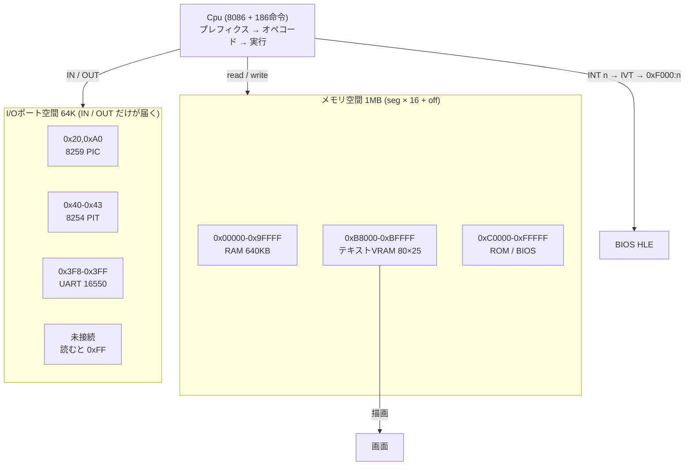
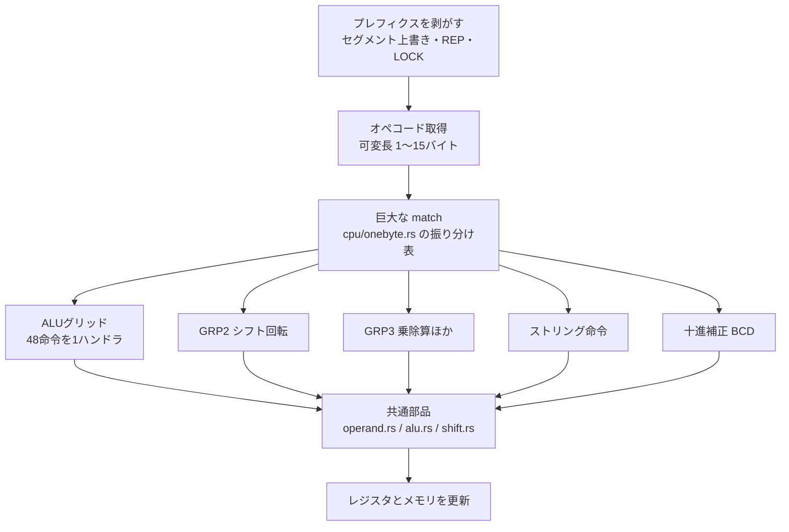
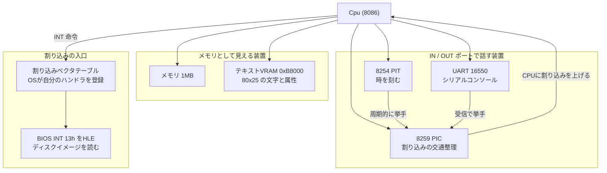
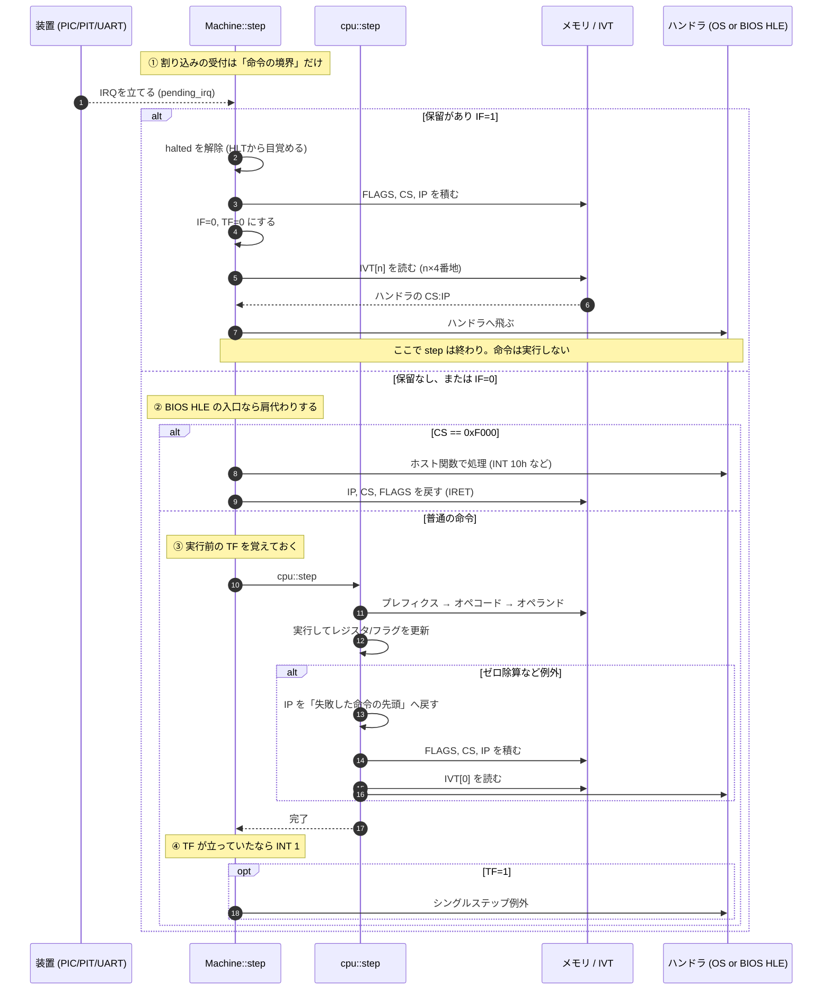
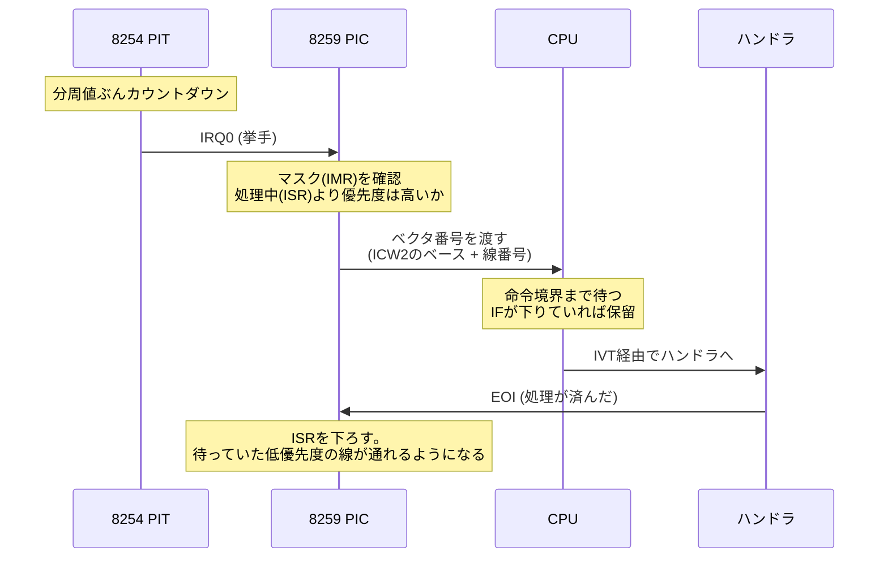
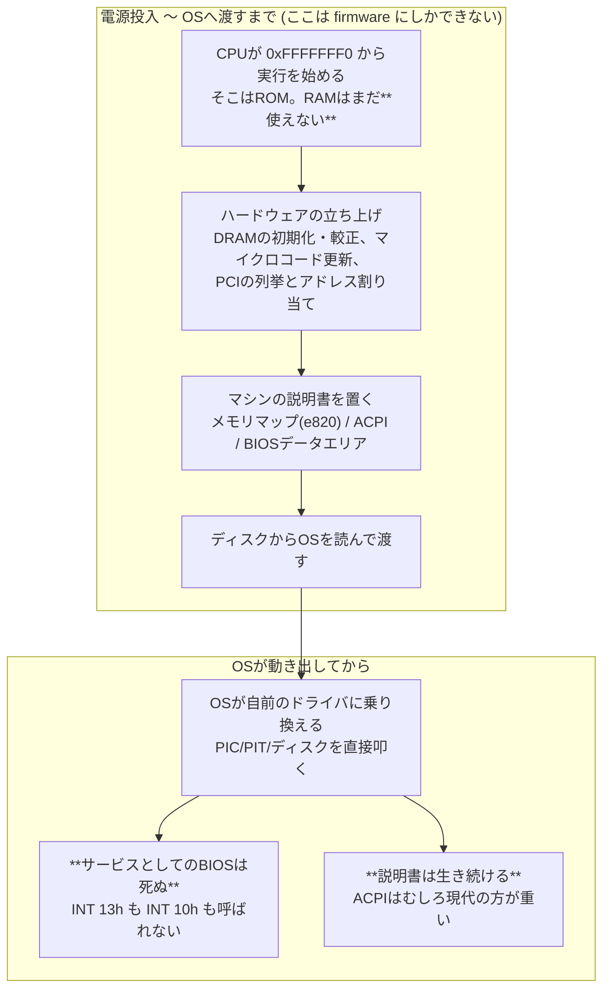
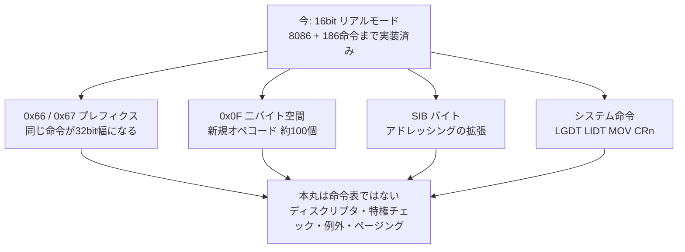
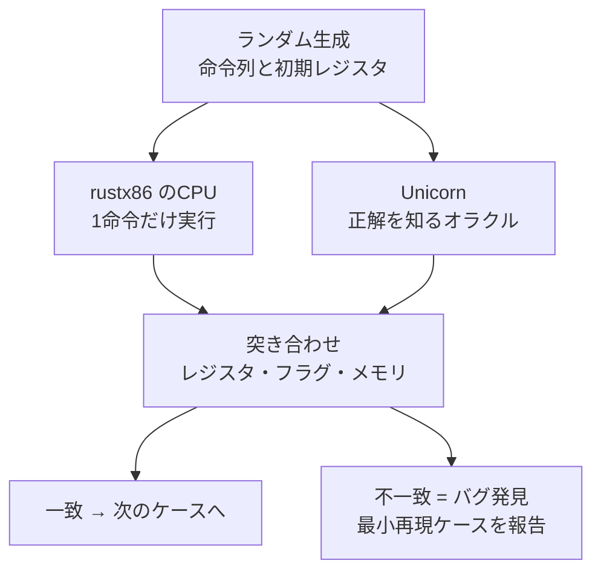

# アーキテクチャ — CPUと装置、16bitと32bit

現代のPCは、40年分の後方互換が地層になってできている。このドキュメントは
rustx86の構造を説明しながら、**なぜPCがこの形をしているのか**を辿る。

## 1. 今ここ: 16bitリアルモードの最小構成

現在動いているのは、CPUとメモリ、それにBIOSの一部を肩代わりするフックだけである。



**アドレス空間が2つある**のがx86の特徴である。メモリ空間とは別に64Kの
I/Oポート空間があり、`IN`/`OUT` という専用命令だけがそこへ届く。
8080時代からの名残で、PIC/PIT/UARTといったISA時代の装置は今もこちら側に居る。

### バスが `match` で足りる理由

16bit時代のPCは**アドレスが定数として焼かれている**。ISAには装置を列挙する
仕組みが無く、「VGAのテキスト画面は 0xB8000」「COM1 は 0x3F8」と決め打ちで
全メーカーが合わせていた。だからバスは番地から宛先を返す `match` で足りる。

現代PCにあるノースブリッジ/サウスブリッジやPCIホストブリッジは、**装置が
動的に増えるようになってから**必要になったものである。アドレスが定数なら、
間に立って経路を決める者は要らない。装置を数える仕組み (PCIの設定空間) が
要るのは virtio を載せる Tier 4 からになる。

`decode_mem` / `decode_io` は [`core/src/bus.rs`](../core/src/bus.rs) にある。

### 未接続のポートは 0xFF を返す

`IN` が誰も名乗り出ないポートを読んだとき、実機のISAバスは誰もドライブ
しないためプルアップで全ビットが立つ。**OSはこの 0xFF を見て「装置が居ない」と
判断する**ので、ここで落としてはいけない。未実装オペコードは即panicする方針だが、
未接続ポートは事情が違う — 探索そのものが正常な動作だからである。

かといって黙って捨てると「なぜ動かないのか」の手がかりが消えるので、
触られたポート番号だけ `unhandled_io` に控えている。

### 装置には2つの話し方がある

PIC/PIT/UARTは `IN`/`OUT` でポート番号を指定して話す。一方でテキストVRAMは
「特定の番地に書くと画面に出る」という形でメモリ空間に居座る。
前者をI/Oポート空間、後者を**メモリマップドI/O**と呼ぶ。

DOSやUNIXのコンソールがBIOSを呼ばずVRAMへ直接書くのは、BIOS経由 (INT 10h) だと
1文字ごとに割り込みが要るからである。0xB8000 から2バイトで1文字 —
[文字コード][属性] が交互に並ぶ。動く実例が [`asm/vram.asm`](../asm/vram.asm) にある。

なお読み出し側には分岐を入れていない。メモリアクセスは最も回数の多い経路なので、
**書き込み側だけで済む仕掛けなら書き込み側に寄せる**という判断である
(描画側への「変わったよ」の合図がそれ)。

ブートセクタ (512バイト、末尾に 0x55AA) を 0x7C00 に置き、`CS:IP = 0000:7C00`
から実行する。これは実機のBIOSがやることと同じで、**PCが40年間変えていない儀式**である。

なぜ 0x7C00 という半端な番地かというと、初代IBM PCのメモリ32KBの末尾付近で、
ブートコードとスタックが衝突しない位置として選ばれた名残である。

### アドレスの作り方 (リアルモードの由来)

8086は16bitのレジスタしか持たないのに、20本のアドレス線 (1MB) を持っていた。
16bitでは64KBしか指せない。この差を埋めるのがセグメントである。

```
物理アドレス = セグメント値 × 16 + オフセット
```

セグメントを16倍する (4bit左シフトする) ことで20bitに届かせる。
「64KBの窓を1MBの空間の中で滑らせる」という発想で、
後のプロテクトモードでは**この計算式そのものが置き換わる**。

## 2. CPUの中身: 振り分け表と共通部品

命令1個の実行はこう流れる。



| ファイル | 役割 |
|---|---|
| `cpu/mod.rs` | Cpu本体・デコーダ・`step` の入口 |
| `cpu/operand.rs` | ModRM解決、オペランドアクセス、アドレス変換、スタック |
| `cpu/alu.rs` | 8種の演算とフラグ計算 |
| `cpu/shift.rs` | シフトと回転 |
| `cpu/string.rs` | ストリング命令とREP |
| `cpu/decimal.rs` | 十進補正 |

命令ごとにファイルを分ける方式は採っていない。x86の命令は数百あり、
ALUグリッドのように48命令が1ハンドラで処理される構造を壊してしまうためである。

| ファイル | 役割 |
|---|---|
| `cpu/onebyte.rs` | 1バイト命令の振り分け (mod.rs から切り出した本体) |
| `cpu/twobyte.rs` | `0x0F` 二バイト命令空間 |
| `cpu/dcache/` | デコード済み命令キャッシュ (下記) |

### 意味の原本と、速い写し (2026-08-10)

上の流れは毎命令「フェッチ → プレフィクス → 巨大match → ModRM再デコード」を
踏む。同じ命令を何百万回もデコードし直すこの構造が ~30 MIPS の天井だった
([ADR-0007](adr/0007-cpu-optimization-steps.md))。

そこで **物理アドレスをキーにデコード結果 (uop) を控えるキャッシュ**
(`cpu/dcache/`) を足した。2回目からはデコードを飛ばして実行だけ。さらに
次の命令が同じ物理ページに居るかぎり、外側の帳簿に戻らず**スロット照合だけで
走り続ける** (ブロック連結 — 分岐も同一ページ内なら続行するので、ホット
ループがまるごと繋がる)。これで 66 MIPS、Linuxフルブート8.8秒。

守っている約束が2つある。

- **意味論を二重実装しない** — dcache の実行器は従来経路と同じ共通部品
  (alu / shift / string…) を呼ぶ。`onebyte.rs` が**意味の原本**、dcache は
  **速い写し**である
- **時計と割り込みは1命令粒度のまま** — 連結中も tsc・装置tick・割り込み
  受付点を外側と同順で刻む。だから**到達命令数は最適化の前後で完全一致**し、
  その一致がそのまま「意味を変えていない」証明になる (CIのOS起動回帰が毎回見張る)

自己書き換えは書き込みがページ世代を進めて写しを外す (TLB・VRAM検出と同じ発想)。

## 3. 目標の姿: 16bit UNIX (ELKS) が動く構成

CPU単体では計算機にならない。ELKSを動かすには次の装置が要る
([ADR-0002](adr/0002-devices-and-16bit-unix.md))。



装置との話し方が**2種類ある**のがポイントである。PIC/PIT/UARTは `IN`/`OUT` という
専用命令でポート番号を指定して話す。一方でVRAMは「特定の番地に書くと画面に出る」
という形でメモリ空間に居座る。前者をI/Oポート空間、後者をメモリマップドI/Oと呼ぶ。

x86が両方を持っているのは歴史的な事情で、8080時代からのI/Oポート空間を引きずったまま、
アドレス空間が広がるにつれてメモリマップドI/Oが主流になった。
現代のPCIデバイスはほぼ後者である。

### 1サイクルに何が起きているか

CPUが1命令進めるとき、実際には命令の実行だけが起きているのではない。
**命令の前後に、割り込みを受け付ける決まった隙間がある**。



読みどころは3つある。

**割り込みは命令の途中では入らない (①)。** 実行中に割り込むと、書き換え途中の
レジスタやスタックのままハンドラへ行くことになり、`IRET` で戻っても再開できない。
だから受付は必ず命令の境界で行う。`HLT` が割り込みで目を覚ますのもここで、
「何もすることが無いので寝て待つ」というOSのアイドルループはこの仕掛けで動く。

**BIOSとOSは同じテーブルを奪い合う (②)。** 起動時、IVTの256エントリはすべて
`0xF000:n` を指している (実BIOSがやることと同じ)。実行がそこへ来たら
バイト列を解釈せずホスト側の関数で肩代わりする。OSが自分のハンドラを
登録したベクタはもう `0xF000` を指していないので、**何の分岐も足さずに
乗っ取りが成立する**。DOSが「BIOSのINT 13hをフックして自分の処理を挟んでから
元へ流す」というチェーンを作れるのも、ここが単なるメモリだからである。

**フォールトとトラップで積むアドレスが違う (③④)。** ゼロ除算 `#DE` は
**フォールト**なので、積むのは「失敗した命令の先頭」である。ハンドラが原因を
直して `IRET` すれば同じ除算をやり直せる、という設計になっている。
一方シングルステップ `INT 1` は**トラップ**で、命令が完了してから上がる。
「実行してから止まる」のでデバッガが1命令ずつ進められる。

なお `INT` が積む順序は `CALL far` と違い、**FLAGSを先に積む**。`IRET` が
逆順に取り出すので、ハンドラ実行中に変わった IF/DF が呼び出し前へ戻る。
ハンドラに入った瞬間に IF が落ちるのは多重割り込みを防ぐためで、
必要ならハンドラ側が `STI` で開け直す。これが「割り込み禁止区間」の正体である。

### 割り込みが「乗っ取られる」ということ

`INT n` は「n番目のエントリが指す番地へジャンプし、`IRET` で戻る」だけの命令である。
0x0000 から並ぶ4バイト×256個のテーブル (IVT) がその宛先表で、
**OSは起動時にここを自分のハンドラで書き換える**。

初期の実装では `INT` をホスト側の関数へ横流ししていたが、それではOSが動かない。
書き換えられるべきテーブルが存在しないからである。今は実IVTを引いており、
起動時に全エントリを BIOS HLE の入口 (`0xF000:n`) で埋めてある。

この形にすると、**乗っ取りに何の分岐も要らない**。OSが自分のハンドラを
登録したベクタはもう `0xF000` を指していないので、自然とHLEが外れる。
BIOSもOSも同じテーブルを奪い合っているだけ、という実機の関係がそのまま出る。
DOSがBIOSのINT 13hを「フックして自分の処理を挟んでから元へ流す」という
チェーン構造も、ここが単なるメモリだからこそ成り立つ。

動く実例が [`asm/interrupt.asm`](../asm/interrupt.asm) にある。
自前ハンドラの登録、書き換えていないベクタのBIOS継続、ゼロ除算からの復帰を
ブートセクタ1枚で通している。

### なぜPICとPITが要るのか

CPUは「今キーが押された」を知る手段を持たない。装置が非同期に「用がある」と
手を挙げる仕組みが割り込みで、その挙手を束ねて優先順位をつけるのが**8259 PIC**である。
そしてOSがプロセスを切り替えるには「定期的に必ず戻ってくる」仕掛けが要る。
それが**8254 PIT**の周期割り込みで、これが無いと1つのプログラムがCPUを
握ったまま離さない。**プリエンプティブなマルチタスクはこのチップの上に立っている**。

一周はこうなっている。どこか1つでも欠けるとスケジューラが動かない。



この2つのチップは1981年のIBM PCから現代のPCまで、互換性のために生き残り続けている。

### 数字に残った歴史

装置の定数には、技術的な必然ではない理由で決まったものが多い。

| 数 | どこで使う | 由来 |
|---|---|---|
| 1.193182 MHz | PITの入力クロック | NTSCカラーサブキャリア (3.579545 MHz) の3分周。**テレビ用の水晶が安かった** |
| 18.2 Hz | DOSの時計 | 上を65536で割った値。分周値の初期値が0 (=65536) だったため |
| IRQ2が欠番 | 割り込み線 | 8259は8本しか持たない。PC/ATで2個目を1個目のIRQ2にぶら下げた |
| ベクタ 0x08 | BIOSのIRQ0 | プロテクトモードではCPUの例外番号と衝突する。**Linuxは起動時に0x20へ付け替える** |

最後の行は Tier 3 でもう一度出てくる。同じチップの同じレジスタが、
32bit化の障害物として顔を出す。

### 初期化がやたら長い理由

OSはPICを初期化するのにICW1〜ICW4という4バイトを順番に書く。これは
**同じポートに順番に書くことで意味が変わる**方式で、レジスタ番号を持たない
代わりに内部の状態機械が「今何番目か」を覚えている。ポート数を節約したかった
時代の設計である。

UARTのDLABも同じ発想で、LCRのbit7を立てると先頭2ポートの意味が通信速度の
分周値に化ける。8本しかないポートに速度設定を置く余裕が無かった。

実装は [`core/src/dev/`](../core/src/dev/) にある。

## 4. BIOSは何のためにあるのか

「OSは起動したらハードを直接叩く。ではBIOSは何のためにあるのか」——
この教材でBIOSを自分で書いていると必ずぶつかる問いである。

答えは、**BIOSには役割が2つあって、死んだのは片方だけ**ということになる。



### 死んだ役割: サービス提供者

`INT 13h` でディスクを読み、`INT 10h` で字を出す — この「代わりにやってあげる」
役目は、32bit以降のOSでは使われなくなった。上に挙げた3つの理由
(16bitである・再入できない・遅い) で、自前のドライバに敵わないからである。

UEFIはこれを設計として明示した。OSは準備が済むと **`ExitBootServices()`** を呼ぶ。
「もう自分でやるから、あなたのサービスは要らない」と**明示的に宣言する**関数である。
この瞬間にfirmwareはサービス提供者をやめる。

### 育った役割: ハードウェアを立ち上げ、マシンを説明する

こちらはOSには**代われない**。理由がはっきりしている。

**RAMがまだ無い。** 電源を入れた直後、DRAMは初期化されておらず**1バイトも読み書き
できない**。メモリコントローラを設定し、タイミングを較正して初めてRAMになる。
firmwareはその作業を、CPUのキャッシュをRAM代わりにして行う。
OSはRAMが無ければロードすらできないので、原理的に代われない。

**装置にアドレスが振られていない。** PCIデバイスは電源投入時、まだどの番地にも
居ない。firmwareがバスを列挙してBARにアドレスを割り当てる。
それが済むまでOSは装置を見つけられない。

**マシンの形を知る手段が無い。** どこがRAMでどこが予約領域か (e820)、
割り込みがどう配線されているか、電源をどう管理するか (ACPI) —— OSはこれを
firmwareが置いたテーブルから読む。**現代のOSはACPIへの依存の方が
`INT 13h` への依存より遥かに大きい。**

### つまり

| 役割 | 32bit以降 |
|---|---|
| サービス提供者 (`INT 13h` / `INT 10h`) | **死んだ** |
| ハードウェアの立ち上げ | 生きている。OSには代われない |
| マシンの説明書 (e820 / ACPI) | **むしろ重くなった** |

「BIOSが要らなくなった」のではなく、**要らなくなったのは肩代わりの部分だけ**である。
firmwareが数MBもあるのは、大半が立ち上げと説明書のためで、
サービスのためではない。

### このエミュレータではどう見えるか

`core/src/bios.rs` が小さいのは、**立ち上げがほぼ要らないから**である。
DRAMは `Vec<u8>` として最初から存在し、PCIも無いので列挙するものが無い。
残っているのは説明書とサービスだけになる。

面白いのは、**ELKSを起動させるまでに踏んだ穴が、どれも「死なない側」だった**
ことである。

| 詰まった箇所 | どちらの役割か |
|---|---|
| A20ゲートが開かない | ハードウェアの立ち上げ |
| BIOSデータエリアが空 | マシンの説明書 |
| PICのvector_baseが0 | ハードウェアの立ち上げ |

サービスの実装ミスで詰まったのではない。**サービスを一切呼ばないOSでも、
立ち上げと説明書が無ければ起動しない** —— 役割の重みがそのまま出ている。

[`power_on_self_test()`](../core/src/bios.rs) がこの3つを1か所に集めているのは、
そういう意味でも正しい名前になった。

### 装置が増えたらBIOSも増えるのか

**増えない。装置を足すコストはバスと装置のコードであって、BIOSのコードではない。**

BIOSが増えるのは、上で見た「死なない側」の2つに当たるときだけである。

1. **ドライバが存在する前に走る誰かが居る** (ブートローダー、リアルモードのsetup)
2. **マシンの形を教える必要がある** (メモリ量、装置の有無)

ロードマップに当てはめると、こうなる。

| 追加するもの | BIOSへの影響 |
|---|---|
| Tier 5 virtio-net | **ゼロ。** イーサネットにBIOSサービスは存在しない (PXE/UNDIは後付けの別物)。OSは自前ドライバで叩く |
| Tier 3 32bit化 | **ゼロ**。むしろ使われなくなる |
| Tier 4 メモリ増設 + Linux | **説明書だけ増える。** カーネルにRAM量を教える者が要る。bzImage直接ロードでは `boot_params` に e820 を自分で書く — サービスではなく説明書の仕事 |
| Tier 6 GUI | **選ぶドライバ次第で変わる** |

Tier 6 が分かりやすい例である。Linuxが `bochs-drm` や `virtio-gpu` のような
自前ドライバでVGAレジスタを直接叩くなら、BIOSは1行も増えない。
ところが `vesafb` を使うと、カーネルはリアルモードのsetupコードから
**INT 10h の VBE を呼ぶ**ので、BIOSが増える。

そして我々は bzImage 直接ロードでそのsetupを飛ばすため、**`vesafb` はそもそも
選べない**。[ADR-0004](adr/0004-how-far-to-follow-the-bios.md) の
「Linuxには最後までBIOSを使わせない」が、Tier 6 の画面ドライバの選択肢を
先に狭めている。決定は後ろの階まで効く。

### なぜ実機のfirmwareは小さくならないのか

このBIOSが300行弱で済むなら、データセンターのfirmwareもそうすればよさそうに見える。
**実際そうしている人たちが居る。**

- **coreboot** — シリコン初期化だけ行い「ペイロード」に飛ぶ最小firmware
- **LinuxBoot** — UEFIの後半 (DXE) を**Linuxカーネルそのもの**で置き換える。
  主張は「**OSはfirmwareより優れたブートローダーである**」
- **Oxide Computer** — UEFIを使わず自前のブートローダーとOSだけ。
  **firmwareを消せるように基板から設計した**

つまり問いは「なぜやらないのか」ではなく「**なぜハードウェアを握れる買い手しか
やれないのか**」になる。障壁は3つある。

**1. この教材がタダで手に入れた部分が、実機では最難関で、しかも非公開。**
ここでDRAMは `Vec<u8>` として最初から存在するが、実機では基板ごと・DIMMごと・
配線長ごとに較正が要る。IntelはFSP、AMDはAGESAという**バイナリブロブ**でしか
出さないので、corebootですらそこは呼ぶだけである。**見えないものは単純化できない。**

**2. firmwareはハードウェアの多様性を吸収する場所。**
艦隊は「基板N種 × DIMMベンダM種 × 装置の組み合わせK種」で、firmwareの仕事は
それを全部「PC」に見せることである。firmwareを単純にすれば多様性は消えず、
OS側へ移るだけで、OSイメージは1つなので不利になる。

**ここのBIOSが小さいのは設計が上手いからではなく、ハードウェア構成を
自分で1つに決めているからである。firmwareの大きさは、自分で制御できない
ハードウェアの多様性に比例する。**

**3. 起動と関係ない仕事が載っている。** RAS (メモリエラー処理・DIMMミラーリング)、
BMCによる遠隔管理、Secure BootとTPMの測定、電力と温度の制御、無停止の更新。
最小化しても消えず、移動するだけである。

なお、UEFIが大きいのは**インターフェースではなく実装**の方である。
EDK2にはドライバモデルもネットワークスタックもHTTP Bootもシェルも入っている。
LinuxBootの着眼点は、そこを見て「**Linuxはfirmwareより良いドライバを
すでに持っている**」と言ったことにある。

## 5. その先: 32bitで何が変わるか

32bit化は「命令が増える」ことだと思われがちだが、実態は違う。



**新しい命令セットになるのではなく、プレフィクスで幅が切り替わる**。
`ADD` のオペコードは16bitでも32bitでも同じで、`0x66` が付くと32bit幅として
解釈される。rustx86でレジスタを最初から `u32` で持たせたのは、この日のためである。

### 実際にやってみて分かったこと (Tier 3b)

**`0x66`/`0x67` はモードと独立している。** プロテクトモード (3a) を実装せずに、
プレフィクスだけを先に動かせた。「既定の幅をひっくり返す」命令なので、
リアルモード (既定16bit) では32bitに、32bitセグメントでは逆に16bitになる。
**「32bit化」は命令セットとモードという2つの別の話**だったことになる。

実際これで FreeDOS が386判定を通過し、インストーラまで到達した。

そして**器を作り直す必要は無かった**。`set_reg16` が上位16bitを保存する形に
してあったので、16bit命令と32bit命令が同じレジスタの別の幅を見る関係が
そのまま成り立つ。実機のEAXとAXの関係と同じである。

幅は型ではなく**実行時のフラグ**で選んでいる (`alu_w` / `read_op_w` / `push_w`)。
分岐表を幅ごとに2本書くと [`cpu/mod.rs`](../core/src/cpu/mod.rs) が倍に膨れるためで、
入口で吸収する形にした。

**忘れると静かに壊れる。** 幅対応を漏らした命令は、即値の長さが変わるので
IPがずれ、以後はデータを命令として食い始める。panicも出ないまま遠くの番地で
無関係な顔をして倒れるので、`0x66` が付いたオペコードを控える仕掛け
(`Machine::prefixed_ops`) を入れてある。

### アドレス変換の三段跳び

PCのアドレス変換は、地層の各段で計算式が置き換わってきた。

| モード | 変換式 | 保護 |
|---|---|---|
| リアルモード | `seg × 16 + off` | なし。誰でも全メモリを触れる |
| プロテクトモード | `ディスクリプタ.base + off` (範囲と権限を検査) | セグメント単位 |
| ページング有効 | 上の結果をページテーブルで物理アドレスへ | ページ単位 + 特権 |

「セグメントレジスタに値を入れる」という同じ操作が、リアルモードでは
単なる数値の代入、プロテクトモードでは**テーブル引きと権限検査**に化ける。
同じ命令の意味が変わるのが、モードという概念の正体である。

## 6. 検証の仕組み

x86には網羅テストROMが無いため、Unicorn Engine (QEMUのCPU部) をオラクルとした
比較実行で検証する ([ADR-0001](adr/0001-16bit-cpu-and-cosim.md))。



装置が増えるとco-simの守備範囲を超える。1命令単位の比較では
装置の状態遷移を検証できないため、そこからは**実OSを動かすこと自体が
テストになる**。ELKSが起動するかどうかが、次の合否判定になる。
