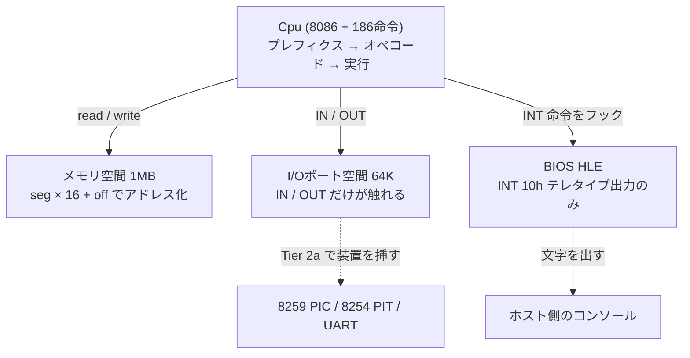
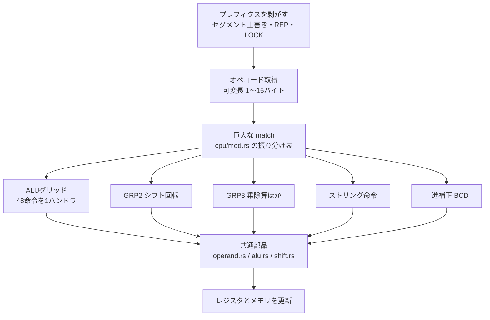
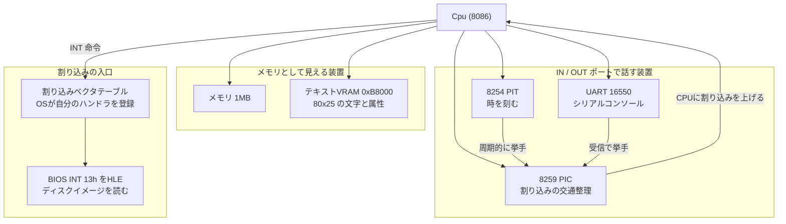
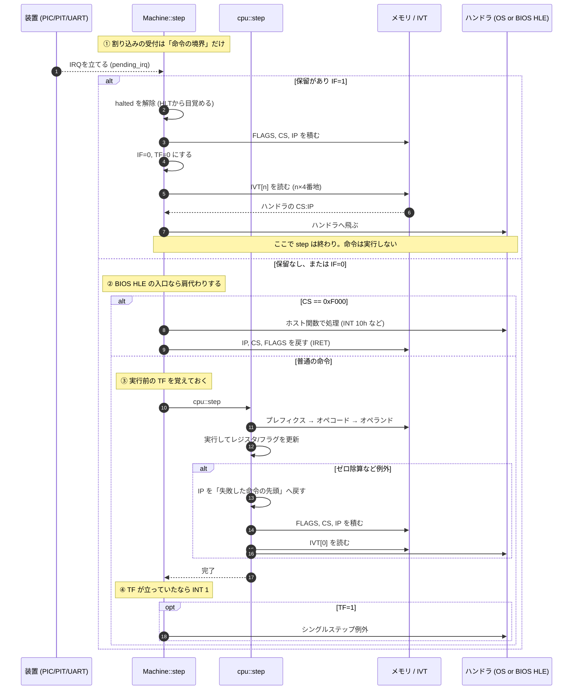
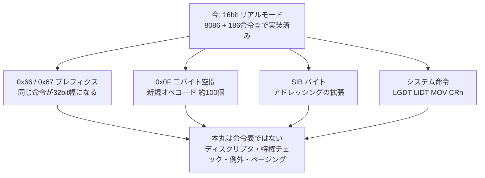
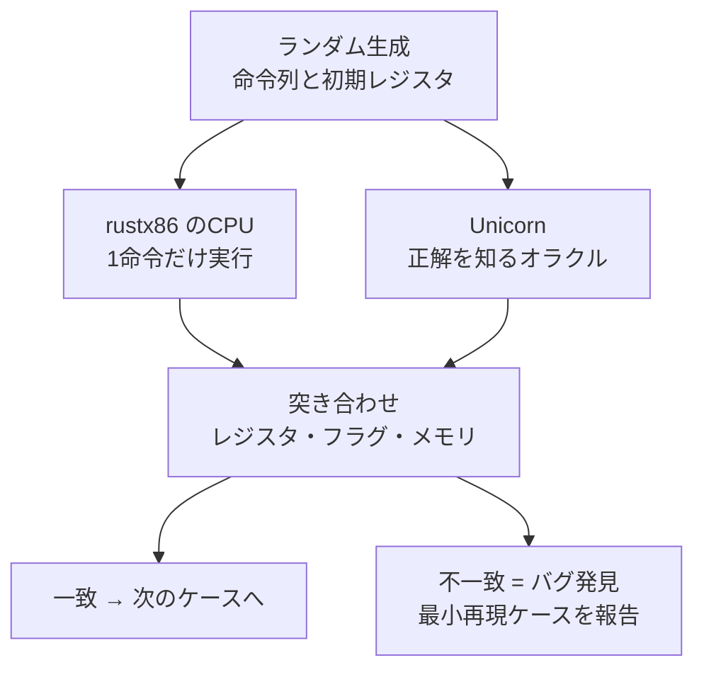

# アーキテクチャ — CPUと装置、16bitと32bit

現代のPCは、40年分の後方互換が地層になってできている。このドキュメントは
rustx86の構造を説明しながら、**なぜPCがこの形をしているのか**を辿る。

## 1. 今ここ: 16bitリアルモードの最小構成

現在動いているのは、CPUとメモリ、それにBIOSの一部を肩代わりするフックだけである。



**アドレス空間が2つある**のがx86の特徴である。メモリ空間とは別に64Kの
I/Oポート空間があり、`IN`/`OUT` という専用命令だけがそこへ届く。
8080時代からの名残で、PIC/PIT/UARTといったISA時代の装置は今もこちら側に居る。
今は素通しのバイト配列で、Tier 2a でここに装置を挿す。

ブートセクタ (512バイト、末尾に 0x55AA) を 0x7C00 に置き、`CS:IP = 0000:7C00`
から実行する。これは実機のBIOSがやることと同じで、**PCが40年間変えていない儀式**である。

なぜ 0x7C00 という半端な番地かというと、初代IBM PCのメモリ32KBの末尾付近で、
ブートコードとスタックが衝突しない位置として選ばれた名残である。

### アドレスの作り方 (リアルモードの由来)

8086は16bitのレジスタしか持たないのに、20本のアドレス線 (1MB) を持っていた。
16bitでは64KBしか指せない。この差を埋めるのがセグメントである。

```
物理アドレス = セグメント値 × 16 + オフセット
```

セグメントを16倍する (4bit左シフトする) ことで20bitに届かせる。
「64KBの窓を1MBの空間の中で滑らせる」という発想で、
後のプロテクトモードでは**この計算式そのものが置き換わる**。

## 2. CPUの中身: 振り分け表と共通部品

命令1個の実行はこう流れる。



| ファイル | 役割 |
|---|---|
| `cpu/mod.rs` | オペコードの振り分け表に徹する |
| `cpu/operand.rs` | ModRM解決、オペランドアクセス、アドレス変換、スタック |
| `cpu/alu.rs` | 8種の演算とフラグ計算 |
| `cpu/shift.rs` | シフトと回転 |
| `cpu/string.rs` | ストリング命令とREP |
| `cpu/decimal.rs` | 十進補正 |

命令ごとにファイルを分ける方式は採っていない。x86の命令は数百あり、
ALUグリッドのように48命令が1ハンドラで処理される構造を壊してしまうためである。

## 3. 目標の姿: 16bit UNIX (ELKS) が動く構成

CPU単体では計算機にならない。ELKSを動かすには次の装置が要る
([ADR-0002](adr/0002-devices-and-16bit-unix.md))。



装置との話し方が**2種類ある**のがポイントである。PIC/PIT/UARTは `IN`/`OUT` という
専用命令でポート番号を指定して話す。一方でVRAMは「特定の番地に書くと画面に出る」
という形でメモリ空間に居座る。前者をI/Oポート空間、後者をメモリマップドI/Oと呼ぶ。

x86が両方を持っているのは歴史的な事情で、8080時代からのI/Oポート空間を引きずったまま、
アドレス空間が広がるにつれてメモリマップドI/Oが主流になった。
現代のPCIデバイスはほぼ後者である。

### 1サイクルに何が起きているか

CPUが1命令進めるとき、実際には命令の実行だけが起きているのではない。
**命令の前後に、割り込みを受け付ける決まった隙間がある**。



読みどころは3つある。

**割り込みは命令の途中では入らない (①)。** 実行中に割り込むと、書き換え途中の
レジスタやスタックのままハンドラへ行くことになり、`IRET` で戻っても再開できない。
だから受付は必ず命令の境界で行う。`HLT` が割り込みで目を覚ますのもここで、
「何もすることが無いので寝て待つ」というOSのアイドルループはこの仕掛けで動く。

**BIOSとOSは同じテーブルを奪い合う (②)。** 起動時、IVTの256エントリはすべて
`0xF000:n` を指している (実BIOSがやることと同じ)。実行がそこへ来たら
バイト列を解釈せずホスト側の関数で肩代わりする。OSが自分のハンドラを
登録したベクタはもう `0xF000` を指していないので、**何の分岐も足さずに
乗っ取りが成立する**。DOSが「BIOSのINT 13hをフックして自分の処理を挟んでから
元へ流す」というチェーンを作れるのも、ここが単なるメモリだからである。

**フォールトとトラップで積むアドレスが違う (③④)。** ゼロ除算 `#DE` は
**フォールト**なので、積むのは「失敗した命令の先頭」である。ハンドラが原因を
直して `IRET` すれば同じ除算をやり直せる、という設計になっている。
一方シングルステップ `INT 1` は**トラップ**で、命令が完了してから上がる。
「実行してから止まる」のでデバッガが1命令ずつ進められる。

なお `INT` が積む順序は `CALL far` と違い、**FLAGSを先に積む**。`IRET` が
逆順に取り出すので、ハンドラ実行中に変わった IF/DF が呼び出し前へ戻る。
ハンドラに入った瞬間に IF が落ちるのは多重割り込みを防ぐためで、
必要ならハンドラ側が `STI` で開け直す。これが「割り込み禁止区間」の正体である。

### 割り込みが「乗っ取られる」ということ

`INT n` は「n番目のエントリが指す番地へジャンプし、`IRET` で戻る」だけの命令である。
0x0000 から並ぶ4バイト×256個のテーブル (IVT) がその宛先表で、
**OSは起動時にここを自分のハンドラで書き換える**。

初期の実装では `INT` をホスト側の関数へ横流ししていたが、それではOSが動かない。
書き換えられるべきテーブルが存在しないからである。今は実IVTを引いており、
起動時に全エントリを BIOS HLE の入口 (`0xF000:n`) で埋めてある。

この形にすると、**乗っ取りに何の分岐も要らない**。OSが自分のハンドラを
登録したベクタはもう `0xF000` を指していないので、自然とHLEが外れる。
BIOSもOSも同じテーブルを奪い合っているだけ、という実機の関係がそのまま出る。
DOSがBIOSのINT 13hを「フックして自分の処理を挟んでから元へ流す」という
チェーン構造も、ここが単なるメモリだからこそ成り立つ。

動く実例が [`asm/interrupt.asm`](../asm/interrupt.asm) にある。
自前ハンドラの登録、書き換えていないベクタのBIOS継続、ゼロ除算からの復帰を
ブートセクタ1枚で通している。

### なぜPICとPITが要るのか

CPUは「今キーが押された」を知る手段を持たない。装置が非同期に
「用がある」と手を挙げる仕組みが割り込みで、その挙手を束ねて優先順位をつけるのが
**8259 PIC**である。そしてOSがプロセスを切り替えるには「定期的に必ず戻ってくる」
仕掛けが要る。それが**8254 PIT**の周期割り込みで、これが無いと
1つのプログラムがCPUを握ったまま離さない。

この2つのチップは1981年のIBM PCから現代のPCまで、
互換性のために生き残り続けている。

## 4. その先: 32bitで何が変わるか

32bit化は「命令が増える」ことだと思われがちだが、実態は違う。



**新しい命令セットになるのではなく、プレフィクスで幅が切り替わる**。
`ADD` のオペコードは16bitでも32bitでも同じで、`0x66` が付くと32bit幅として
解釈される。rustx86でレジスタを最初から `u32` で持たせたのは、この日のためである。

### アドレス変換の三段跳び

PCのアドレス変換は、地層の各段で計算式が置き換わってきた。

| モード | 変換式 | 保護 |
|---|---|---|
| リアルモード | `seg × 16 + off` | なし。誰でも全メモリを触れる |
| プロテクトモード | `ディスクリプタ.base + off` (範囲と権限を検査) | セグメント単位 |
| ページング有効 | 上の結果をページテーブルで物理アドレスへ | ページ単位 + 特権 |

「セグメントレジスタに値を入れる」という同じ操作が、リアルモードでは
単なる数値の代入、プロテクトモードでは**テーブル引きと権限検査**に化ける。
同じ命令の意味が変わるのが、モードという概念の正体である。

## 5. 検証の仕組み

x86には網羅テストROMが無いため、Unicorn Engine (QEMUのCPU部) をオラクルとした
比較実行で検証する ([ADR-0001](adr/0001-16bit-cpu-and-cosim.md))。



装置が増えるとco-simの守備範囲を超える。1命令単位の比較では
装置の状態遷移を検証できないため、そこからは**実OSを動かすこと自体が
テストになる**。ELKSが起動するかどうかが、次の合否判定になる。
