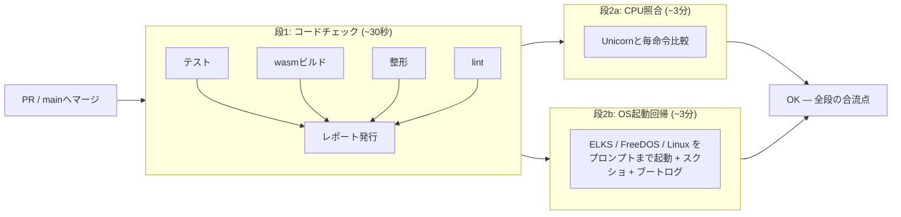

# CI — 何を機械に見張らせるか

このリポジトリのCIは「テストを回す装置」ではない。`cargo test` は開発中に
毎回手で回しているので、CIが同じことをしても保険にしかならない。
**CIの本命は、手元で忘れるもの・手元では起きないもの**である。

Checkのレポートには**何をしたかと結果だけ**を書く。設計の理由 (この文書) を
毎回のCheckに繰り返し載せても、読む人は同じ文章を何十回も見ることになる。

## 全体図 (2026-08-10 パイプライン化)

1本のワークフロー (ci.yml) を**段構え**にしてある。安いコードチェックが
先に走り、通ったときだけ重い検査が並行して走る — 壊れたコードに
数分の検査を払わない。最後の OK が合流点。



CPU照合は以前 paths で「CPUを触ったPRだけ」に絞っていたが、段構えに
したので常に回す。回る時間は起動回帰と並行で隠れ、判定条件が単純になる。

## Checksタブに出すものは絞る

GitHub Actions のジョブは自動で Check として表示されるが、**選んでも
ログページへのリンクにしかならない**。ステージごとに項目を作ると、
左リストがリンク集と見分けのつかない列になる (実際になった)。

そこで [Checks API](https://docs.github.com/rest/checks) で**本文つきの
Check run** を自前で発行する ([.github/actions/publish-check](../.github/actions/publish-check/action.yml))。
出すのは次の2つだけ:

| 項目 | 中身 |
|---|---|
| **CI 結果** | 見出しが「4/4 合格」。開くと先頭に合否表、下に各ステージのログ |
| **CPU照合 結果** | 見出しが「Unicornと一致」 |
| **OS起動回帰 結果** | 3OSのプロンプト到達と画面のスクショ。ブートログはアーティファクト |

各ステージは `continue-on-error` で最後まで走らせてから束ねる。
テストが落ちてもビルドの結果は見たいからである。

## ステージと、それぞれが止める事故

| ステージ | 止める事故 | 実際に起きたか |
|---|---|---|
| テスト | ふつうの退行 | (手元の保険) |
| **wasmビルド** | **ネイティブでは通るのにブラウザでだけ壊れる**。`std::time::Instant` は wasm32 に存在しない ([build.md](build.md)) | 起きた |
| 整形 | `cargo fmt` 忘れ | **CIを作ったその日に自分が落ちた** (clippy --fix が崩した整形をそのまま push した) |
| lint | clippy の指摘 (警告もエラー扱い) | — |
| CPU照合 | 命令の意味論の退行。フラグ1bitの違いまで毎命令比較 | Tier 1 で多数 (ADCのAF等) |

wasmビルドのレポートには **`.wasm` のサイズ**も出る (初回 196 KB)。
サイズが跳ねたPRに気づくための計器である。

## 検査で見張るより、事故れない構造にする

一度「版ずれ」というステージを作って、すぐ廃止した。この顛末は原則として
残す価値がある。

ブラウザのキャッシュを破るため `?v=番号` を全JSに付けて手で上げていた。
番号がずれると新旧のコードが混ざって `emu.key is not a function` になるので、
「番号が揃っているか」を検査するステージをCIに積んだ。

だが**キャッシュ問題は serve.py がとっくに解決していた** — 全応答に
`Cache-Control: no-store` を送っている。同じ問題を2回別の方法で直し、
手作業の方 (?v=) だけが残っていた。**番号そのものを廃止**したら、
上げ忘れも、ずれも、ずれの検査も、仕組みごと消えた。

検査を足す前に「**その事故は構造で不可能にできないか**」を先に問う。

## 入れていないもの・絞っているもの (理由つき)

- **警告のみのステージを置かない** — 「緑だが指摘あり」は読めない。
  整形 (3568行) と lint (32件) は**先に全部掃除してから**ゲートにした
- ~~CPU照合を毎PRで回さない~~ — 以前は `paths:` で CPU を触ったPRに絞っていたが、
  段構え化 (上の全体図) で常に回すことにした。回る時間は起動回帰と並行で隠れる
- ~~OS起動テストはCIでは空撃ち~~ — かつての既知の穴。`cargo test` のOS起動系は
  イメージが無いと今もスキップして緑になるが、**段2bのOS起動回帰が
  実物のイメージ (Actionsキャッシュ) で3OSをプロンプトまで起動する**ので、
  空撃ちの穴は塞がった

## OS起動回帰 (2026-08-10 追加)

段2b — 3つのOSをプロンプトまで実際に起動する
(`cargo run --release --example regress`)。当初はmainマージ時だけの予定
だったが、パイプラインを段構えにしたことで「コードチェックが通ったPRだけ、
CPU照合と並行に」回せるようになり、PRの回転を鈍らせずに毎回検査できる。
イメージはActionsキャッシュが効くので2回目からは取得なし。

- **16bit回帰**: ELKS が `login:` に、FreeDOS がメニューを抜けて FreeCOM に着く。
  判定だけでなく**そのときの画面 (80×25のテキスト) をスクショとしてレポートに貼る**
- **32bit回帰**: Linux (vmlinux + initramfs-mini) が busybox シェルに着く。
  シリアルの末尾をスクショに。**到達までの命令数は決定的**なので上限も見張る —
  大きく増えたら速度ではなく意味の後退 (スピン・時計の狂い) の印
- イメージは GPL 配布物なのでリポジトリに置かず、入手経路は
  `tools/fetch-images.sh` ただ一つ (CIはActionsキャッシュに控えるだけ)

## 今後の展望

1. **CPU照合が32bitに広がる** — Unicorn は `MODE_32` を持つので、
   プロテクトモードの命令もそのまま突き合わせられる。踏み台は今のまま
3. **CD (配ること) はまだ無い** — ブラウザ版は今 `web/serve.py` の手元配信
   だけ。公開する段になったら、mainマージで GitHub Pages へ `web/` を
   出すワークフローを足す。Pages はキャッシュを効かせるので、そのときは
   **デプロイ側がコンテンツハッシュを付ける** (手で番号を上げる方式には戻さない)。
   イメージは置かず、利用者が fetch-images で用意する構図は変えない
4. **ベンチの継続記録** — 一部実現した (2026-08-10): 起動回帰が Linux ブートの
   MIPS を毎回測ってレポートに記録する。共有ランナーは±10〜30%揺れるので、
   **hard fail は「壊滅の検出」用の粗い下限 (REGRESS_MIN_MIPS=10) だけ**。
   日々の推移はレポートの数字で見る。ばらつきを均す正規化 (同一ランナーで
   ホスト側の較正ループを回して割る) は、数字が要る段になったら足す

## 手元で同じことを確かめる

CIと同じ検査は全部1行で打てる。

```bash
cargo test                                  # テスト
cargo build -p rustx86-wasm --target wasm32-unknown-unknown --release
cargo fmt --all --check                     # 整形 (直すのは cargo fmt --all)
cargo clippy --workspace --exclude rustx86-cosim --all-targets -- -D warnings
cargo test -p rustx86-cosim                 # CPU照合 (初回はUnicornのビルドで数分)
```
