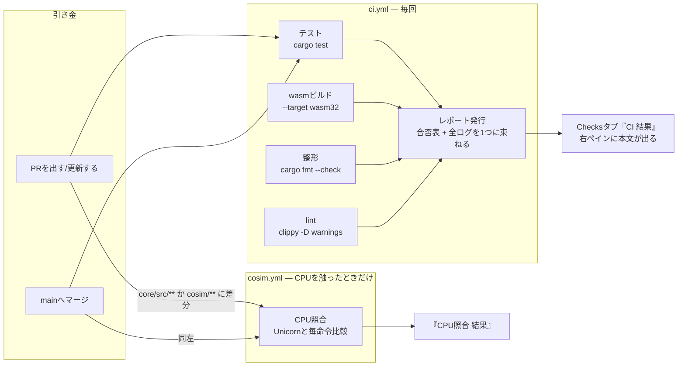

# CI — 何を機械に見張らせるか

このリポジトリのCIは「テストを回す装置」ではない。`cargo test` は開発中に
毎回手で回しているので、CIが同じことをしても保険にしかならない。
**CIの本命は、手元で忘れるもの・手元では起きないもの**である。

Checkのレポートには**何をしたかと結果だけ**を書く。設計の理由 (この文書) を
毎回のCheckに繰り返し載せても、読む人は同じ文章を何十回も見ることになる。

## 全体図



## Checksタブに出すものは絞る

GitHub Actions のジョブは自動で Check として表示されるが、**選んでも
ログページへのリンクにしかならない**。ステージごとに項目を作ると、
左リストがリンク集と見分けのつかない列になる (実際になった)。

そこで [Checks API](https://docs.github.com/rest/checks) で**本文つきの
Check run** を自前で発行する ([.github/actions/publish-check](../.github/actions/publish-check/action.yml))。
出すのは次の2つだけ:

| 項目 | 中身 |
|---|---|
| **CI 結果** | 見出しが「4/4 合格」。開くと先頭に合否表、下に各ステージのログ |
| **CPU照合 結果** | 見出しが「Unicornと一致」。CPUを触ったPRにだけ現れる |

各ステージは `continue-on-error` で最後まで走らせてから束ねる。
テストが落ちてもビルドの結果は見たいからである。

## ステージと、それぞれが止める事故

| ステージ | 止める事故 | 実際に起きたか |
|---|---|---|
| テスト | ふつうの退行 | (手元の保険) |
| **wasmビルド** | **ネイティブでは通るのにブラウザでだけ壊れる**。`std::time::Instant` は wasm32 に存在しない ([build.md](build.md)) | 起きた |
| 整形 | `cargo fmt` 忘れ | **CIを作ったその日に自分が落ちた** (clippy --fix が崩した整形をそのまま push した) |
| lint | clippy の指摘 (警告もエラー扱い) | — |
| CPU照合 | 命令の意味論の退行。フラグ1bitの違いまで毎命令比較 | Tier 1 で多数 (ADCのAF等) |

wasmビルドのレポートには **`.wasm` のサイズ**も出る (初回 196 KB)。
サイズが跳ねたPRに気づくための計器である。

## 検査で見張るより、事故れない構造にする

一度「版ずれ」というステージを作って、すぐ廃止した。この顛末は原則として
残す価値がある。

ブラウザのキャッシュを破るため `?v=番号` を全JSに付けて手で上げていた。
番号がずれると新旧のコードが混ざって `emu.key is not a function` になるので、
「番号が揃っているか」を検査するステージをCIに積んだ。

だが**キャッシュ問題は serve.py がとっくに解決していた** — 全応答に
`Cache-Control: no-store` を送っている。同じ問題を2回別の方法で直し、
手作業の方 (?v=) だけが残っていた。**番号そのものを廃止**したら、
上げ忘れも、ずれも、ずれの検査も、仕組みごと消えた。

検査を足す前に「**その事故は構造で不可能にできないか**」を先に問う。

## 入れていないもの・絞っているもの (理由つき)

- **CPU照合を毎PRで回さない** — 捕まえられるのはCPUの意味論の変化だけで、
  docs や web のPRで回しても何も検査していない。しかも Unicorn (C製) の
  初回ビルドに数分かかる。`paths:` で `core/src/**` と `cosim/**` に絞り、
  関係ないPRには**項目ごと現れない** — 「スキップ」という読めないCheckも出さない
- **警告のみのステージを置かない** — 「緑だが指摘あり」は読めない。
  整形 (3568行) と lint (32件) は**先に全部掃除してから**ゲートにした
- **OS起動テストはCIでは空撃ちになっている** — ELKS/FreeDOS のイメージは
  再頒布の責任を負わないためリポジトリに置いておらず
  ([tools/fetch-images.sh](../tools/fetch-images.sh) 冒頭)、イメージが無い
  環境ではテストが**スキップして緑になる**。CIの「94 passed」のうち
  約10件は何も検証していない。これは既知の穴で、展望の筆頭 (下記)

## OS起動回帰 (2026-08-10 追加)

`regress.yml` — **mainへのマージ時だけ**、3つのOSをプロンプトまで実際に起動する
(`cargo run --release --example regress`)。PRごとには回さない — イメージ取得と
リリースビルドで数分かかり、PRの回転を鈍らせる。マージ後に赤くなったら
そのコミットが犯人、という切り分けで十分回る。

- **16bit回帰**: ELKS が `login:` に、FreeDOS がメニューを抜けて FreeCOM に着く。
  判定だけでなく**そのときの画面 (80×25のテキスト) をスクショとしてレポートに貼る**
- **32bit回帰**: Linux (vmlinux + initramfs-mini) が busybox シェルに着く。
  シリアルの末尾をスクショに。**到達までの命令数は決定的**なので上限も見張る —
  大きく増えたら速度ではなく意味の後退 (スピン・時計の狂い) の印
- イメージは GPL 配布物なのでリポジトリに置かず、入手経路は
  `tools/fetch-images.sh` ただ一つ (CIはActionsキャッシュに控えるだけ)

## 今後の展望
2. **Tier 3a でCPU照合が32bitに広がる** — Unicorn は `MODE_32` を持つので、
   プロテクトモードの命令もそのまま突き合わせられる。踏み台は今のまま
3. **CD (配ること) はまだ無い** — ブラウザ版は今 `web/serve.py` の手元配信
   だけ。公開する段になったら、mainマージで GitHub Pages へ `web/` を
   出すワークフローを足す。Pages はキャッシュを効かせるので、そのときは
   **デプロイ側がコンテンツハッシュを付ける** (手で番号を上げる方式には戻さない)。
   イメージは置かず、利用者が fetch-images で用意する構図は変えない
4. **ベンチの継続記録** — `bench` を夜間に回して MIPS を記録すれば
   性能の退行も見張れる。ただし共有ランナーは負荷が読めず、
   ±10%の測定ばらつきに埋もれるので、**数字を信じられる形にできるまでやらない**
   (「非表示タブで半減」をベンチ自身が警告する話と同根。[README のベンチ節](../README.md#ベンチマーク))

## 手元で同じことを確かめる

CIと同じ検査は全部1行で打てる。

```bash
cargo test                                  # テスト
cargo build -p rustx86-wasm --target wasm32-unknown-unknown --release
cargo fmt --all --check                     # 整形 (直すのは cargo fmt --all)
cargo clippy --workspace --exclude rustx86-cosim --all-targets -- -D warnings
cargo test -p rustx86-cosim                 # CPU照合 (初回はUnicornのビルドで数分)
```
