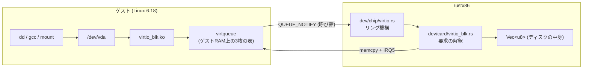
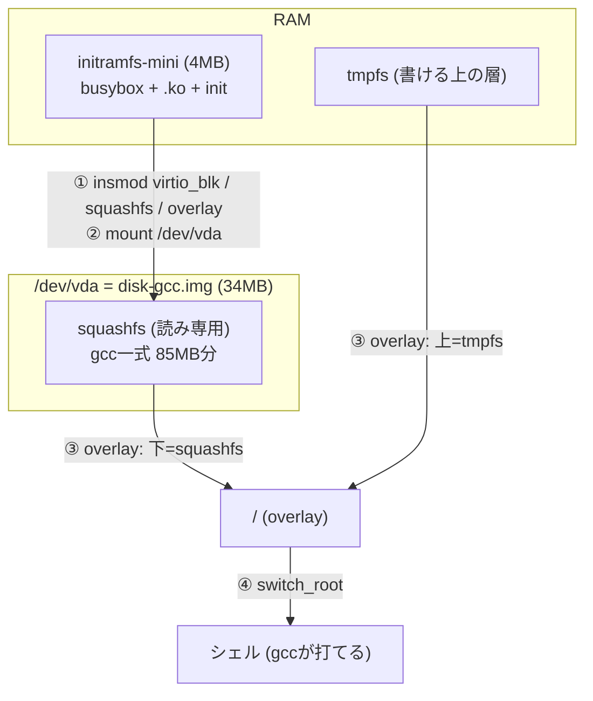

# ディスク — rootfsがRAMから引っ越すまで

initramfsだけの機械には構造的な限界がある: **展開した中身が全部RAMに載る**。
gcc一式 (展開88MB) を積んだら256MB要求された。ディスクなら読んだ分しか
ページキャッシュに載らない — 同じ中身が**128MBで動く** (実測 buff/cache 3MB)。

このドキュメントは、その道具立て (virtio-blk) と乗り物 (squashfs + overlay) の話。

## 全体像 — 要求が1往復する道



1. ゲストのドライバが**記述子** (どこに何バイト、読みか書きか) をRAMの表に書く
2. I/Oポートの呼び鈴 (QUEUE_NOTIFY) を1回鳴らす
3. ホストは表を歩いて **memcpyするだけ** — 転送量に関係なくトラップは1回
4. 済んだらusedリングに書いてIRQ5

これがATA PIOとの本質的な違いで、あちらは1セクタ512Bを運ぶのに
`insw` 256回 = **I/Oトラップ256回**かかる。エミュレータではトラップこそが
コストなので、この差は実機より大きく効く。ATA/IDEは互換の相手
(ReactOS・純正UNIX) が来たときに「遅い口」として足す ([roadmap](../roadmap.md))。

## PCIでの見つかり方

| | RTL8029 (NIC) | virtio-blk |
|---|---|---|
| スロット | 3 | 4 |
| 名乗り | 10EC:8029 | **1AF4:1001** (Red Hat / legacyブロック) |
| I/O窓 | 0xC000 (32B) | 0xC040 (64B) |
| IRQ | 3 | 5 |

virtioは **legacy (0.9.5)** で実装した。BAR0のI/Oポート24バイト+設定空間で
完結し、modern (1.0) のPCI capability経由MMIOより面が狭い。Linuxのドライバは
どちらも喋る (`virtio_pci_legacy_dev.ko`)。素子と基板の分け方は
[ADR-0018](../adr/0018-devices-chip-card-bus.md) の通り:
リング機構は `dev/chip/virtio.rs`、ブロック要求の解釈は `dev/card/virtio_blk.rs`。

## rootfsの乗り物 — squashfs + overlay + switch_root



- **squashfsを選んだ理由**: rootfsは読み専用が正しい姿 (Live CDと同じ)。
  イメージは圧縮したまま置け、カーネルは読んだブロックだけ展開して
  ページキャッシュに載せる。「起動時に全部展開」が消えるのがRAM節約の正体
- **overlayfs**: 書き込みはtmpfsの上の層が受ける。`gcc hello.c` が
  カレントに a.out を書けるのはこのおかげ。電源を切れば消える (それでよい —
  残したいものはディスクイメージを焼き直して入れる)
- **switch_root**: initramfsは「ディスクを見つけて移る係」に戻る。
  実機のLinuxディストリビューションと同じ役割分担で、
  ミニinitramfsが汎用のブートステージ、ディスクが本体になる
- **輪の防止**: ディスク側の木には `/.rustx86-disk` の印が焼いてある。
  ディスクの中のinit (同じスクリプト) はこの印を見て、またディスクを
  探しに行く輪に入らない

ディスク無しで起動すればminiのシェルにまっすぐ落ちる — 従来の姿のまま。

## RAMの食い方の比較 (gcc一式で実測)

| 方式 | 圧縮イメージ | 中身のRAM負担 | 必要RAM |
|---|---|---|---|
| initramfs (`initramfs-gcc`) | 34MB (起動時に読み捨て) | **展開後83MBが全部tmpfsに** | 256MB |
| ディスク (`disk-gcc.img`) | 34MB (ホスト側に常駐) | **読んだ分だけページキャッシュ** | **128MB** |

initramfs方式は展開中に「圧縮イメージ+展開済みの中身」が同時にRAMに載る
二重負担もある。足りないとカーネルは**落ちずに途中でやめる**ので、
ローダが起動前に算数で断る ([pitfalls #14](pitfalls.md)、`initrd_ram_needed`)。

## 使い方

```bash
# 焼く (道具箱=Dockerの中で走る。詳細は ../howto/images.md)
tools/images/sh/make-gcc-disk.sh

# ネイティブで起動 (INITRDは既定でminiなので指定不要)
DISK=images/disk-gcc.img cargo run --release --example run -- images/vmlinuz-lts

# 検証を自動で (ゲストに1コマンド流して結果を持ち帰る)
DISK=images/disk-gcc.img GUEST_CMD='gcc /hello.c -o /tmp/h && /tmp/h; printf "DONE%s\n" MARK' \
  cargo run --release --example guestcmd
```

## ブラウザでの選び方

ツールバーの「ルートFS」で**メモリ型とディスク型を選べる**。データは
`web/machines.js` の `ROOTFS` — initrdだけの項がメモリ型、`disk` 付きの項が
ディスク型で、**どちらの挙動になるかはデータが言う**:

| 選択肢 | initrd | ディスク | RAM自動 |
|---|---|---|---|
| ミニ (RAM) | initramfs-mini | — | 128MB |
| gcc入り (ディスク) | initramfs-mini | disk-gcc.img → vda | **128MB** |
| gcc入り (RAM) | initramfs-gcc | — | 256MB |

## 速さ — 圧縮はゲストのFSではなく輸送路の仕事

最初の実装はsquashfsをgzip圧縮で焼いていた。`time gcc hello.c` が**24.95s**
(うちsys 20.90s) — メモリ版 (2.25s) の11倍遅い。userはぴたり一致していたので、
差は全部カーネルの中。犯人はsquashfsの**ゲスト内解凍**だった: cc1 (45MB) を
読むたび、エミュレートされた76MHz級のCPUがgzipを解く。

squashfsの圧縮方式のA/B (cc1 45MBの冷read sys / 温めた後の gcc real):

| squashfs | イメージ | cold read (sys) | gcc |
|---|---|---|---|
| gzip | 35MB | 15.59s | 8.08s |
| zstd | 32MB | 16.34s | 8.35s |
| lz4 -Xhc | 41MB | 3.30s | 3.55s |
| **無圧縮** | 88MB | **0.91s** | **2.82s** |

zstdは速くない — エミュレートされたCPUの上では、どの方式も「桁で高い」。
lz4は3倍緩和するが、そもそも**払わなくていいコスト**である。

答えは分業: **squashfsは無圧縮で焼き、配布だけ .gz で運ぶ**。ブラウザは
fetch後に `DecompressionStream('gzip')` で**ホスト側で1回だけ**解く —
実測88MBを**335ms** (ゲストにやらせたら15.6秒の仕事)。

| | 転送 | 冷えたgcc |
|---|---|---|
| 旧 (gzip squashfs) | 34MB | 24.95s |
| **新 (無圧縮 + 輸送gzip)** | 34MB | **4.44s** (native) / 4.45s (ブラウザ) |

残るsys 1.6秒はページキャッシュへの初回読み込み。2回目からは温まって
メモリ版と同じ速さになる。

## まだ無いもの

- ゲストが書いた内容の持ち帰り (いまはスナップショット経由のみ)
- ATA の HDD (6d)。**ATAPI の CD は 2026-08-23 に入った** (dev/chip/ide.rs、IDE secondary
  0x170/0x376、IRQ15、PIO)。速さは virtio、互換は ATA、の分担どおり: CD は読むだけなので
  PIO で足りる (2048B × 1 ブロックを insw で運ぶ)。HDD を足すなら primary に
  READ/WRITE SECTORS を乗せる。virtio-mmio (PCIの無い機械に挿す口) は台帳のまま
- CD の像はスナップショットに**入れない** (v16)。virtio-blk の像は書き換わるので控えに
  写すが、CD は読むだけなので、素子の状態 (DRQ の途中でも) だけ控えて、復元側が同じ ISO を
  `cd_attach` で挿し直す。`cd_wanted()` が「素子はあるが像が無い」の印
