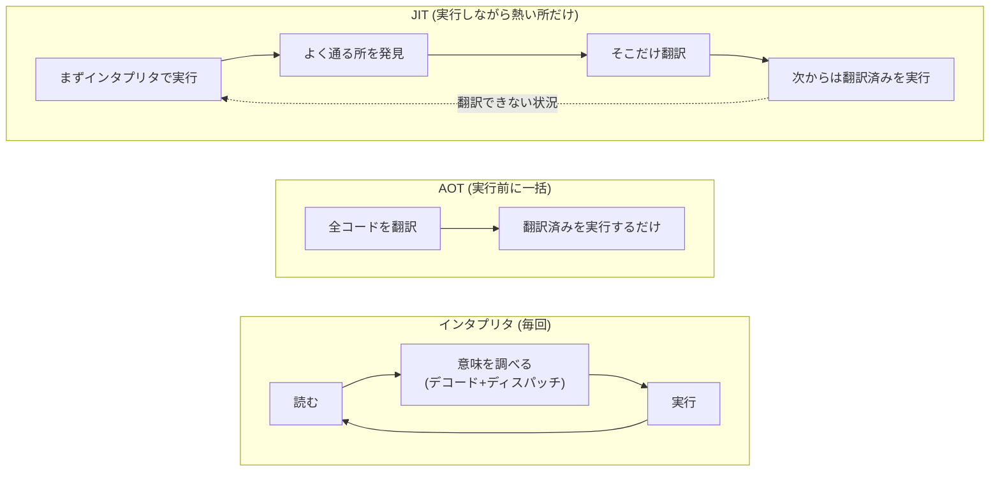
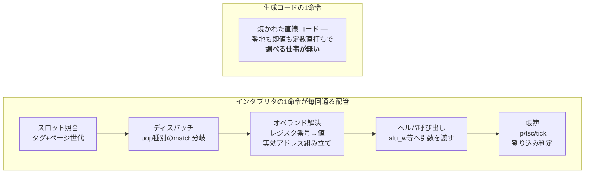
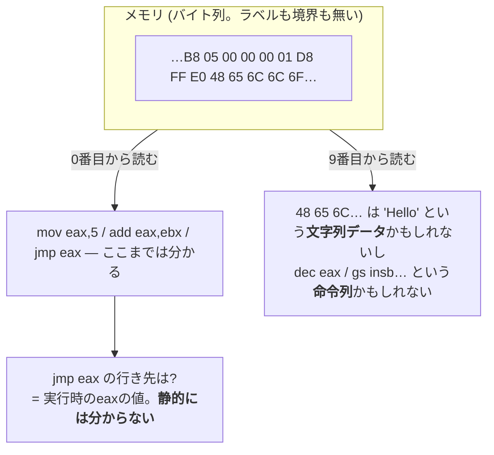
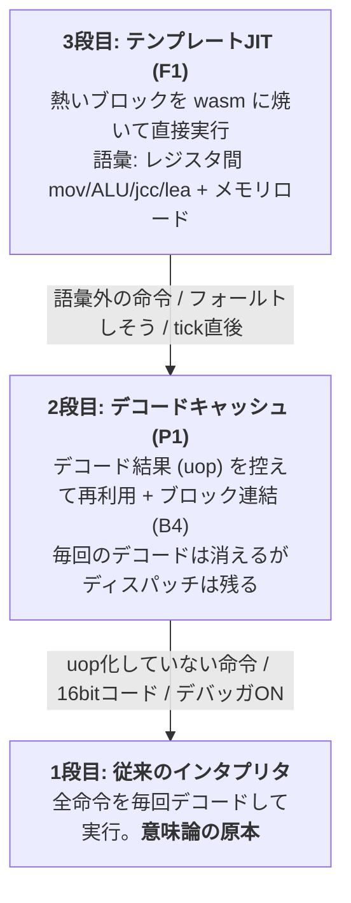
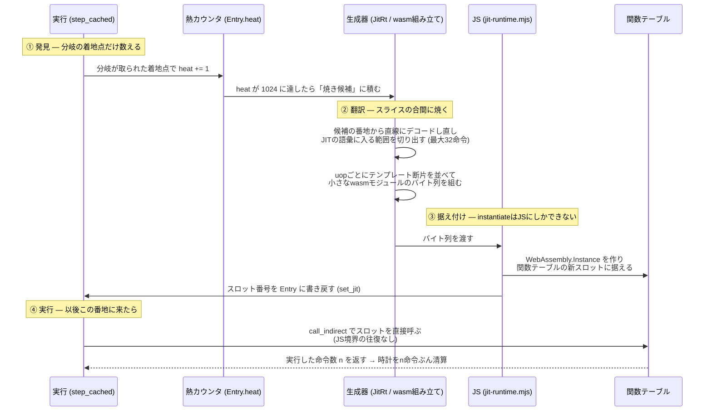
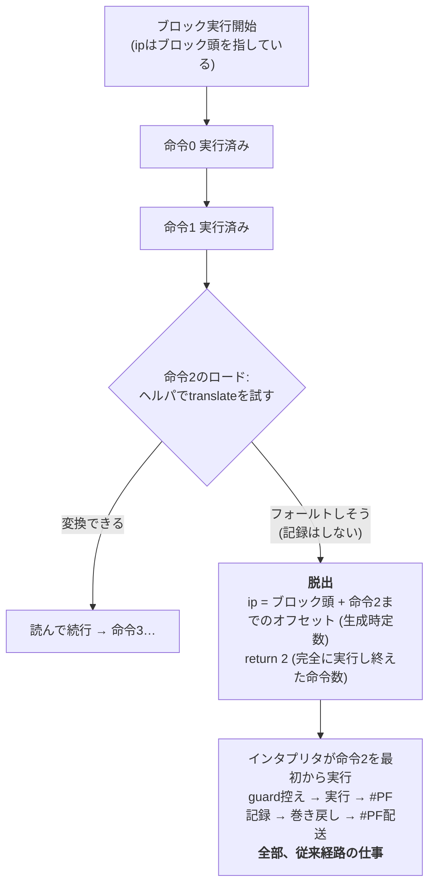

# JITの考え方と仕組み — なぜAOTではないのか

rustx86のテンプレートJIT (F1、[ADR-0008](../adr/0008-template-jit.md)) が
**何をしているのか**と、**なぜ「事前に全部翻訳」(AOT) ではだめなのか**を図で辿る。

扱っている問い:

- インタプリタ・AOT・JITは何が違うのか (翻訳するタイミングの話)
- **なぜ速くなるのか** — インタプリタの1命令40サイクルの正体と、
  なぜ「JITだけが効く」と消去法で確定したのか
- なぜエミュレータはAOTできないのか (どこがコードか、実行するまで分からない)
- 「熱いブロックだけ焼く」は具体的にどう回っているのか
- 生成コードがフォールトしそうなとき、どう逃げるのか (F1bの脱出モデル)
- 「JITを入れても結果が1bitも変わらない」をどう証明しているのか
- それぞれの設計は**どの実測が決めたのか** (結果論の台帳)

## 1. 3つの実行方式 — 違いは「翻訳するタイミング」だけ

ゲストのx86機械語を、ホスト (ブラウザならwasm) が実行できる形にする方法は
3つある。**やる仕事は同じで、いつやるかが違う。**

| 方式 | 翻訳のタイミング | 例え |
|---|---|---|
| インタプリタ | 翻訳しない。毎回その場で意味を調べて実行 | 逐次通訳 — 1文ごとに訳す。同じ文が100回来ても100回訳す |
| AOT (Ahead-Of-Time) | **実行の前に**全部翻訳しておく | 翻訳書籍 — 出版前に全ページ訳し終える |
| JIT (Just-In-Time) | **実行しながら**、よく通る所だけ翻訳 | 同時通訳のメモ — 頻出フレーズだけ訳語を作り置きし、次からはメモを読む |



インタプリタの遅さの正体は、実行そのものではなく**毎回払う「意味を調べる」配管**
である。まずその解剖から。

## 2. なぜ速くなるのか — 1命令40サイクルの解剖

rustx86のインタプリタは (デコードキャッシュ込みで) 1命令あたり実測16〜36ns、
M1でおよそ**40サイクル**である。ゲストの `add eax,ebx` はホストなら1サイクルの
仕事なのに、なぜ40倍かかるのか。1命令が毎回通る道を並べるとこうなる。



### 結果論その1: 「どれか1つが重い」のではなかった

この配管、**個別に削る実験は全部失敗した** ([perf.md](../reference/perf.md)の台帳):

| 実験 | 何を削ろうとしたか | 結果 |
|---|---|---|
| B3 ペア融合 | ディスパッチの回数 (cmp+jccを1回に) | **+20〜28%悪化** |
| B5 ブロック配列化 | スロット照合 (頭1回に集約) | **+8%悪化** (x86ホストでも+4%) |
| C5 tick一括払い | 帳簿 (まとめ払い) | **+10%悪化** |
| D2 表サイズ調整 | キャッシュミス | 差なし |

M1のアウトオブオーダ実行と分岐予測は、照合も帳簿も**既に他の仕事の陰に
隠している**。だから個別に削っても壁時計は動かず、コードの形を崩した分
(分岐の追加・レジスタ圧) だけ悪化する。40サイクルの正体はどれか1項目ではなく、
**「命令ごとに毎回、汎用の配管を通ること」そのもの**だった。

これを消す方法は1つしかない — 配管を通らないコード、つまり
**その命令列専用のホストコードを作る**。JITが本命に昇格したのは思想ではなく
消去法である。裏付けもある: ループ展開した小さなステブは素で100 MIPS出る。
遅いのは「広く浅い」カーネル本体で、そこは配管の通行回数が支配している。

### 結果論その2: 固定費は事前に測って「回収可能」と確定させた

JITには翻訳の固定費がある。作り始める前にwasmバイト手組みのプローブ
(jit-probe.mjs) で測った:

| 費目 | M1実測 | 意味 |
|---|---|---|
| 生成 (バイト組み立て) | 13µs/ブロック | 一度きり |
| instantiate | 6.3µs/ブロック | 一度きり。恐れていた「instantiate地獄」は無かった |
| **呼び出し+実行** | **7ns/回 ≒ 1ns/uop** | 毎回。**インタプリタの16〜36ns/命令の1桁下** |

固定費 ~20µs は、1回の実行で 100〜300ns 浮くのだから**百数十回の実行で元が取れる**。
ホットなブロックは数百万回走る — だから「熱いブロックだけ焼く」で収支が成立する。
逆に言えば、1〜2回しか走らないコードを焼くのは純損で、これが
閾値 (1024回) と「熱い所だけ」の理由である。もしこのプローブで回収不能と出ていたら
撤退する約束だった (退路はインタプリタ — 常に動く)。

### 結果論その3: それでも現在ワッシュな理由 — 消した配管の代わりに払っている税

理屈は1桁速いのに、実測はまだ損益分岐前後である。各増分の実測が
「どこに税が残っているか」を1つずつ暴いてきた:

| 段階 | 実測 | 暴かれた税 | 対処 |
|---|---|---|---|
| F1a 素朴版 | **-4〜6%の赤字** | ブロック呼び出しごとの**JS境界の往復** + 毎ブロック頭の**hashmap照合** | call_indirect化 (#57) + Entryへの畳み込み (#58) → 損益分岐へ |
| F1b-1 ロード | **ワッシュ** | メモリアクセスごとの**ヘルパ呼び出し** (lin+TLB+読みをRustに委譲している税) | 次の梃子: TLBヒット経路のインライン生成 |

パターンが見えている: **速くする話は全部「何かを消す」話で、消した配管の
代わりに別の税を払っていないかを交互A/Bが毎回暴く**。理論値 (1ns/uop) との
差分がそのまま残タスク一覧になっている — 回収余地が1桁あることはプローブが
保証しているので、税を消す作業を増分で続けるのが現在地である。

**では、速いと分かっているなら、なぜ最初から全部翻訳 (AOT) しないのか。**

## 3. なぜエミュレータはAOTできないのか

コンパイラ (RustやCの) がAOTできるのは、**入力がソースコード**だからである。
関数の境界も、どこがコードでどこがデータかも、言語が保証してくれる。
エミュレータの入力は**メモリに置かれた生のバイト列**で、その保証が全部無い。

### 理由1: どこがコードか、実行するまで分からない

x86の機械語は可変長で、区切り記号が無い。**同じバイト列でも、読み始める位置が
1バイトずれると全く別の命令列にデコードされる。**さらに `jmp eax` (行き先が
レジスタの中身) のような間接分岐は、実行時の値が決まるまで行き先が分からない。



AOTするには「プログラム中の全コード」を列挙し切る必要があるが、間接分岐の
行き先を全て静的に知ることは一般には不可能である (実行してみるしかない)。
中途半端に推測して翻訳すると、データを命令として翻訳したり、命令の途中から
翻訳したりする。

### 理由2: コードは実行中に生まれ、書き換わる

エミュレートしているのは**機械**であって、1本のプログラムではない。

- OSはディスクからプログラムを**実行中に**メモリへロードする — AOTの時点では存在すらしない
- Linuxは起動中に自分のコードを書き換える (alternatives / jump label)。DOSのゲームも平気で自己書き換えする
- ページングが有効なら、**同じ線形アドレスの指す物理メモリが実行中に差し替わる** — 「アドレスXのコード」という概念自体が実行時の状態

つまりAOTが前提とする「翻訳対象が実行前に確定している」が、エミュレータでは
根本的に成立しない。**JITとは、この現実への答えである: 静的に予言するのを諦め、
「実行が教えてくれた事実」だけを翻訳する。**実際に実行された場所はコードだと
確定しているし、実際に熱い場所は翻訳の元が取れると確定している。

なお、エミュレータ以外の世界でも同じ構図がある。V8 (JavaScript) やJVMがJITなのも、
動的な言語では「実行してみないと型も呼び先も分からない」からで、
「入力の正体が実行時に決まるものはJITになる」と覚えると早い。

## 4. rustx86の3段の階段 — それぞれが下の段に落ちられる

rustx86の実行系は3段になっていて、上の段ほど速いが語彙が狭い。
**どの段も、扱えないものは1つ下の段に落とすだけで正しく動く** — この退路が
「JITを少しずつ育てる」開発を可能にしている。



大事なのは、**意味論の原本が1段目にしか無い**ことである。2段目も3段目も、
フラグ計算や演算は1段目と同じヘルパ関数を呼ぶ (または同じ表現でデータを書く)。
速い写しを作っても意味の定義は複製しない — 正しさの証明が
「原本と突き合わせる」だけで済むのはこの規律のおかげである。

## 5. JITパイプライン — 発見・翻訳・据え付け・実行

「熱いブロックだけ焼く」は、具体的には4つの部品が回っている。



設計上のポイント:

- **熱は分岐の着地点でしか数えない。**毎命令数えるとホットループに計測コストが
  乗って本末転倒になる (B5/C5の実測教訓)。着地点=ブロック頭だけ数えれば、
  ループ1周につき1回で済む
- **生成コードの実行判定はEntry読みだけ。**「この番地に焼けたブロックがあるか」を
  hashmapで引くと毎ブロック頭に通行料が付く。デコードキャッシュのEntryに
  スロット番号を畳み込んだので、通常のキャッシュ照合のついでに判定が終わる
- **1ブロック=1wasmモジュールの個別焼きで成立する。**事前プローブで
  instantiateが6.3µs/ブロックと知れたため。ホットブロックは数百万回走るので
  数百回の実行で元が取れる

## 6. 生成コードの中身 — テンプレート方式

レジスタ割り付けも最適化もしない。**uopごとに手書きのコード断片 (テンプレート) を
並べて継ぐだけ**である。QEMUのTCG以前からある古典で、実装量と回収の釣り合いがよい。

たとえばこのx86ループが熱くなると:

```asm
loop:
    mov  edx, [eax]      ; メモリロード (F1bで語彙入り)
    add  edx, ebx
    sub  ecx, 1
    jne  loop
```

こういう形のwasm関数が生成される (擬似コード):

```text
func b() -> i32:                      ; 返り値 = 実行し終えた命令数
    ;; mov edx,[eax] — ロードはRustヘルパ経由
    v = call ld32(machine, DS, load(regs+0))   ; lin変換+TLB+読みはRust側
    if (v >> 32) != 0:                ; フォールトしそうという合図
        store(ip, load(ip) + 0)       ; ip = ブロック頭 + 0 (この命令の頭)
        return 0                      ; 0命令実行済み → 後はインタプリタが裁く
    store(regs+8, wrap(v))            ; edx = 読めた値

    ;; add edx,ebx — フラグは計算せず「材料」だけ書く (lazy flags)
    a = load(regs+8); b = load(regs+12)
    r = a + b
    store(cc_op, ADD); store(cc_a, a); store(cc_b, b); store(cc_r, r)
    store(regs+8, r)

    ;; sub ecx,1 — 同上
    ...

    ;; jne loop — 条件はRustヘルパに聞く (遅延フラグの評価器を二重実装しない)
    taken = call cond(machine, NZ)
    store(ip, load(ip) + select(taken, len+rel, len))
    return 4                          ; 4命令やり切った
```

読みどころが3つある。

**その1: レジスタは「メモリ上の実アドレス直打ち」。**wasmの生成コードは
メインモジュールと同じリニアメモリをimportしていて、`regs[2]` の実アドレスを
生成時に定数として焼き込む。Rust側の`Machine`と生成コードが同じ場所を
読み書きするので、**ブロックの途中のどこでインタプリタに戻っても状態が繋がる**。

**その2: フラグを計算しない。**C1 (lazy flags) で、インタプリタ自身が
「フラグは材料 (op, a, b, r) だけ控えて、読まれた時に合成する」方式になっている。
生成コードも同じ表現で材料を書くだけ — フラグ合成という一番複雑な意味論を
生成コードに持ち込まずに済み、しかも表現が同じだから境界での変換も要らない。

**その3: 難しい仕事はRustヘルパに委譲する。**メモリロードの
「セグメント適用→ページ変換→TLB→読み」も、条件コードの評価も、
インタプリタと同じ関数を呼ぶ。wasm→wasmのimport呼び出しは安い
(JS境界とは別物)。速さのためにここをインライン展開するのは、
測ってワッシュと出てから検討する次の梃子である ([perf.md](../reference/perf.md))。

## 7. フォールト脱出 — 巻き戻しを作らないための設計 (F1b)

メモリに触る命令の何が怖いかというと、**ページフォールト (#PF)** である。
実CPUの約束は「フォールトした命令は何も起きなかったことになる」— つまり
命令の途中で失敗したら、レジスタもフラグも命令前の姿に巻き戻さないといけない。
生成コードに巻き戻し機構を持ち込むと一気に複雑になる。

F1bの答えは**巻き戻さない。失敗しそうなら、失敗する前に逃げる**である。



この形が成立する理由は、**脱出が「現命令の状態を1つも変える前」に起きる**からである。
ロードは命令の先頭の仕事なので、そこで逃げればレジスタもフラグもメモリも無傷 —
巻き戻すものが無い。あとはインタプリタがその命令を白紙からやり直し、
#PFの記録も配送も従来経路がやる。

もう1つ効いているのが**「脱出は保守的でよい」という非対称**である。
本当はフォールトしない場面で余計に脱出しても、インタプリタがやり直して
同じ結果になる — 遅くなるだけで意味は変わらない。逆 (フォールトを見逃して実行)
だけが許されない。おかげでページ跨ぎロードのような稀で面倒な形は、
判定を作り込まず無条件脱出に倒せる。

## 8. 「1bitも変わらない」の証明 — JITの審判たち

JITの怖さは「だいたい合っている」状態である。速くなったが挙動が微妙に違う、
では最適化ではなく別のマシンになってしまう。rustx86では**JIT on/offで
命令数もシリアル出力もビット同一**を機械で証明し続けている。

| 審判 | 何を比べるか | いつ回るか |
|---|---|---|
| cosim | ランダム命令をUnicorn (実CPU相当) と1命令ずつ | 毎PR (CI) |
| OS起動回帰 | 3OSがプロンプト到達+決定的命令数 | 毎PR (CI) |
| jit-check | JIT on/off でシェル到達までの命令数+シリアル全文 | 毎PR (CI) |
| jit-lockstep | interp/JITを並走させ**スナップショット全体 (CPU+装置+RAM) をバイト比較**。決定性を利用した二分探索で食い違いを数百命令まで絞る | 手元 (重いので任意) |

実際、jit-checkをすり抜けた食い違いをjit-lockstepが捕まえたことがある。
JITの時計清算がページ跨ぎの着地で1命令ぶん多く払っていて (F1aから潜伏)、
シリアルにはµs未満でしか現れなかったが、スナップショット比較は
「同一tscでJIT側だけipが1命令手前」というsignatureで一発で示した ([PR #60](https://github.com/yoshiharu-ishii/rustx86/pull/60))。
**決定性は、それ自体が最強のデバッガである** — 同じ入力なら全状態が毎回同じだから、
二分探索が成立する。

### 8b. なぜ4つ目のバックエンドは一発でビット同一だったのか (F1d-a、2026-08-16)

F1d-a (dynasmrt/AArch64の手書きエミッタ) は、初回の起動でJIT on/offの
命令数 (970,000,000) もシリアルFNVも完全一致した。wasm生成器 (F1a) が
ここに到達するまで何度も審判に叩かれたのと対照的である。**運ではない —
過去に買ったバグが全部「契約」に変換されていて、新しいバックエンドは
同じ失敗を踏み直せない構造でスタートした**からである。決定性の源を分解する:

1. **意味論の原本は1つ、という規律が「食い違える場所」を消している。**
   生成コードがやるのはオペランドの運搬と遅延フラグの材料 (cc_*) のストア
   だけで、フラグの評価・CF入力・条件判定・シフトは**インタプリタと同じ
   Rust関数**を呼ぶ。バックエンドが壊せるのは配線だけで、配線ミスは
   指紋が初回に必ず検出する — 「だいたい合っている」状態が存在できない
2. **時計と割り込み受付点の契約が数式になっている。**
   入場予算 = min(チェーン残り+1, tick_countdown) — この1行が「ブロック内で
   tickが起きない ⇒ 割り込みの材料が湧かない ⇒ 受付点は毎命令実行と同一」を
   構成的に保証する。テストで確かめる性質ではなく、成り立つように作る性質
3. **清算の事故は教訓が契約文で残っていた。** 「先頭命令は外側が前払い済み、
   n-1を払う。着地の時計は払わない」— これはF1a時代の時計過払い
   (tscが実行列より先行し、printk時刻のµsずれとしてjit-lockstepが特定した
   [PR #60](https://github.com/yoshiharu-ishii/rustx86/pull/60)) の**death certificateそのもの**で、
   F1dはこの文面を写しただけで同じバグ類を最初から持てない
4. **ipの更新はブロック出口で1回。** 中間状態が存在しないので、
   途中で何が起きても (ヘルパ呼び・観測) ipの食い違いようがない
5. **開幕の語彙を#PF不能なレジスタ形に絞った** (F1aと同じ開き方)。
   フォールト脱出・巻き戻しという最大の非決定性源を骨格から締め出し、
   決定性の証明を「時計の清算だけ」に縮めてから語彙を広げる
6. **機械そのものが決定的。** TSC=命令数、装置はtick駆動、壁時計も乱数も
   無い。だからバックエンドの責務は「同じ命令列を同じ副作用で実行する」
   ことだけに縮んでいる — 残り全部は機械側が保証済み

まとめると、F1a→F1b→F1cの3世代で買った失敗 (JS境界の税・時計過払い・
リンク税) は、それぞれ**設計契約・doc・台帳**として残された。決定性が
「改善」したのではなく、**失敗の知識が複利で効く形に貯金されていた** —
これがこのリポジトリで検証網を先に建てる理由の、いちばん短い実例である。

なお逆向きの教訓も1つ踏んだ: F1c時代のjit.rsには「素の線形ストアは世代
(page_gen) を進めない」という当時のcoreの事実が焼き付いていたが、
その後の正しさ修正 (ADR-0020) で**core側の前提が変わった**。docに
「その日が来たらn+1脱出の受けを足せ」と書き残されていたから気づけた —
契約は書いた瞬間から腐り始めるので、**前提を変えた者が写しを直す**
(今回はdoc更新で返済し、ストア語彙の解禁条件として明記した)。

### 8c. 指紋が3日緑でも見えなかった穴 — 門番はコースの数だけ強くなる

F1d-e (2026-08-17) で、上の枠組みの限界も1つ踏んだので対にして残す。
gcc課程の定規 (jcmd — ディスク起動+コンパイルのコマンド窓を指紋化) を
作ってJIT on/offを比べた初回、on側が**virtio記述子域の破壊→完了割り込み
喪失→デッドハルト**で死んだ。正体は正しさの穴:

- 自己書き換え/DMA上書きの検出は「コードを控えたページ (page_has_code) への
  書き込みだけ世代を進める」仕掛けだが、**この印はインタプリタのfillしか
  立てていなかった**。JITだけが実行するページは検出網の外
- ブート課程では混合実行 (同じページをインタプリタも踏む) が偶然印を立てて
  守っていた — だから **jbootの指紋がビット同一のまま3日通っても見えなかった**
- 修正は「bakeもfillと同じ義務を負う」の1行 ([`jit::mark_code_page`])。
  再発防止テストは**全opがJIT語彙のSMCループ** (jit-a64/tests/smc_jit.rs)。
  8bitストア版だと語彙外でインタプリタに落ち、fillがページを守って
  **偽緑**になる — 罠ごとテストのコメントに固定した

教訓: §8bの「決定性は設計の産物」は正しいが、**指紋の緑はそのコースが
踏んだ経路の証明でしかない**。写し (キャッシュ・JITブロック) を持つ機構を
足すたびに問うべきは「この写しを腐らせる書き込みは、**誰が**検出の印を
立てるのか」— fill・bake・DMA、経路が増えるたびに義務の一覧を数え直す。
コースを増やす (ブート+定常WL) のは、その数え漏れを機械が見つけるための投資である。

## 9. なぜこの形なのか — 実測が決めた設計の台帳 (結果論)

このJITの設計判断は、思想ではなくほぼ全部**実測が決めた**。
「べき論」と「決め手になった数字」を並べておく — 前提が変われば
数字ごと再訪するため ([perf.md](../reference/perf.md)の流儀)。

| 設計判断 (べき論) | 決め手になった実測 (結果論) |
|---|---|
| そもそもJITに踏み切る**べき** | B3/B5/C5/D2が全滅 (+8〜28%悪化か差なし)。インタプリタ構造内の再配置では40サイクルに届かないと確定した消去法 |
| 作る前に固定費を測る**べき** | jit-probe: 生成13µs+据え付け6.3µs+呼び出し1ns/uop — 「百数十回で回収」と確定してから骨格に着手。回収不能なら撤退の約束だった |
| 熱は分岐の着地点だけで数える**べき** | B5/C5の教訓 — ホットループへ毎命令の計測を足すと、計測自体が最適化を食う |
| 正しさの証明を速度より先にやる**べき** (案A: 毎命令の受付点維持) | 命令数決定性という回帰の柱を崩さずにF1aを証明できた。おかげでF1bの時計過払いバグも「命令数がずれた」として機械が検出した |
| 意味論の原本は1つにする**べき** | フラグ・演算・変換をヘルパ共有にしたので、生成コードの正しさが「原本と突き合わせる」だけで証明できる。jit-lockstepが時計過払いを一発特定できたのもこの規律の配当 |
| JS境界を通さない**べき** | F1a素朴版の-4〜6%赤字の正体がJSトランポリンの往復だった。call_indirect化 (#57) とEntry畳み込み (#58) で損益分岐へ |
| ロードはまずヘルパ経由で組む**べき** (インライン化は測ってから) | F1b-1の交互A/B = ワッシュ。「ヘルパ税がブロック大型化と相殺」という答えが出たので、次の梃子 (TLBインライン) に進む根拠になった。先にインライン化していたら、何が効いたのか分からなくなる |
| 判定は単発ではなく交互A/Bでやる**べき** | M1は熱ダレで同じバイナリが数分で12.5s〜14.2sぶれる (F1b-1の実測表がそのまま証拠)。単発の速さは運 |

台帳を貫くパターン: **1増分=1変数**で入れて交互A/Bで測ると、失敗した実験さえ
「どこに税が残っているか」を教える教材になる。B3/B5/C5の全滅が無ければ
JITへの昇格判断は勘だったし、F1aの赤字が無ければJS境界の税は見えなかった。

## 10. AOTとの違い、まとめ

| | AOT | rustx86のJIT |
|---|---|---|
| 翻訳の対象 | 全コード (のつもり) | **実際に実行されて熱かった**ブロックだけ |
| コードの発見 | 静的解析 (間接分岐で破綻) | 実行そのもの (実行された場所=コードで確定) |
| 自己書き換え | 前提が崩壊する | ページ世代 (page_gen) で検出し、古いブロックを捨てるだけ |
| 失敗時 | 逃げ場が無い | インタプリタに落ちる (退路が常にある) |
| 翻訳の品質 | 時間をかけて最適化できる | テンプレート並べるだけ (それでも配管の除去で1桁速い) |

一言でいえば: **AOTは「未来を予言してから走る」、JITは「走った過去だけを信じる」。**
エミュレータの入力 (生のメモリ+実行時に変わる機械の状態) には後者しか成立しない。

## 11. これからの続き (F1ロードマップの現在地 — 2026-08-16 引き直し)

- **済**: F1a 骨格 (レジスタ間のみ・3ISAでビット同一・call_indirect化・Entry畳み込み)
- **済**: F1b-1〜3 メモリロード/ストア/スタック形 (フォールト脱出モデル。
  wasmバックエンドは凍結 — [ADR-0008](../adr/0008-template-jit.md))
- **済→凍結**: F1c Craneliftネイティブ (関門〜予算退出まで完成したが
  **リンク税+25%**で絶対速度が負け — [ADR-0013](../adr/0013-f1c-freeze.md)。実装は `f1c-final` タグ)
- **現在地**: **F1d 税なしテンプレートJIT** ([ADR-0022](../adr/0022-cpu-round3-before-gfx.md))。
  a: 骨格 (レジスタ語彙、ビット同一一発、受け口はチェーン入口のみ) →
  b: ロード語彙+taken分岐着地の再プローブ (カバレッジ2.2→23.6%。HashMap
  プローブ税+1.9sとOOM即死の授業料は台帳) →
  **c: ストア/スタック語彙+n+1脱出の履行** — ストア/push後に自ページ世代を
  照合し、動いていたらそのopまで実行済み (i+1) で脱出 (§8bの「腐った前提」
  の返済が実装になった)。x19=Machine掴み置き・Jcc両側焼きで
  カバレッジ34%・平均ブロック5.5命令・赤字+11%まで接近 →
  d: TLBヒット路のインライン生成 → e: 定常WL定規jcmd (fill-bake義務の
  正しさ穴を一撃で暴いた — §8c) →
  **f: 8bit語彙+損益のローリング再審** — cc1の主食 (8bit ALU/mov/store) を
  エミッタに実装。reg8はバイト番地の直アクセス、cc_rは幅でマスクして材料を
  ビット同一に。ブロックごとに入場/実行命令数を数え、256入場ごとに平均<3命令
  なら負の印へ降格 (入場税が勝つブロックはインタプリタに返す)。
  ブート互角・gcc窓-15% (main比で赤字半減)。
  残る赤字の正体は毎opロード/ストア+cc6ストアの実行密度 →
  **g: 密度の2梃子** ([ADR-0023](../adr/0023-f1d-g-density.md)) —
  cc死储の省略 (次opが上書きするなら材料6ストアを書かない) と条件判定の
  インライン化 (材料がホストレジスタに生きている間に adds/cmp+cset —
  h_cond呼びが消える)。写像は意味論の二重実装に半歩踏み込むので、守りは
  **全数照合** (tests/cond_inline.rs — ADDのキャリー極性が逆という即死級の
  写し間違いを一発で暴いた)。jboot -14% (119 MIPS)・gcc窓-2.3%・
  **起動込み全体ではJITが最速**になった。
  次の梃子はゲストレジスタのホストレジスタ常駐化 (ヘルパ境界のflush規律が
  要る大工事 — ADR-0023で保留、台帳を見て裁く)
- **その先**: ブロック粒度実行 (案B再訪 — icount式切り直しで命令数決定性を
  保ったままdead-flags等を解禁)。wasmバックエンド解凍は前倒し済み (PR #180 —
  ブラウザからJIT on/offを切替可)
