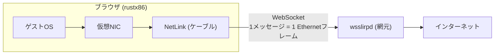

# ネットワーク — ブラウザの中のPCがインターネットに出るまで

ブラウザのWASMは生のソケットを持てない。それでも中のゲストOSは
本物のインターネットに出られる — フレームを外へ運ぶ**ケーブル**と、
その先でNATしてくれる**網元**があればよい。



- **境界プロトコルはこれだけ**: 1 WebSocketバイナリメッセージ = 1 Ethernetフレーム
- 網元は [wsslirp](https://github.com/yoshiharu-ishii/wsslirp) (Go)。gVisor netstackで
  ゲストのTCP/UDPを終端し、本物のソケットで外へ出る。DHCP・DNS・外向きICMPも
  こちらの仕事。QEMUの `-netdev user` を独立デーモンにしたものと思えば正確
- 決定性は壊れない: coreはフレームの出入り口しか持たず、時計もソケットも
  知らない。**NICを挿さない起動は今までどおりビット同一** (ADR-0017)

## ゲストごとのNIC — 時代が違えばバスも違う

「1台のPC」に挿さるカードは1枚でも、**どのバスのカードが見えるかはOSの時代で決まる**。

| ゲスト | NIC | バス | ドライバ | 状態 |
|---|---|---|---|---|
| FreeDOS | NE2000 | ISA (0x300, IRQ3) | Crynwr NE2000.COM + mTCP | ✅ `PING 1.1.1.1` 実証済み |
| ELKS | NE2000 | ISA (0x300, IRQ3) | カーネルne0 + ktcp | ✅ `urlget` でHTML取得実証済み |
| Linux (lts) | RTL8029 (予定) | **PCI** | `ne2k-pci` モジュール | 🚧 ADR-0017 5c。ltsカーネルはISAを知らないため |

RTL8029は「PCIに載ったNE2000」なので、8390コアは同じものを使い回す。
ISA→PCIの順で作るのは歴史の順そのものである
([ADR-0017](../adr/0017-network-isa-first.md))。

## 使い方

1. 網元を立てる (どこか1つのターミナルで):

   ```
   go run ./cmd/wsslirpd -listen 127.0.0.1:8087 -token dev
   ```

2. ツールバーの**LANポート**を押し、トークンを入れて **Connect**。
   灯りの意味は実機のリンクランプと同じ:

   | 灯り | 表示 | 意味 |
   |---|---|---|
   | 灰 | Network:Disable | 繋いでいない (既定。故障ではない) |
   | 黄 (瞬き) | Network:Connecting | 接続を試している |
   | 緑 | Network:Connect | 網元と繋がった |
   | 赤 | Network:Disconnect | 繋がらない / 切れた |

   **緑はケーブルのリンクであって、ゲストが使えているかとは別物** —
   これも実機のランプと同じ。機械を1台も起動していなくても、
   スイッチが生きていれば緑に点く。

3. 機械を起動する。**NICが挿さるのは電源ONの瞬間だけ**なので、
   走行中に繋いだ場合は「再起動」で挿し直す (ELKSのカーネルは起動時にしか
   装置を探さない。実機にホットプラグが無いのと同じ)。

4. ゲストの中から:
   - **FreeDOS**: ドライバ常駐〜DHCPまで自動で流れる。あとは `PING 1.1.1.1`
   - **ELKS**: `net=ne0` 済みなので起動時にktcpまで自動で上がる。
     `urlget http://example.com/` で本物のHTMLが返る (pingコマンドはELKSに無い。
     telnetd/ftpdも動いているので、逆に**ゲストへ**入ることもできる)

## 自動化・E2E向け: ?net= パラメータ

URLに `?net=1` を付けると既定の網元 (`ws://127.0.0.1:8087/net`) へ、
`?net=<wsのURL>` で任意の網元へ、ページを開いた瞬間に繋ぐ。
`&nettoken=<トークン>` も付けられる。**?net= があるとダイアログの設定より
そちらが勝つ** (E2Eの再現性のため)。ヘッドレスのE2Eは
`tools/webtest/netping.mjs` を参照。

## 台帳

- PCI + RTL8029 (Linux対応) — ADR-0017 5c、次の実装
- e1000 / rtl8139 — ReactOS・DOSの要求が来たら同じPCIバスへ
- virtio-net — microVM段 (Tier 8) で自前カーネルとセットで再訪
