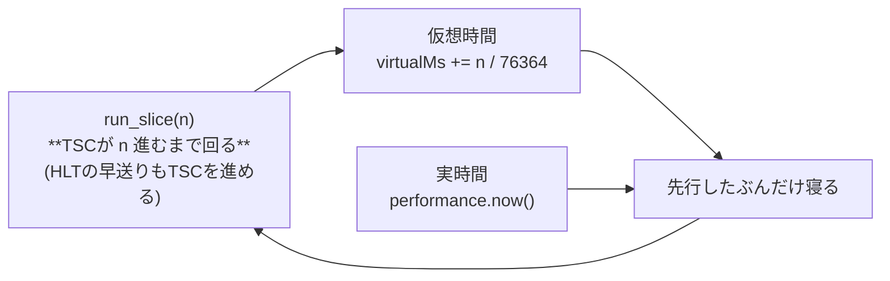

# ネットワーク — ブラウザの中のPCがインターネットに出るまで

ブラウザのWASMは生のソケットを持てない。それでも中のゲストOSは
本物のインターネットに出られる — フレームを外へ運ぶ**ケーブル**と、
その先でNATしてくれる**SLiRP backend**があればよい。

SLiRP backend というのは QEMU の `-netdev user`(通称 SLiRP)と同じ役の
プロセスのこと。**ゲストのEthernetフレームを受け取り、ユーザー権限のまま
TCP/UDPを終端して本物のソケットで外へ出す**。root も TAP も要らない代わりに、
ゲストは NAT の内側に居ることになる。


- **境界プロトコルはこれだけ**: 1 WebSocketバイナリメッセージ = 1 Ethernetフレーム
- SLiRP backendは [wsslirp](https://github.com/yoshiharu-ishii/wsslirp) (Go)。gVisor netstackで
  ゲストのTCP/UDPを終端し、本物のソケットで外へ出る。DHCP・DNS・外向きICMPも
  こちらの仕事。QEMUの `-netdev user` を独立デーモンにしたものと思えば正確
- 決定性は壊れない: coreはフレームの出入り口しか持たず、時計もソケットも
  知らない。**NICを挿さない起動は今までどおりビット同一** (ADR-0017)

## ゲストごとのNIC — 時代が違えばバスも違う

「1台のPC」に挿さるカードは1枚でも、**どのバスのカードが見えるかはOSの時代で決まる**。

| ゲスト | NIC | バス | ドライバ | 状態 |
|---|---|---|---|---|
| FreeDOS | NE2000 | ISA (0x300, IRQ3) | Crynwr NE2000.COM + mTCP | ✅ `PING 1.1.1.1` |
| ELKS | NE2000 | ISA (0x300, IRQ3) | カーネルne0 + ktcp | ✅ `urlget` でHTML取得 |
| Linux (lts) | RTL8029AS | **PCI** (10EC:8029) | `ne2k-pci` モジュール | ✅ DHCP → ping → `wget https://` |

挿さるNICは**そのOSが知っているバス**で決まる。画面のNIC欄も機械に合わせて変わる。
RTL8029は「PCIに載ったNE2000」なので、**8390コアは同じものを使い回す** —
実装は [`isa::ne2000`](../../core/src/dev/isa/ne2000.rs) 1つで、
[`pci::rtl8029`](../../core/src/dev/pci/rtl8029.rs) は設定空間の顔を着せるだけである。
実物のRTL8029ASもNE2000互換を売りにした廉価チップで、Linuxのドライバも
コアの `lib8390.c` を共有している。**皮だけ替わるのが正しい姿**で、
ISA→PCIの順で作るのは歴史の順そのものでもある
([ADR-0017](../adr/0017-network-isa-first.md))。

唯一実体に響くのがPROM (MACが書いてある領域) の並べ方で、ISAの8bit経路では
各バイトが2度ずつ並ぶのに対し、PCI版は連続バイトで読む。倍幅のまま渡すと
`52:54:00:…` が `52:52:54:…` に化ける (実際に化けた)。

**機械の世代がバスを決める。** フロッピーから起動する機械 ([`pc_floppy`]) は
PCIを積まない — 積むと `net_attach` がPCIスロット側へ挿してISAの0x300窓が閉じ、
**16bitのゲストからNICが消える** (2026-08-14に実際に消えた。pitfalls 12)。

[`pc_floppy`]: ../../core/src/lib.rs

## ゲストの時計を実時間に繋ぎ止める (轡)

ネットワークで一番厄介なのは装置ではなく**時間**だった。ゲストの「1秒に1回」は
実時間の1秒でなければならない。ずれると、その差がそのまま**本物のインターネットへの
パケットの量**になって出る。

エミュレータの時間は命令数で進む。しかもアイドル (HLT) の早送りがあるので、
暇なゲストの仮想時間は一瞬で溶ける。放っておくと ping が毎秒数百発になる。



契約を1行で言うと **「予算 = TSCの進み」** である。ここを外すと両方向に転ぶ。

| 事故 | 何をした | 結果 |
|---|---|---|
| 2026-08-14 | 早送りが予算を飛び越えた / 借りを50msで打ち切った | ゲストの1秒が実時間の数十ms → **pingが毎秒数百発** |
| 2026-08-15 | 予算に含まれる早送りを、外からもう一度足した | ゲストの1秒が実時間2秒 → **`sleep 5` が10秒** |

どちらも「時間を配る側と使う側で、どちらが早送りを勘定するか」が曖昧だったのが
原因である (pitfalls 7 / 7b)。**契約を守るなら、外から足すものは何も無い。**

## TLS — https が通るのに要るもの

`wget https://` はゲストの中で完結しない。CPU・時計・ファイルの3方向に前提がある。

| 要るもの | なぜ | 無いとどうなる |
|---|---|---|
| **MMX / SSE2の語彙** | libcryptoはCPUIDのMMXビットを見ずに `movq mm` を踏む。SSE2を名乗った石はMMXも来る | `#UD` で `ssl_client` が即死 |
| **RTCの実時刻** | 証明書の有効期間の検証 | `certificate verify failed` |
| **ssl_client + libssl/libcrypto** | busyboxのwgetはTLSを外部ヘルパに投げる | `ssl_client: not found` |
| **CA束と、その置き場所** | OpenSSLの既定は `/etc/ssl/cert.pem` (OPENSSLDIR直下) | 時計を直しても `certificate verify failed` のまま |

RTCだけは設計上の緊張があった。**coreは意図的に時計を読まない** (決定性が壊れ、
`std::time::Instant` はwasm32に無い)。折り合いはMACアドレスと同じ**入力**にすることで、
[`Machine::set_rtc_unix`](../../core/src/lib.rs) を電源投入時にホストが呼ぶ。
呼ばなければ従来どおり固定時刻なので、**CIの決定性は保たれる**。

TLS一式の同梱でinitramfsは 1.4MB → 4.1MB、起動は 580M → 770M命令になった。
これは意味の後退ではなく**積んだ荷物の重さ**なので、起動回帰の上限も引き直してある。

## 使い方

1. SLiRP backendを立てる (どこか1つのターミナルで):

   ```
   go run ./cmd/wsslirpd -listen 127.0.0.1:8087 -token dev
   ```

2. ページを開く。**既定でケーブルは挿さっている** — 机の裏で
   LANケーブルが刺さっているのが普通の姿で、使うたびに挿し直す理由がない。
   繋ぎ先を変えるときだけ NIC の「設定…」から。灯りの意味は実機のリンクランプと同じ:

   | 灯り | 表示 | 意味 |
   |---|---|---|
   | 灰 | Network:Disable | 繋いでいない (`?net=off` か、自分で切ったとき) |
   | 黄 (瞬き) | Network:Connecting | 接続を試している |
   | 緑 | Network:Connect | SLiRP backendと繋がった |
   | 赤 | Network:Disconnect | 繋がらない / 切れた |

   **緑はケーブルのリンクであって、ゲストが使えているかとは別物** —
   これも実機のランプと同じ。機械の電源を切っても、スイッチが生きていれば
   緑のまま点いている。

3. 機械を起動する。**NICが挿さるのは電源ONの瞬間だけ**なので、
   走行中に繋いだ場合は「再起動」で挿し直す (ELKSのカーネルは起動時にしか
   装置を探さない。実機にホットプラグが無いのと同じ)。

4. ゲストの中から:
   - **FreeDOS**: ドライバ常駐〜DHCPまで自動で流れる。あとは `PING 1.1.1.1`
   - **ELKS**: `net=ne0` 済みなので起動時にktcpまで自動で上がる。
     `urlget http://example.com/` で本物のHTMLが返る (pingコマンドはELKSに無い。
     telnetd/ftpdも動いているので、逆に**ゲストへ**入ることもできる)
   - **Linux**: initが `udhcpc` を裏で回すので、シェルが出た時点で
     `10.0.2.15` が付いている。`ping 1.1.1.1` も `wget https://…` もそのまま通る

## 自動化・E2E向け: ?net= パラメータ

**`?net=off` で挿さずに起動できる** (NIC無しの姿を見たいとき)。
URLに `?net=1` を付けると既定のSLiRP backend (`ws://127.0.0.1:8087/net`) へ、
`?net=<wsのURL>` で任意のSLiRP backendへ、ページを開いた瞬間に繋ぐ。
`&nettoken=<トークン>` も付けられる。**?net= があるとダイアログの設定より
そちらが勝つ** (E2Eの再現性のため)。ヘッドレスのE2Eは
`tools/webtest/netping.mjs` を参照。

## CIはネットワークを見張る — ただし外には出ない

毎pushで「16bitと32bitの両方が線に出るか」を検査している
(CIの「4 機能層 — ネットワーク」)。ただし**本物のインターネットへは出ない**。
出ると3つの意味で弱いからである: 相手のサイトが落ちればこちらが赤くなる、
ICMPには権限が要る、他人のサーバーに毎push負荷をかける。

そこで宛先を内側に畳む。**ゲストが通る道は1バイトも変わらない。**

| 検査 | 宛先 | 誰が答えるか |
|---|---|---|
| ICMP | `10.0.2.2` | SLiRPのゲートウェイ = wsslirpのnetstackが自分で答える |
| HTTP | `http://<ホストの実IP>:8199/` | ジョブが立てた自分のサーバ (wsslirpdは `-allow-private` で建てる) |

`127.0.0.1` を宛先にはできない — ゲストにとってそれは自分自身で、線にすら出ない。
wsslirpdは受け取った宛先IPへそのままdialするので、ホストの実アドレスを渡す。

見張れるのは「NICが見えるか・DHCPが通るか・ICMPが往復するか・TCPが流れるか・
**ゲストの時計が実時間か**」。手順は `tools/webtest/net-e2e.sh` が持っていて、
立てて回して**必ず片づける** (残骸のデーモンは古いバイナリで偽のバグを生む)。

**TLSだけはここで見張れない。** 閉じた世界に信頼できる証明書は置けないからで、
自己署名を足せばCA束が本番と別物になり検証の意味が変わる。
実インターネット向けの手動E2E (`netlinux.mjs` を既定の宛先で走らせる) が唯一の番人である。
**自動で見張れていない穴として明記しておく** ([ci.md](../reference/ci.md))。

## 台帳

- **Tier 5d 本測定** — TCP over TCP の破綻、MTUの押し出し、レイテンシの内訳。
  WebSocket (TCP) の上にゲストのTCPを流しているので、病理が出るはずである。
  ゲストがLinuxのフルスタックなので最初から本気の道具で測れる
- e1000 / rtl8139 — ReactOS・DOSの要求が来たら同じPCIバスへ
- virtio-net — microVM段 (Tier 8) で自前カーネルとセットで再訪
- IPv6・帯域制限・UDSトランスポート — wsslirp側の台帳 (必要になった実測時点で取り出す)
