# 踏んだ罠の型 — 一般的な実装が牙を剥いた記録

このプロジェクトで実際に踏んだ罠のうち、**rustx86固有ではなく他所でも踏み得る型**を
集めた。各項は「型 (守る規則) → 事件 (何が起きたか) → 検知 (どうやって捕まえたか)」。
教科書どおりに書いたのに罠だった、というものほど価値が高いので先頭に置く。

## 1. `setTimeout(0)` のループは4msずつ止まる (HTML仕様のクランプ)

**型**: ワーカーで計算ループを回すとき、`setTimeout(fn, 0)` での自己再予約は
「タイマのネストが5段を超えたら最低4ms」というHTML仕様のスロットリングに当たる。
イベントループに戻りたいだけなら **MessageChannel の port.postMessage** を使う
(クランプ無しのマクロタスク。他のメッセージも同じFIFOに並ぶので応答性は保たれる)。

```js
// NG: 「0ms後」のつもりが、ネスト5段目からは毎回4ms待たされる
function loop() {
  runSlice();           // ~8ms の計算
  setTimeout(loop, 0);  // ← 実質 setTimeout(loop, 4)。1/3が休憩になる
}
loop();

// OK: MessageChannel の自分宛メッセージはクランプ対象外のマクロタスク
const wake = new MessageChannel();
wake.port1.onmessage = () => loop();
function loop() {
  runSlice();
  wake.port2.postMessage(0);  // 隙間なく次へ。キー入力等も同じFIFOで割り込める
}
loop();
```

どちらもマクロタスク境界を挟むので「メッセージを捌く隙」は同じ。違いは
**待たされるかどうかだけ** — 差し替えは事実上1行で済む。

**事件**: Linuxワーカーが8msスライスごとに `setTimeout(loop, 0)` で再予約していた。
8ms働いて4ms強制休憩 = デューティ比67% — **ブラウザだけheadlessより×1.5遅い**
「タブ税」の正体がこの2文字 (`, 0`) だった。エラーも警告も出ず、CPUは忙しそうに
見え、プロファイラにはただの待機として写る。**完全に無音の税**である。

```mermaid
gantt
    dateFormat X
    axisFormat %Lms
    section 修正前 setTimeout(0)
    実行 8ms          :active, 0, 8
    クランプ待ち 4ms   :crit, 8, 12
    実行 8ms          :active, 12, 20
    クランプ待ち 4ms   :crit, 20, 24
    実行 8ms          :active, 24, 32
    section 修正後 MessageChannel
    実行 8ms          :done, 0, 8
    実行 8ms          :done, 8, 16
    実行 8ms          :done, 16, 24
    実行 8ms          :done, 24, 32
```



**検知**: headlessとブラウザの比率 (×1.5) が熱でもJITでも説明できず、ランナーの
スケジューリングを読み直して発覚。修正後の実測: ブラウザ vmlinux 21s→**15s**
(headless 14sとの差 = 残る税~7%)。PR #68。

## 2. 一括清算は、原本の支払い順序と同型にする

**型**: 「毎回払う」処理を「まとめて払う」に最適化するとき、**原本が払わない場面で
払っていないか**を確認する。前払いしてから中断すると二重払いになる。

**事件**: JITブロックの時計清算がn命令ぶん (=次命令の前払い込み) を払ってから
ページ跨ぎ判定でreturnしていた。インタプリタは跨ぎでは払わない — 跨ぎ着地のたびに
tscが+1先行し、ゲストのrdtscが実行列とずれた。F1aから潜んでいたが、printkの
µs解像度に届かず不可視。ブロックが倍増したF1bで±20µsの姿を現した。

**検知**: 決定性を利用した**スナップショット並走の二分探索** (下の型3)。
「同一tscでJIT側だけipが1命令手前」というsignatureが過払いを名指しした。PR #60。

## 3. ゲートの解像度を過信しない — 量子化された審判はµsの嘘を通す

**型**: 回帰ゲートには解像度がある。「ゲート緑」は「ゲートの目盛りより細かい嘘は
見えていない」と読む。決定的なシステムなら、**全状態のバイト比較**という
最強解像度の審判を安く作れる — 疑わしいときはそちらに昇格する。

**事件**: JIT決定性ゲート (命令数+シリアル全文) は、tsc過払い (型2) を
F1a期に通していた。ずれがシリアルに現れるのはprintkのµs粒度からで、
それ未満の嘘は素通りだった。

**検知**: interp/JITを並走させ、スナップショット全体 (CPU+装置+RAM) を
10M命令刻みでバイト比較→食い違えば新ペアで刻み1/100 — の二分探索
(tools/webtest/jit-lockstep.mjs として常設)。決定性はそれ自体が最強のデバッガである。

## 4. 「書き込みで検出」は配線を数える — ドキュメントは網を謳い、コードは繋がっていない

**型**: 「XはYで検出される」と設計文書が言うとき、**Yの呼び出し点を全部数える**。
経路が複数ある書き込み (単発store / REP / 物理直書き) の一部だけが網に
繋がっていることがある。

**事件**: dcacheの自己書き換え検出 (note_write) は「コードページへの書き込みで
世代が進む」と謳っていたが、実際に呼んでいたのはREP文字列と物理直書きだけで、
**素の線形ストア (write8/write_wide) は網の外**だった。Linuxが無事だったのは
text_pokeがmemcpy=REP MOVS経由という偶然による。修正は両経路同時でないと
JIT⇔interpのビット同一が壊れるため、台帳の別件として記録 (ADR-0008 F1b-2追記)。

**検知**: JITのストアヘルパを書くとき「write32を正確に写す」ために呼び出し点を
数えて発覚。**写経は監査になる**。

## 5. ホットパスへの追加は、削減のつもりでも測るまで信じない

**型**: 現代CPUのアウトオブオーダ実行・分岐予測・ストアバッファは、毎回の照合や
帳簿を**既に他の仕事の陰に隠している**。それを「削る」ために足したチェックや
キャッシュは、隠れていたものを顕在化させて逆効果になり得る。

**事件簿**: B3ペア融合 (+20〜28%悪化)・B5ブロック配列化 (+8%)・C5 tick一括払い
(+10%)・C7 dTLB最終結果キャッシュ (ワッシュ) — 「明らかに仕事が減る」変更が
ことごとく壁時計を動かさないか悪化させた。x86ホストでも再現 (B5) — M1固有ではない。

**検知**: すべて交互A/B。理屈でどれだけ正しくても、判定は壁時計。

## 6. 単発の速さは熱の運 — 交互A/Bだけを信じる

**型**: ラップトップは数分のベンチで熱ダレし、同じバイナリが12.5s〜14.2sぶれる。
新旧を別々の時刻に測った比較は熱を測っている。**新旧を交互に走らせた差**だけを信じる。

**事件**: D2 (TLBスロット数) は単発では8192が速く見えたが、交互A/Bで逆転した。
以後すべての判定が交互A/B (perf.md の測定の規律)。

**続き — 別バイナリの絶対値は比べるな (2026-08-12)**: 交互A/Bは「同じ
バイナリ」が前提。**別々にビルドしたバイナリの絶対値は、無関係な依存の
リンクだけで20%以上動く** — ホットループ機械語のアラインメントとiキャッシュ
挙動が変わるため (Mytkowicz 2009 の古典的な罠)。実例: 同じ vmlinux 576M を
Machine/Box/run粒度/ループ本体まで揃えても、core-exampleバイナリ 9.7s vs
cranelift をリンクした jit-native バイナリ 12.7s。**JITのoff/on比較は
同一バイナリなので正しい**が、その絶対値を別ハーネス (bootphase) の絶対値へ
換算してはいけない。異なる実行形態を比べたいなら、同じバイナリに両方を
載せてフラグで切り替える。

## 7. 時間を飛ばす最適化は「会計」を揃える — 予算も超えない

**型**: アイドル早送りなど時間をスキップする最適化は、(a) 飛ばした量を時計にも
装置にも同じだけ払う、(b) 呼び出し側が渡した予算を1命令も超えない、の2つを守る。
どちらを破っても「ゲストの時計だけが実時間の何倍も流れる」事故になる。

**事件**: HLT早送りが1 stepでPIT1周期 (763k命令) 飛び、予算6000のrun_sliceが
127倍超過 — ゲスト時計が116倍速になりELKSのtetrisが即死した。
修正は step_budgeted (パルス手前で止まり、続きは次の呼び出し)。

**検知**: ゲーム (tetris/snake) はテンポの回帰テストになる。「速すぎる/遅すぎる」は
ゲストの date +%s 2点測定で定量化する。

### 7b. 予算に含まれているものを、外からもう一度足さない (2026-08-15)

同じ会計の話の**逆向き**。`run_slice(n)` は「TSCが n 進むまで回る」契約で、
HLTの早送りもTSCを進めるので、飛ばした時間は**既に予算の中**に入っている。
それをランナーが `sliceSize + skipped` と二重に計上していた。

```js
virtualMs += sliceSize / INSTR_PER_GUEST_MS + skippedMs;  // ← 二重計上
```

仮想時間が実際の倍のペースで溜まり、その借りを実時間で返すので、
**ゲストの1秒が実時間2秒**になる (`sleep 5` が10秒かかった)。7の事故
(116倍速) の対策として入れた轡が、今度は倍遅くしていた。

**検知**: 内訳を分けて出す。「CPUを回した時間」と「意図的に待った時間」を
別々に数えれば、待ちすぎは一目で分かる (実測は 0.49秒 対 9.57秒 だった)。
さらに**スライス分だけの合計がゲスト時間とちょうど一致**していたのが決定打で、
「早送り分はどこへ行ったのか」と問うと二重計上に行き着く。

**教訓**: 時間を配る側と使う側で、**どちらが早送りを勘定するか**を1箇所に決める。
契約を「予算=TSCの進み」と書いたなら、外から足すものは何も無い。

## 8. 幅なし命令族は32bitで牙を剥く

**型**: x86の「オペランド幅を持たない」命令族 (string/PUSH-POP/GRP3/シフト/
CDQ/XCHG/LOOP/IN-OUT…) は、16bitで動いていても32bit化で静かに壊れる。
即値や退避の長さが変わりIPがずれ、**panicせず遠くで暴走する**。

**事件**: 十数回踏んだ。`0x66` プレフィクスつきで実行されたオペコードを
全部記録する観測 (prefixed_ops) を常設して、来たものから対応した。

**検知**: 「倒れた場所は犯行現場ではない」— ESP整列監視・スタックwatch・
レジスタ遷移トレースで現場まで遡る。

## 9. 速い道を足したら、遅い道が拾う条件を明示する

**型**: 高速パス (一括処理・キャッシュ・特殊形) を足すときは、
「どの条件で遅い道に落とすか」を**列挙してテストに残す**。落とし忘れは
高速パスが「対応していない形を黙って間違える」形で現れる。

**事件**: REP一括処理で16bitセグメントを落とし忘れ、ELKSのテストが4本落ちた。

## 10. プロファイルの数字は現場ではない

**型**: プロファイラの「X%」は削除で回収できる保証ではない。ストールは
付け替わる。プロファイルは**容疑者リスト**であり、判決は壁時計 (交互A/B)。

**事件**: BTreeSet::insert「27%」を消しても壁時計は動かなかった。
memmove「11%」は本物だった (C4bで-17%)。区別は測るまで分からない。

## 11. 同一ロジックでも±4%動く — ノイズ床より小さい差は勝敗にしない

4変種マトリクス (2026-08-13) で、releaseでは意味が完全に同一のバイナリ
(opstatsカウンタがコンパイル時に消え、非ホットな死にフィールド16Bだけ違う)
が中央値+4%・単発+10%動いた。レイアウト (pitfall 6) と熱の合成が
この帯を作る。規律:

- **±4%以内の差で勝敗を宣言しない** (交互A/Bでも)
- 固定順の周回A/Bは**先頭ポジションが熱的に有利** — 順序を回すか、
  ペア差の符号だけを数える
- 誤差棒そのものを測りたければ「意味同一・レイアウトだけ違う」対照を
  1本入れる (今回の変種Bがその実例)

## 12. 機械の顔が入口ごとに違うと、テストの通る世界に不具合が住めない

`Emulator::from_disk` (ブラウザのフロッピー起動) だけが 32bit プロファイル
= **PCI付き**の機械を作っていた。PCIバスを足した日 ([ADR-0017])、
`net_attach` は「PCIがあればPCIスロットへ挿す」ようになり、ISAの0x300窓が
閉じた。FreeDOSのパケットドライバは0x300しか叩かないので、ゲストから
NICが消えてMACが `FF:FF:FF:FF:FF:FF` に化けた (2026-08-14)。

見逃した理由がこの型の核心である。**coreのテストは16bit機
(`PC_16BIT`) しか見ておらず、ブラウザだけが別の機械を作っていた。**
ネイティブの最小再現は最初から正しく動いていて、コアには非がなかった。
不具合は「テストが見ている世界」と「利用者が触る世界」の隙間に住んでいた。

- **同じ用途の機械は、入口が違っても同じプロファイルで作る**
  (ネイティブの `boot.rs` とwasmの `from_disk` は同じ機械であるべき)
- 用途が違うなら**名前を持たせる** (`pc_floppy` / `pc_32bit`) — 名前の無い
  組み合わせは、誰も見張らないまま増える
- 装置の見え方を変える変更 (バスを足す・窓を開け閉めする) は、
  **利用者が実際に通る入口ごと**に回帰を置く

## 13. 「捨てるのをやめる」だけでは詰まる — 出口も一緒に作る

**型**: 有限のバッファ (リング・キュー・窓口) が溢れたとき、**捨てる代わりに
待たせる**のは正しい改善であることが多い。ただし捨てる経路には、たいてい
**「詰まりを相手に知らせる合図」が抱き合わせで乗っている**。合図ごと消すと、
待たせた側が永久に待つ。

**事件**: NE2000の受信リングが満杯のとき、フレームをその場で捨てて OVW
(オーバーラン) を立てていた。捨てるのをやめて手前の行列で待たせるようにしたら
**転送の途中で機械が永久に止まった**。8390のドライバは1回の割り込みで読む枚数に
上限があり、上限で降りるときリングに未読を残したままISRを下ろす。そこへ新しい
フレームが入れない (満杯) と、二度と割り込みが上がらない — **リング満杯・
行列あり・ゲストはHLTで永眠**の三すくみ。旧実装ではOVWが出口を兼ねていた。

**直し**: 事実をそのまま合図にする。**満杯 = 未読がリングに居る**のだから、
詰められなかったときに受信済み (PRX) を立て直す。下ろすのは相手の仕事で、
下ろした後もまだ残っていれば次のtickでまた立つ (レベルトリガの読み替え)。

**検知**: 外から中を覗く窓 (`net_debug` → `q=35 isr=00 curr=51 bnry=56`) が
一撃だった。**「行列あり・満杯・割り込み無し」は誰も合図を出していない印**で、
推測を1回も挟まずに原因に届いた。止まった場所のeip頻度 (アイドルループ
0xc5a4a26b が99%) が「暴走ではなく永眠」と先に教えていたのも効いた。
