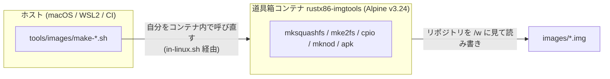
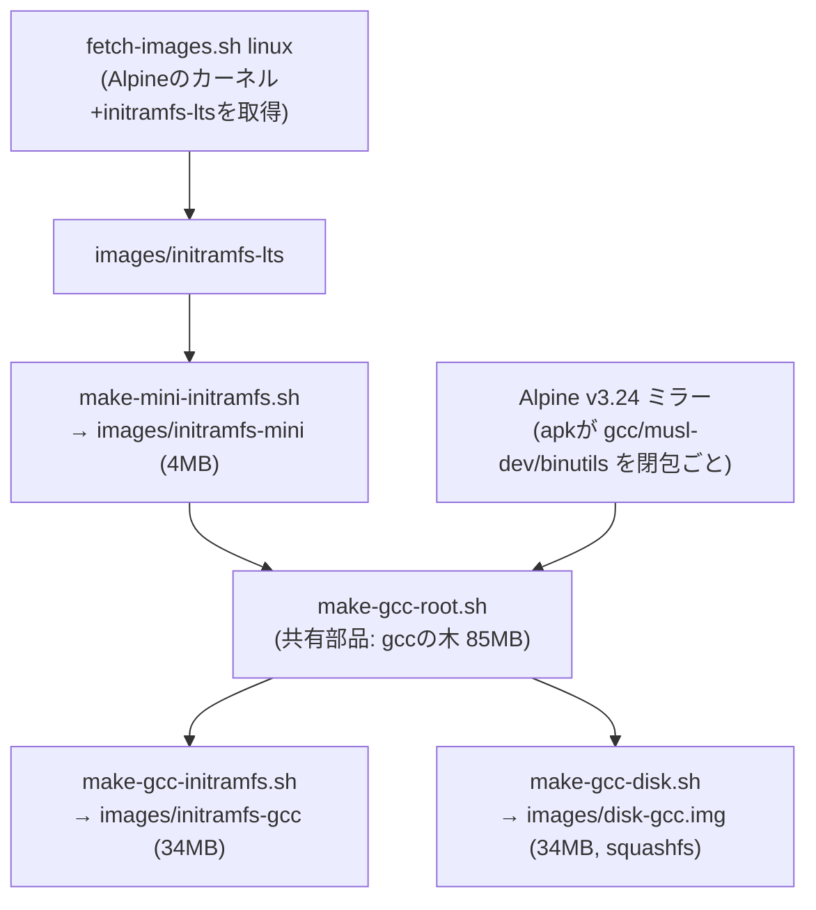

# イメージの焼き方 — 道具箱と5つのスクリプト

ゲストに見せるもの (initramfs・ディスク) を作る手順と道具のマニュアル。
「何を焼き直せばいいか」で迷ったら[依存の図](#何がどれに依存しているか)を見る。

## レイアウトの規約 — sh/ の中 = Dockerの中

```text
tools/images/
  Dockerfile          道具箱の定義 (Alpine v3.24 + 焼き道具一式)
  in-linux.sh         入口。リポジトリを /w に見せて1コマンド実行
  sh/                 **ここに置いたスクリプトは全部コンテナ内で走る**
                      (先頭の番人が /.dockerenv を見て自分で入る)
  make-linux-snapshot.sh   ネイティブに残る例外 — エミュレータを走らせる係
                           (定規はネイティブのみ、の原則)
```

置き場所が境界そのもの: 「これはどこで動くのか」はパスを見れば分かる。
新しいスクリプトを書くときも、ホストの道具に依存する素材加工なら `sh/` へ、
エミュレータやRust/wasmを動かすならネイティブ側へ。

## 道具箱 (Docker) — Linuxの道具はLinuxから借りる

squashfsやcpioのアーカイブを**正しく**焼くにはLinuxの道具が要る
(mksquashfs、rootでのmknod、apk)。macOS/Windowsに移植を探したり自前実装を
書いたりせず、**Alpineのコンテナから本物を借りる**:



- **定義**: [`tools/images/imgtools/Dockerfile`](../../tools/images/imgtools/Dockerfile)。
  ゲストと同じ Alpine v3.24 — 道具の癖 (圧縮の既定値など) がゲストのカーネルと揃う
- **入口**: [`tools/images/in-linux.sh`](../../tools/images/in-linux.sh) `<コマンド...>`。
  リポジトリを `/w` にマウントして1コマンド実行する。イメージが無ければその場で焼く (初回のみ数十秒)
- **自動**: イメージ焼きのスクリプトは先頭で `/.dockerenv` を見て、**外から呼ばれたら
  自分をコンテナ内で呼び直す**。つまり普段は道具箱を意識しなくてよい —
  `sh tools/images/sh/make-gcc-disk.sh` と打てば勝手に中で走る
- **守備範囲はイメージ焼きだけ**。Rust/wasmのビルドと速度測定はネイティブのまま
  (**定規はネイティブのみ** — コンテナ越しの測定はVMのノイズが乗る)

手で道具を借りたいとき:

```bash
tools/images/in-linux.sh mksquashfs -version
tools/images/in-linux.sh sh -c 'apk --arch x86 search gcc | head'
```

## 何がどれに依存しているか



| スクリプト | 出力 | 何のため |
|---|---|---|
| `fetch-images.sh linux` | vmlinuz-lts / initramfs-lts | 素材の取得。**カーネルとモジュールの出所はここ1つ** (vermagicが必ず合う) |
| `make-mini-initramfs.sh` | initramfs-mini | 既定のルートFS。busybox+snake+init。**ドライバ(.ko)とinitの細工は全部ここ** |
| `make-gcc-root.sh <dir>` | (ディレクトリ) | gccの木の共有部品。apkに依存の閉包を引かせ、開発者向けの荷物を削る |
| `make-gcc-initramfs.sh` | initramfs-gcc | gccの木をcpioで詰めた版。**ディスク無しでも動く保険** (RAM 256MB要る) |
| `make-gcc-disk.sh` | disk-gcc.img | gccの木をsquashfsで焼いた版。**こちらが本命** (RAM 128MBで済む)。[構成の説明](../explanation/disk.md) |

## いつ何を焼き直すか

| 変えたもの | 焼き直すもの |
|---|---|
| init の中身 (`make-mini-initramfs.sh` の中) | mini → (gccを使うなら) gcc系も **両方** — gccの木はminiの上に組むため |
| 積むモジュール (.ko) の一覧 | 同上 |
| gccの荷物の選択 (`make-gcc-root.sh`) | initramfs-gcc / disk-gcc.img |
| Dockerfile (道具の版) | `docker rmi rustx86-imgtools` してから任意のスクリプト (次回実行時に焼き直る) |

出力の置き場: `images/` (ネイティブ用) と `web/` (ブラウザ用の複製)。
どちらも配布物なのでgit管理外 — **リポジトリにあるのはレシピだけ**。

## 落とし穴 (踏んだものだけ)

- **insmodの順は depends= の実測で**。`strings x.ko | grep depends=` が正。
  直感 (virtio → ring) は逆だった — ringが土台
- **apkの鍵輪は `--root` の先を見る**。空のrootに鍵は無い → `--keys-dir /etc/apk/keys`
- **BSD findの方言** (`-depth 1`) はbusyboxに無い。コンテナ内で書くシェルは
  busybox方言で
- **連結gzipのISIZEは最後の塊しか名乗らない**。initramfsを継ぎ足しで作ると
  RAM自動判定が欺かれる ([pitfalls #14](../explanation/pitfalls.md))
