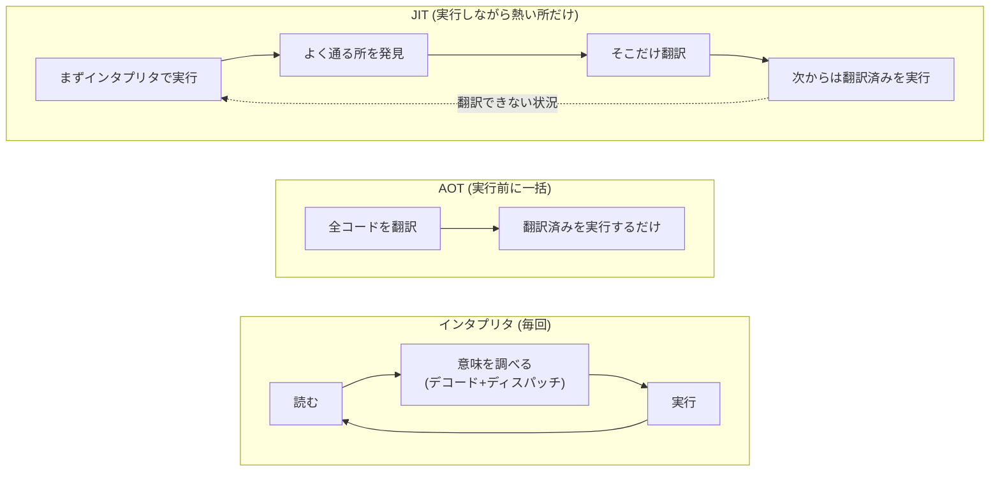
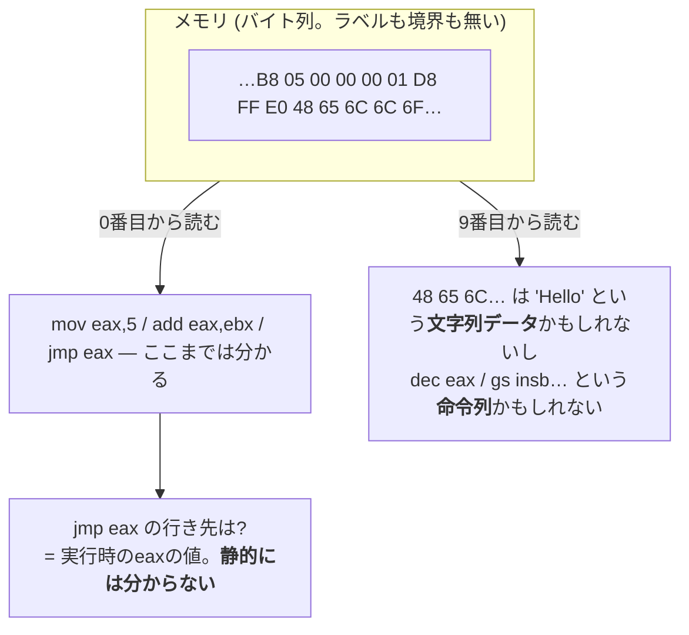
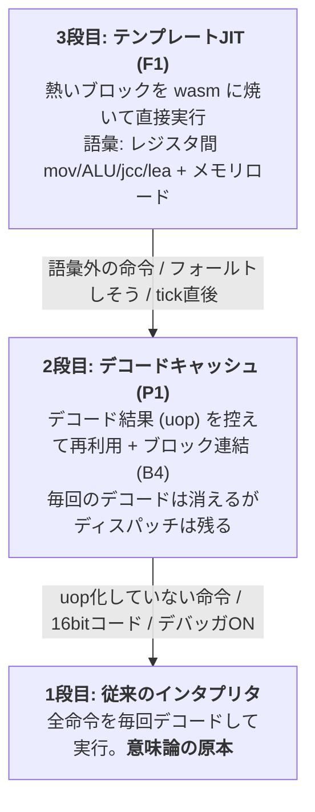
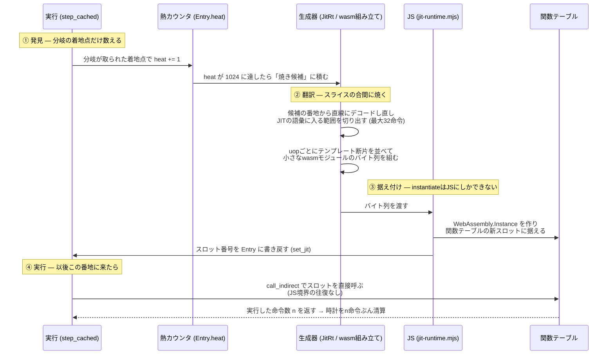
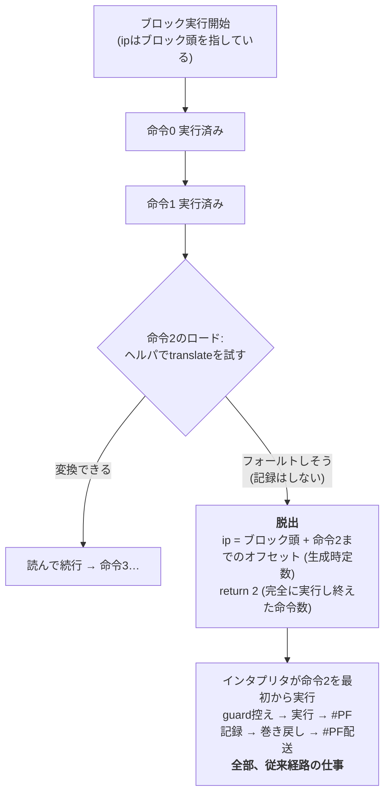

# JITの考え方と仕組み — なぜAOTではないのか

rustx86のテンプレートJIT (F1、[ADR-0008](adr/0008-template-jit.md)) が
**何をしているのか**と、**なぜ「事前に全部翻訳」(AOT) ではだめなのか**を図で辿る。

扱っている問い:

- インタプリタ・AOT・JITは何が違うのか (翻訳するタイミングの話)
- なぜエミュレータはAOTできないのか (どこがコードか、実行するまで分からない)
- 「熱いブロックだけ焼く」は具体的にどう回っているのか
- 生成コードがフォールトしそうなとき、どう逃げるのか (F1bの脱出モデル)
- 「JITを入れても結果が1bitも変わらない」をどう証明しているのか

## 1. 3つの実行方式 — 違いは「翻訳するタイミング」だけ

ゲストのx86機械語を、ホスト (ブラウザならwasm) が実行できる形にする方法は
3つある。**やる仕事は同じで、いつやるかが違う。**

| 方式 | 翻訳のタイミング | 例え |
|---|---|---|
| インタプリタ | 翻訳しない。毎回その場で意味を調べて実行 | 逐次通訳 — 1文ごとに訳す。同じ文が100回来ても100回訳す |
| AOT (Ahead-Of-Time) | **実行の前に**全部翻訳しておく | 翻訳書籍 — 出版前に全ページ訳し終える |
| JIT (Just-In-Time) | **実行しながら**、よく通る所だけ翻訳 | 同時通訳のメモ — 頻出フレーズだけ訳語を作り置きし、次からはメモを読む |



インタプリタの遅さの正体は、実行そのものではなく**毎回払う「意味を調べる」配管**
(ディスパッチ+オペランド解決+ヘルパ呼び出し) である。rustx86の実測では
1命令あたり16〜36ns — 生成コードなら同じ仕事が約1ns/uopで済む
([ADR-0008の事前実測](adr/0008-template-jit.md))。この差を回収するのがJITで、
AOTはそれを「全部・事前に」やろうとする方式に見える。

**では、なぜAOTにしないのか。**

## 2. なぜエミュレータはAOTできないのか

コンパイラ (RustやCの) がAOTできるのは、**入力がソースコード**だからである。
関数の境界も、どこがコードでどこがデータかも、言語が保証してくれる。
エミュレータの入力は**メモリに置かれた生のバイト列**で、その保証が全部無い。

### 理由1: どこがコードか、実行するまで分からない

x86の機械語は可変長で、区切り記号が無い。**同じバイト列でも、読み始める位置が
1バイトずれると全く別の命令列にデコードされる。**さらに `jmp eax` (行き先が
レジスタの中身) のような間接分岐は、実行時の値が決まるまで行き先が分からない。



AOTするには「プログラム中の全コード」を列挙し切る必要があるが、間接分岐の
行き先を全て静的に知ることは一般には不可能である (実行してみるしかない)。
中途半端に推測して翻訳すると、データを命令として翻訳したり、命令の途中から
翻訳したりする。

### 理由2: コードは実行中に生まれ、書き換わる

エミュレートしているのは**機械**であって、1本のプログラムではない。

- OSはディスクからプログラムを**実行中に**メモリへロードする — AOTの時点では存在すらしない
- Linuxは起動中に自分のコードを書き換える (alternatives / jump label)。DOSのゲームも平気で自己書き換えする
- ページングが有効なら、**同じ線形アドレスの指す物理メモリが実行中に差し替わる** — 「アドレスXのコード」という概念自体が実行時の状態

つまりAOTが前提とする「翻訳対象が実行前に確定している」が、エミュレータでは
根本的に成立しない。**JITとは、この現実への答えである: 静的に予言するのを諦め、
「実行が教えてくれた事実」だけを翻訳する。**実際に実行された場所はコードだと
確定しているし、実際に熱い場所は翻訳の元が取れると確定している。

なお、エミュレータ以外の世界でも同じ構図がある。V8 (JavaScript) やJVMがJITなのも、
動的な言語では「実行してみないと型も呼び先も分からない」からで、
「入力の正体が実行時に決まるものはJITになる」と覚えると早い。

## 3. rustx86の3段の階段 — それぞれが下の段に落ちられる

rustx86の実行系は3段になっていて、上の段ほど速いが語彙が狭い。
**どの段も、扱えないものは1つ下の段に落とすだけで正しく動く** — この退路が
「JITを少しずつ育てる」開発を可能にしている。



大事なのは、**意味論の原本が1段目にしか無い**ことである。2段目も3段目も、
フラグ計算や演算は1段目と同じヘルパ関数を呼ぶ (または同じ表現でデータを書く)。
速い写しを作っても意味の定義は複製しない — 正しさの証明が
「原本と突き合わせる」だけで済むのはこの規律のおかげである。

## 4. JITパイプライン — 発見・翻訳・据え付け・実行

「熱いブロックだけ焼く」は、具体的には4つの部品が回っている。



設計上のポイント:

- **熱は分岐の着地点でしか数えない。**毎命令数えるとホットループに計測コストが
  乗って本末転倒になる (B5/C5の実測教訓)。着地点=ブロック頭だけ数えれば、
  ループ1周につき1回で済む
- **生成コードの実行判定はEntry読みだけ。**「この番地に焼けたブロックがあるか」を
  hashmapで引くと毎ブロック頭に通行料が付く。デコードキャッシュのEntryに
  スロット番号を畳み込んだので、通常のキャッシュ照合のついでに判定が終わる
- **1ブロック=1wasmモジュールの個別焼きで成立する。**事前プローブで
  instantiateが6.3µs/ブロックと知れたため。ホットブロックは数百万回走るので
  数百回の実行で元が取れる

## 5. 生成コードの中身 — テンプレート方式

レジスタ割り付けも最適化もしない。**uopごとに手書きのコード断片 (テンプレート) を
並べて継ぐだけ**である。QEMUのTCG以前からある古典で、実装量と回収の釣り合いがよい。

たとえばこのx86ループが熱くなると:

```asm
loop:
    mov  edx, [eax]      ; メモリロード (F1bで語彙入り)
    add  edx, ebx
    sub  ecx, 1
    jne  loop
```

こういう形のwasm関数が生成される (擬似コード):

```text
func b() -> i32:                      ; 返り値 = 実行し終えた命令数
    ;; mov edx,[eax] — ロードはRustヘルパ経由
    v = call ld32(machine, DS, load(regs+0))   ; lin変換+TLB+読みはRust側
    if (v >> 32) != 0:                ; フォールトしそうという合図
        store(ip, load(ip) + 0)       ; ip = ブロック頭 + 0 (この命令の頭)
        return 0                      ; 0命令実行済み → 後はインタプリタが裁く
    store(regs+8, wrap(v))            ; edx = 読めた値

    ;; add edx,ebx — フラグは計算せず「材料」だけ書く (lazy flags)
    a = load(regs+8); b = load(regs+12)
    r = a + b
    store(cc_op, ADD); store(cc_a, a); store(cc_b, b); store(cc_r, r)
    store(regs+8, r)

    ;; sub ecx,1 — 同上
    ...

    ;; jne loop — 条件はRustヘルパに聞く (遅延フラグの評価器を二重実装しない)
    taken = call cond(machine, NZ)
    store(ip, load(ip) + select(taken, len+rel, len))
    return 4                          ; 4命令やり切った
```

読みどころが3つある。

**その1: レジスタは「メモリ上の実アドレス直打ち」。**wasmの生成コードは
メインモジュールと同じリニアメモリをimportしていて、`regs[2]` の実アドレスを
生成時に定数として焼き込む。Rust側の`Machine`と生成コードが同じ場所を
読み書きするので、**ブロックの途中のどこでインタプリタに戻っても状態が繋がる**。

**その2: フラグを計算しない。**C1 (lazy flags) で、インタプリタ自身が
「フラグは材料 (op, a, b, r) だけ控えて、読まれた時に合成する」方式になっている。
生成コードも同じ表現で材料を書くだけ — フラグ合成という一番複雑な意味論を
生成コードに持ち込まずに済み、しかも表現が同じだから境界での変換も要らない。

**その3: 難しい仕事はRustヘルパに委譲する。**メモリロードの
「セグメント適用→ページ変換→TLB→読み」も、条件コードの評価も、
インタプリタと同じ関数を呼ぶ。wasm→wasmのimport呼び出しは安い
(JS境界とは別物)。速さのためにここをインライン展開するのは、
測ってワッシュと出てから検討する次の梃子である ([perf.md](perf.md))。

## 6. フォールト脱出 — 巻き戻しを作らないための設計 (F1b)

メモリに触る命令の何が怖いかというと、**ページフォールト (#PF)** である。
実CPUの約束は「フォールトした命令は何も起きなかったことになる」— つまり
命令の途中で失敗したら、レジスタもフラグも命令前の姿に巻き戻さないといけない。
生成コードに巻き戻し機構を持ち込むと一気に複雑になる。

F1bの答えは**巻き戻さない。失敗しそうなら、失敗する前に逃げる**である。



この形が成立する理由は、**脱出が「現命令の状態を1つも変える前」に起きる**からである。
ロードは命令の先頭の仕事なので、そこで逃げればレジスタもフラグもメモリも無傷 —
巻き戻すものが無い。あとはインタプリタがその命令を白紙からやり直し、
#PFの記録も配送も従来経路がやる。

もう1つ効いているのが**「脱出は保守的でよい」という非対称**である。
本当はフォールトしない場面で余計に脱出しても、インタプリタがやり直して
同じ結果になる — 遅くなるだけで意味は変わらない。逆 (フォールトを見逃して実行)
だけが許されない。おかげでページ跨ぎロードのような稀で面倒な形は、
判定を作り込まず無条件脱出に倒せる。

## 7. 「1bitも変わらない」の証明 — JITの審判たち

JITの怖さは「だいたい合っている」状態である。速くなったが挙動が微妙に違う、
では最適化ではなく別のマシンになってしまう。rustx86では**JIT on/offで
命令数もシリアル出力もビット同一**を機械で証明し続けている。

| 審判 | 何を比べるか | いつ回るか |
|---|---|---|
| cosim | ランダム命令をUnicorn (実CPU相当) と1命令ずつ | 毎PR (CI) |
| OS起動回帰 | 3OSがプロンプト到達+決定的命令数 | 毎PR (CI) |
| jit-check | JIT on/off でシェル到達までの命令数+シリアル全文 | 毎PR (CI) |
| jit-lockstep | interp/JITを並走させ**スナップショット全体 (CPU+装置+RAM) をバイト比較**。決定性を利用した二分探索で食い違いを数百命令まで絞る | 手元 (重いので任意) |

実際、jit-checkをすり抜けた食い違いをjit-lockstepが捕まえたことがある。
JITの時計清算がページ跨ぎの着地で1命令ぶん多く払っていて (F1aから潜伏)、
シリアルにはµs未満でしか現れなかったが、スナップショット比較は
「同一tscでJIT側だけipが1命令手前」というsignatureで一発で示した ([PR #60](https://github.com/yoshiharu-ishii/rustx86/pull/60))。
**決定性は、それ自体が最強のデバッガである** — 同じ入力なら全状態が毎回同じだから、
二分探索が成立する。

## 8. AOTとの違い、まとめ

| | AOT | rustx86のJIT |
|---|---|---|
| 翻訳の対象 | 全コード (のつもり) | **実際に実行されて熱かった**ブロックだけ |
| コードの発見 | 静的解析 (間接分岐で破綻) | 実行そのもの (実行された場所=コードで確定) |
| 自己書き換え | 前提が崩壊する | ページ世代 (page_gen) で検出し、古いブロックを捨てるだけ |
| 失敗時 | 逃げ場が無い | インタプリタに落ちる (退路が常にある) |
| 翻訳の品質 | 時間をかけて最適化できる | テンプレート並べるだけ (それでも配管の除去で1桁速い) |

一言でいえば: **AOTは「未来を予言してから走る」、JITは「走った過去だけを信じる」。**
エミュレータの入力 (生のメモリ+実行時に変わる機械の状態) には後者しか成立しない。

## 9. これからの続き (F1ロードマップの現在地)

- **済**: F1a 骨格 (レジスタ間のみ・3ISAでビット同一・call_indirect化・Entry畳み込み)
- **済**: F1b-1 メモリロード (フォールト脱出モデル。速度はワッシュ — [perf.md](perf.md))
- **次の梃子**: TLBヒット経路のインライン生成 (ロードのヘルパ税を消す)
- **予定**: F1b-2 ストア (vram_dirty / 自己書き換え検出との整合が本題)
- **予定**: F1c ネイティブバックエンド (Cranelift直行。フロントエンドはwasm版と共有 — ADR-0008)
