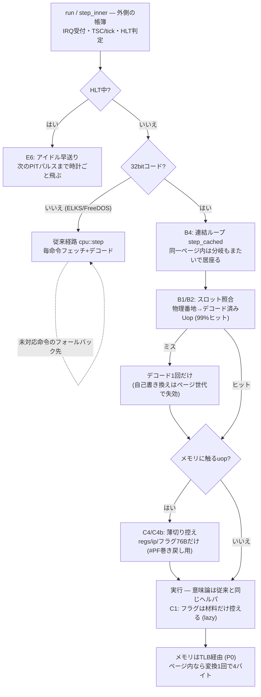
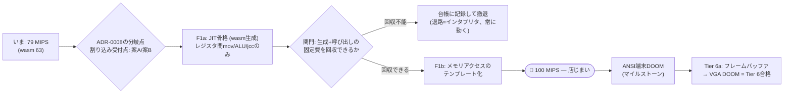

# CPU最適化ロードマップ

判断の記録は [ADR-0007](adr/0007-cpu-optimization-steps.md) (段階方針) と
[ADR-0008](adr/0008-template-jit.md) (JIT設計)。ここは数字と進捗の生きた台帳。

## 地図 — どの順で何をやって、いまどこか

### 道のり (13 → 79 MIPS、ネイティブvmlinux基準)

| 手 | 中身 | 結果 | PR |
|---|---|---|---|
| P0 | TLB・幅アクセス単一変換・REP一括 | 13 → 23.5 MIPS | Tier 3b期 |
| E6/E1/E2 | HLT早送り・vmlinux直接ロード (-40%命令)・スナップショット起動 | 起動の55%を実行しない | [#37](https://github.com/yoshiharu-ishii/rustx86/pull/37) |
| B1/B2 | デコード済み命令キャッシュ (dcache) + カバレッジ99% | -25%、wasm約2倍 | [#38](https://github.com/yoshiharu-ishii/rustx86/pull/38) |
| C4+B4 | 条件付き控え + **ブロック連結** (同一ページ内は分岐もまたぐ) | **-43%**、66 MIPS到達 | [#40](https://github.com/yoshiharu-ishii/rustx86/pull/40) |
| C1 | lazy flags (cc_op方式 — JITの土台を兼ねる) | -3〜4% | [#46](https://github.com/yoshiharu-ishii/rustx86/pull/46) |
| C4b | 控えの薄切り (Cpu丸ごと400B→触る76Bだけ) | **-17%**、79 MIPS / wasm 63 | [#47](https://github.com/yoshiharu-ishii/rustx86/pull/47) |

戦死者 (測って悪化・差なし、全部台帳に理由つきで記録済み): B3ペア融合 (+20〜28%)、
B5ブロック配列化 (+8%)、C5 tick一括払い (+10%)、D2 TLBサイズ、TLB/表の固定長配列化、
E3 quiet、C6フェッチ窓。**教訓: M1のOoOは毎命令の照合も帳簿も既に隠蔽している —
インタプリタ内の再配置は40サイクル/命令の壁を動かせない。**

### ホスト横断の実測 (2026-08-11、同じイメージ・同じ命令数 — 全マス完了)

| ホスト | ネイティブ bzImage (970M) | ネイティブ vmlinux (580M) | wasm bzImage (1000M) | wasm vmlinux (600M) |
|---|---|---|---|---|
| M1 MacBook Air (2020) | 10.7s / **90.7 MIPS** | 7.3s / 79.5 | 16.2s / 61.7 | 10.0s / 60.3 |
| Ivy Bridge素のWindows (2012) | 23.9s / 40.6 | 15.2s / 38.2 | 36.9s / 27.1 | 21.6s / 27.8 |
| 同マシンのVirtualBox VM (Ubuntu) | 26.1s / 37.2 | 16.0s / 36.3 | 36.0s / 27.8 | 21.3s / 28.2 |

読み方:

- **仮想化の税はわずか5〜9%、wasmではほぼゼロ** (同一ハードのネイティブ vs VM)。
  エミュレータは純粋なユーザー空間演算でVM exitをほぼ起こさないため。
  M1との2.4倍差の正体は**CPU素の世代差** (2020 vs 2012) がほぼ全て
- **wasm/ネイティブ比は、M1で68%、Ivy Bridgeで67%** — V8のwasm JITの効率は
  ISA (arm64/x86_64) によらず安定
- **命令数は全3ホスト×2経路×2ランタイムでビット同一** (970M/580M/1000M/600M) —
  決定性がOS・ISA横断で成立。Tier 8 (ホスト混在のスナップショットfork) への布石
- Windowsビルドは MSVC で素通り (14.9s)、headless.mjs のWindows対応は
  [#49](https://github.com/yoshiharu-ishii/rustx86/pull/49) の1行修正のみ —
  **Tier 7の主要リスク (Windows 10ビルド) は消えた**
- 2012年の企業PC相当でもwasmで27 MIPS = ブート37s — 「古いPCにブラウザだけで
  Linuxが立つ」の下限値として記録。JIT (F1) はこの層の底上げも兼ねる

### いまの実行経路 — どこにどの最適化が住んでいるか



### これからのフロー — 100 MIPSまでとその先



各段の関門は変わらず: **cosim全緑 + kernel_lockstep + 命令数不変 (580M/1000M) + 交互A/B**。

### F1a の全ホスト実測 (2026-08-12、vmlinux 600M・wasm・JIT on/off)

| ホスト (ISA) | JIT OFF | JIT ON | 差 | 命令数ビット同一 |
|---|---|---|---|---|
| M1 (arm64) | 12.7s / 47.3 | 12.8s / 46.9 | ほぼ同着※ | ✅ tsc完全一致 |
| WSL2 (x86_64) | 25.3s / 23.8 | 26.6s / 22.6 | **+6%遅** | ✅ tsc完全一致 |
| Windows native (x86_64) | 24.0s / 25.0 | 25.0s / 24.0 | **+4%遅** | ✅ tsc完全一致 |

※M1はJIT ONが毎回2番目で熱ダレを被る順序バイアス。冷えたround0は同着。

**2つの結論:**

1. **決定性は完璧** — JIT on/off で命令数 (600Mちょうど) もシリアル全文もビット同一。
   しかも **arm64でもx86_64でも** 成立 (339ブロック全部)。生成wasmコードと
   インタプリタが同じ意味を持つことが3ISA横断で証明された = **F1aの本命の成果**
2. **速度は約-4〜6%の赤字** (x86でクリーンに出た)。理由: F1aが焼くのは339個の
   **レジスタ間だけの安いブロック**で、実行のたびに `try_enter`(間接呼び出し) →
   JSトランポリン → 生成wasm → 復帰の**JS境界の往復**を払う。安い仕事に高い通行料。
   黒字化は **F1b** (メモリuopを焼く=ブロックの仕事を増やして通行料を薄める、
   ブートはメモリ律速なのでここで効く) と **call_indirect化** (JS境界を消す、
   ADR-0008で予告済み)。骨格の正しさが取れたので、次は黒字化に進める

### F1b-1 の実測 (2026-08-11、M1・vmlinux 600M・JIT on同士の新旧交互A/B)

メモリ**ロード** (mov r32,[mem] / alu r32,[mem] / cmp/test のロード形) を語彙に
追加した素朴版 (アクセスはRustヘルパ経由、フォールトは脱出)。ブロック数は
**344 → 668** に倍増。

| round | main (F1a) | F1b-1 |
|---|---|---|
| 1 | 13.2s / 45.4 | 14.2s / 42.4 |
| 2 | 12.8s / 47.0 | 14.0s / 42.8 |
| 3 | 14.0s / 42.9 | 13.0s / 46.1 |
| 4 | 13.0s / 46.1 | 12.5s / 47.8 |
| 5 | 12.8s / 46.7 | 12.7s / 47.2 |
| 6 | 12.8s / 46.8 | 12.7s / 47.1 |

**判定: ワッシュ** (中央値 12.9s vs 12.9s。序盤2周のF1b劣勢は熱の運として捨てる)。
ヘルパ呼び (lin+translate+読み) の税が、ディスパッチ除去+ブロック大型化の利得と
相殺 — ADR-0008の「測って決める点」の答えが出た。

### F1b-2 の実測 (2026-08-11、ストア/RMW追加。M1・交互A/B 6周)

ブロック 668→**822**。中央値 **13.37s vs 13.37s = またワッシュ**。

**そして原因が確定した — JITカバレッジの実測 1.2%。**
ブロック実行の清算nを積むカウンタ (jit_instrs) を足して測ったところ、
ブート600M命令のうちJITブロック内で走ったのは**わずか7M命令**。
仮に生成コードが無限に速くても全体は1.2%しか縮まない — ワッシュは
**単価の問題ではなくカバレッジの問題**だった。822ブロックは「熱い着地点の数」
であって「命令の居場所」ではない。カーネルの熱い区間はcall/ret/push/popが
密で、語彙外の命令がブロックを細切れにしている。

**次の梃子は語彙の拡大 (スタック形: push/pop/call/ret) に変更。**
TLBヒット経路のインライン生成は「カバレッジが上がって単価が効く土俵ができてから」
に降格 (カバレッジ1.2%では単価を10倍にしても見えない)。

### F1b-3 の実測 (2026-08-11、スタック形+カバレッジ機構。M1)

カバレッジ1.2%の謎解き。1手ずつ実測して犯人を積み上げた:

| 手 | 何をした | カバレッジ |
|---|---|---|
| 計測 | 動的uop分布 (opstats) — **語彙内は既に81.2%**。語彙不足説は棄却 | — |
| スタック形 | push/pop/call/ret/leave/xchg を語彙へ (ブロック822→1212) | 1.2→2.3% |
| ポンプ間隔 | スライス50M→2M (焼きが届く前に熱いフェーズが終わっていた) | 2.3→7.8% |
| 走路焼き | collect_run — 熱い頭から語彙外1命令を飛ばして後続も一気に焼く | →8.1% |
| **追い出し対策** | **fill 15M回/32Kスロットで據え付けた入口が衝突で剥がれ続けていた** → 永続台帳 jit_map からfillのついでに埋め直す | 7.9→**16.2%** |
| 閾値 | 1024→64 (ブロック1881→7254) | →18.1% |

**判定 (JIT on/off 交互A/B、同一ビルド): まだ微赤字** (interp中央値13.1s vs
jit 13.7s)。平均ブロック長4.4命令で、メモリopのヘルパはインタプリタと同じ仕事
+呼び出し税 — **ディスパッチ除去だけでは単価が並ぶ**。カバレッジ機構は
できたので、**次 = F1b-4: TLBヒット経路のインライン生成 (単価)**。
概算: 単価1/3×カバレッジ50%なら-35%が見える。
残りのカバレッジ (18%→) は「64回未満しか走らないコード」= 真の広く浅い領域で、
閾値を下げても伸びは鈍い — 単価が先。

### ブラウザ実測 (2026-08-11 ユーザー実測、M1・インタプリタ・JIT未配線)

| 経路 | ブラウザ | ヘッドレス (同日・熱あり) |
|---|---|---|
| bzImageフル (1000M) | 33s | 26.9s / 37.2 MIPS |
| vmlinux直接 (600M) | **21s** | ~14s |

**タブの税はおよそ×1.5** — **正体を特定して修正済み (2026-08-12)**: ワーカーの
スライスループが `setTimeout(loop, 0)` で自分を再予約しており、HTML仕様の
「ネスト5段超のタイマは最低4ms」クランプに毎スライス当たっていた。
スライス目標8ms + 強制休憩4ms = デューティ67% ≒ ×1.5。修正はMessageChannelの
port.postMessage (クランプ無しのマクロタスク。キー入力も同じFIFOに並ぶので
応答性は不変)。内蔵ブラウザでのA/B: 7→14 MIPS (×2、この環境はスロットリングが
強く差が増幅される)。前面タブでは×1.5の解消 = ~21s→~14-15s圏の見込み。
**実機Chrome確認 (2026-08-12 ユーザー実測): bzImageフル 43s→約23s (×1.9)** —
クランプ解消×1.5+熱条件の改善で計算どおり。ブラウザの
壁時計を動かす順は: JITカバレッジ (F1b-3 スタック形) → ワーカーへのJIT配線
(setupJit+pumpJit)。普段使いの起動はスナップショット (0.93s) が別にある。

**決定性はF1aより強い証明に更新**: jit-check (命令数+シリアル全文) に加え、
interp/JITを並走させ**スナップショット全体 (CPU+装置+RAM) を10M命令刻みで
バイト比較** — ブート完了まで完全一致。

**副産物: F1aから潜んでいた時計の過払いを発見・修正。** JIT清算が「着地の
1命令ぶんの前払い」をしてからページ跨ぎ判定でreturnしていて、跨ぎ着地のたびに
tscが+1先行していた (インタプリタは跨ぎでは払わない)。F1aでは該当ブロックが
稀でprintkのµs解像度に届かず不可視、F1bでブロックが倍増して**printk時刻が
±20µsずれて**発覚。同一tscでJIT側だけipが1命令手前という snapshot 比較の
signature から特定した。修正後は上記のとおり全一致。

目標: **フルブート10秒** (Tier 3d)。GUI (Tier 6) で「使い物になる」ための地力であり、
マイクロVM (Tier 8) の50台並行の分母でもある。

**出口条件 (ADR-0007追記)**: ~100 MIPS に達したら一旦止めて Tier を進める。
切り札 (F1 JIT・B5トレース化) は温存し、GUI/NWを動かして遅くて話に
ならなければ台帳に戻る — **Tierの節目ごとに最適化判断を挟む**。

## 現在地 (2026-08-10 B4後、M1 Mac ネイティブ)

| 経路 | シェル到達 | 実効速度 |
|---|---|---|
| vmlinux 直接ロード | 580M命令 / **8.8s** | **66.2 MIPS** (P1a後16.3s → C4 → B4で半減) |
| wasm (headless) | 600M / **13.6s** | **44.2 MIPS** (P1a前は50〜66s — 4倍弱) |
| ブラウザ実機 (再起動→シェル) | **21s** (B4後、ユーザー実測) | P1a後45s → P1b後38s → 21s |
| スナップショット復元 | — | 0.1〜1s (起動しない、が最速) |

**フルブート10秒 (ネイティブ) を達成。** 出口条件100 MIPSまで残り1.5倍。

プロファイル (boot中のsample、上位):

```
33%  cpu::step     — フェッチ + プレフィクス + 巨大matchのディスパッチ
13%  modrm         — オペランドの毎回再デコード
12%  memmove       — 毎命令のCPU控え(352B) + REP転送
 8%  translate_for — ページング変換 (TLBヒット経路)
```

## なぜ 30 MIPS なのか

1命令 34ns = M1の**約110サイクル**。毎命令「フェッチ → プレフィクスループ →
巨大match (間接分岐の予測ミス) → ModRM再デコード → 実行 → 帳簿」を踏む
古典的スイッチ型インタプリタの相場であり、**コードが悪いのではなく構造の上限**。
メモリ経路の微修正が効かないことは実測で確認済み (下の台帳)。

## 全量カタログ — 思いつく限り全部並べて、上から順につぶす

案として小出しにせず**全部載せる**。1件ずつ交互A/Bで測り、状態を更新する。
状態: ✅済 / 🔬未計測 / 💤寝かせ (前提が変われば再訪) / 🔒前提待ち。

### A. ビルド・ツールチェーン (コードを変えずに済む — 最初につぶす)

| # | 案 | 期待 | 状態 | メモ |
|---|---|---|---|---|
| A1 | codegen-units=1 + target-cpu=native | 数% | ✅済 | 交互A/B 21.0→20.5s (-2〜3%)。units=1はCargo.tomlへ、target-cpuは手元向け |
| A2 | wasm-opt -O3/-O4 | wasm数% | 💤 | wasm-packが既定で-O適用済みと確認。-O4はheadless交互A/Bで差がノイズに沈んだ (2026-08-10) |
| A3 | PGO (プロファイル誘導最適化) | 5〜15% | ✅済 | 交互A/B 6周中5勝、中央値 13.8→12.2s (**約-10%**)。レシピは `tools/pgo-build.sh` — 普段のビルドには混ぜず (再現性)、速いネイティブが欲しいときだけ使う。ネイティブのみ (rustcのPGOはwasm対象外) |
| A4 | panic=abort | 数% | 🔬 | wasmのパニックフック (未実装命令の報告) と両立するか要確認 |

### B. ディスパッチとデコード (プロファイル46%の本丸)

| # | 案 | 期待 | 状態 | メモ |
|---|---|---|---|---|
| B1 | デコード済み命令キャッシュ (P1a: 頻出族+フォールバック) | 2〜3倍 | ✅P1a済 | 交互A/B 21.7→16.3s (-25%)、wasm ~2倍 (50-66→25s)。命令数不変 |
| B2 | カバレッジ拡大 (P1b: フォールバック率<1%まで) | — | ✅済 | 実測上位16種を追加し93.7→**99.0%** (フォールバック5M)。ネイティブはノイズ内だが**ブラウザは45→38s (-15%、ユーザー実測)** — 間接分岐が高いwasmほど効く (P1aと同じパターン)。B3/B4の土台でもある |
| B3 | 頻出ペアの融合 (cmp+jcc等のスーパー命令) | 10〜30% | 💤 | **B4の後では取り分が残っていない** — 4変異体 (rel32込み/rel8限定/パニック除去/関数隔離) 全部が交互A/Bで20〜28%悪化 (2026-08-10)。融合は命令の21% (71Mペア) に効いたが、節約はスロット照合1回だけで、ホットループへの分岐追加と生成コードの乱れが上回る。決定的命令数は全変異体で不変を確認。実験はタグ [`exp/speed-b3`](https://github.com/yoshiharu-ishii/rustx86/releases/tag/exp%2Fspeed-b3) に保存 (ブランチだとGitHubが「PRを作れ」のバナーを出し続けるのでタグにした)。B5トレース化やF1 JITの中では前提が変わるので、そのとき再訪 |
| B4 | 基本ブロック連結 (ブロック間でディスパッチループに戻らない) | 10〜20% | ✅済 | 期待を大きく超えた: 交互A/B 22.6→12.9s (**-43%**)、wasm 25.2→13.6s。ブロック表を作らず step_cached 内で連結 — 同一ページ内なら分岐もまたいで続行 (ループ丸ごと)。lin計算・ページ変換・外側のはしごが消える。時計・割込み受付・タグ照合は1命令粒度のまま = 命令数不変 |
| B5 | ホットループのトレース化 (スーパーブロック) | 10〜30% | 💤 | 測って悪化 (2026-08-11): ブロック=連続uop配列 (pool) 化で「照合は頭で1回・中身は連続読み」にしたが、交互A/B 6周で**6戦全敗 (+8%)**。命令数不変・新規デコード15M→5Mと構造は狙い通り動いたのに壁時計は逆行 — M1のOoOと分岐予測は毎命令照合のループを既に隠蔽しており、見出し照合+ループ境界の追加が上回った。スロット数スイープ (8K悪化/128K同等) とも整合: **表アクセスはボトルネックではない**。実験はタグ [`exp/speed-b5-blocks`](https://github.com/yoshiharu-ishii/rustx86/releases/tag/exp%2Fspeed-b5-blocks)。**x86ホストでも再検証済み** (2026-08-11、Ubuntu VM 4コア): main 16.0s vs B5 16.65s (+4%) で同じ向き — 「M1のOoOだから」説は棄却、ブロック化はホストによらず割に合わない。JIT (F1) の中では前提が変わるので再訪 |
| B6 | matchを関数ポインタ表に (threaded dispatch) | 0〜10% | 🔬 | B1より先に単独で測れる。Rustはcomputed goto不可なので表引き |
| B7 | ModRM形状のインラインキャッシュ | 数% | 💤 | B1が取り込むので単独では寝かせ |

### C. 実行の質 (B1と独立 — 並行して収穫)

| # | 案 | 期待 | 状態 | メモ |
|---|---|---|---|---|
| C1 | フラグの遅延評価 (lazy flags) | 10〜25% | ✅済 | 実測は**約-3〜4%** (交互A/B 6周: ネイティブ中央値8.9→8.6s、wasmも同程度)。期待10〜25%はB4前の前提 — B4が毎命令の固定費を先に食った後では、フラグ合成は残りプロファイルの小さな費目だった (B3と同じ構図)。ただし意味論の置き場が良くなる (cc_op方式はB5トレース化/F1 JITの土台) ので採用。cosim・kernel_lockstep全緑、命令数不変 (580M/1000M) |
| C2 | RMW命令の変換1回化 | 3〜8% | ✅ほぼ済 | dcacheのexecが番地を1回計算して読み書き共用 — キャッシュ経由 (99%) では達成済み。残るは従来経路の1%のみ |
| C3 | TLBヒット経路のインライン化・iTLB分離 | 3〜8% | 🔬 | translate_for 8%の内側 |
| C4 | CPU控えのさらなる削減 (xmm/dr/hiddenの遅延保存) | 5〜10% | ✅済 | 「触るものだけ控える」に転換: キャッシュ済みuopのうちメモリに触るものだけ命令前控えを取る (レジスタ間演算・jcc・leaは#PF不能なので省く)。交互A/B 22.0→20.8s (-5%)、シェル区間 12.4→11.0s (-11%)。命令数不変 |
| C4b | 控えの薄切り (slim save) | — | ✅済 | C4の続き (2026-08-11)。キャッシュ済みuopが書き得るのは regs/ip/フラグ(遅延材料込み) だけ — Cpu丸ごとclone (~400B、xmm 128B+hidden 72B込み) をやめ ~76B に。プロファイルの memmove 11%が標的。交互A/B 6周: **ネイティブ中央値 8.9→7.4s (-17%)、wasm +5〜13%**。フォールバック経路は従来どおり丸ごとclone (何でも起こせるため)。命令数不変、cosim・kernel_lockstep・全テスト緑 |
| C5 | tick判定のブロック単位化 (毎命令→ブロック頭) | 数% | 💤 | 測って悪化 (2026-08-11): tsc/tick_countdownをローカル予算に置き換え境界だけ踏む形 (決定性不変) にしたが、交互A/Bで**+10%悪化**。毎命令のフィールドRMWはM1のストアバッファが既に隠蔽しており、レジスタ圧と出口ごとの払い戻しコードが上回った。「帳簿は削れば速い」は事実で裏切られた |
| C6 | 命令フェッチ窓 | — | 💤 | 測って効かず (2026-08-10)。B1がフェッチ自体を消す |
| C7 | メモリuopのdTLBインラインキャッシュ (uopに前回の(ページ,物理)を控える) | 3〜5% | 💤 | 台帳外の棚卸しで追加 (2026-08-12)。translate_for 5%の内側狙い。B5の教訓 (ホットループへのチェック追加は逆効果) と同型のリスクあり。**wasm F1b凍結 (2026-08-11) により汎用単価の候補として復活** — native/wasm/ブラウザ全部に効く数少ない残り玉。次に測る |
| C8 | condition/setccの分岐レス化 | 1〜2% | 💤 | 同上棚卸し。微益。F1では生成コード側の話になる |
| C9 | dbg.onの単相化 (const genericでコンパイル時に消す) | 1〜3% | 💤 | 同上棚卸し。改修が広い割に薄い |
| C10 | INSTRUCTIONS_PER_TICK 64→256 | 数% | 🔒意味変更 | 同上棚卸し。装置の刻みが変わる=**命令数基準の引き直し**を伴う。案B (ADR-0008) と同じ箱 |

### D. メモリとデータ配置 (キャッシュ戦法はここでは有効)

| # | 案 | 期待 | 状態 | メモ |
|---|---|---|---|---|
| D1 | Machine構造体のホット項目を先頭64Bに寄せる | 0〜5% | 🔬 | regs/ip/flags/tick/tlbの先頭が同キャッシュ行に |
| D2 | TLBスロット数の調整 (4096→実測で上下) | 0〜5% | 💤 | 測って効かず (2026-08-11): 1024/2048/8192/16384を走らせ、単発では8192が速く見えたが**交互A/Bにかけると逆転** (4096中央値8.4s vs 8192は8.7s) — 単発の速さは熱の運だった。4096維持。TLBのVec→固定長配列 (境界チェック除去、C3の一部) も交互A/Bで差はノイズ |
| D3 | wasm境界チェック削減 | wasm 5〜15% | 🔬 | リニアメモリ直アクセスの形に |

### E. 実行量そのものを減らす (MIPSではなく命令数を削る)

| # | 案 | 期待 | 状態 | メモ |
|---|---|---|---|---|
| E1 | vmlinux直接ロード (解凍ステブ削除) | -40% | ✅済 | 971M→580M |
| E2 | スナップショット起動 | 起動0.1〜1s | ✅済 | 「実行しない」が最速 |
| E3 | cmdline quiet (printk整形を削る) | -5〜15%? | 💤 | 測って効かず (2026-08-10): 命令数は50M粒度で変化なし (600Mのまま)、壁時計差は熱ノイズ内。printkはブート命令数の主役ではなかった。dmesgが見えなくなる代償に見合わない |
| E4 | earlyprintk=serial (無言150Mの体感) | 体感 | 🔬 | 命令数は減らない |
| E5 | 自前スリムカーネル (config絞り) | -30〜50%? | 💤 | 580M自体を削る。Alpine汎用configは重い。再現ビルドの手間と相談 |
| E6 | HLT早送り・条件付き控え | — | ✅済 | P0の成果 |

### F. 大物・研究枠 (テーブルには残す)

| # | 案 | 期待 | 状態 | メモ |
|---|---|---|---|---|
| F1 | テンプレートJIT (wasm/ネイティブ生成) | 5〜20倍 | ❄️wasm凍結 | B1-B5全滅で本命昇格 (2026-08-11)。**F1a骨格が動いた** (2026-08-12): ホット検出→wasm生成器 (レジスタ間mov/ALU/jcc/lea)→instantiate→実行のパイプが通り、**JIT on/offで命令数・シリアル出力ビット同一** (jit-check.mjs、CIの決定性ゲート)。Linuxブートで339ブロック発火。JIT無効時の退路は無コスト。設計はADR-0008 (案A: 毎命令の受付点維持)。**F1b-1 (ロード) / F1b-2 (ストア/RMW) 済** (2026-08-11): ブロック344→822、どちらも**ワッシュ**。原因確定: **JITカバレッジ実測1.2%** (jit_instrsカウンタ) — 単価でなくカバレッジの問題。次の梃子は語彙の拡大 (スタック形 push/pop/call/ret)。TLBインラインはカバレッジが上がってから。**上の実測を参照** |
| F2 | 投機的な先行デコード (別スレッド) | 数% | 💤 | デコードは純粋なので決定性は守れるが複雑。B1で足りるはず |
| F3 | ホストフラグの流用 | — | 💤 | Rust/wasmからは触れない。JIT (F1) の中でのみ意味を持つ |

### つぶす順番 (2026-08-10 深夜 更新 — 最適化フェーズここで一区切り)

```
済み:    A1 A2(寝) B1 B2 B3(寝) B4 B5(寝) C1 C2 C4 C4b C5(寝) D2(寝) E1 E2 E6
         — 13→78 MIPS
方針転換 (2026-08-10深夜、ユーザー決定): **Tier進行の前に100 MIPSを取り切る**。
理由「エミュレータの速さは以後すべての検証の単価 — あとからの検証が短縮できる」。
経過:   C1 -3〜4% (期待10〜25%はB4前の前提)、C4b -17% (memmove 11%の正体は
        Cpu丸ごと控えだった)。以降は全滅: D2・TLB配列化・C5 (+10%悪化)・
        B5ブロック化 (+8%悪化) — インタプリタ内の再配置はもう動かない
現在地: 素で**~78 MIPS** (7.4s/580M)、PGO (A3, tools/pgo-build.sh) なら
        推定~86。**構造の上限に到達 — 100へはF1テンプレートJITが本命昇格**。
        なお展開ステブ区間 (小さい熱ループ) は素で100 MIPS出ている —
        JITの回収見込みが最も大きいのは「広く浅い」カーネル本体区間。
        100到達で店じまいし、マイルストーン: ANSI端末DOOM → Tier 6a → VGA DOOM へ
```

**B3の教訓**: 最適化の取り分は積み木ではない。B4 (ブロック連結) が
「毎命令の固定費」を先に食い尽くしたので、同じ費目を狙うB3には
もう払い戻しが残っていなかった。カタログの期待値は**着手時点の前提**の
値であり、先行する最適化が前提を書き換える。

16bit経路の現在値は 45.6 MIPS (Tier 2 の90から半減 — 32bit化の税。
dcacheは32bit専用)。16bit機の体感には足りているので投資はしない。
理由ごと README のベンチマーク節に記録した。

## 段階

### P0: 負荷そのものを減らす — 済み

実行を速くする前に、実行する量と無駄を削った。

- [x] TLB / 幅アクセスの単一変換 / REP一括処理 (13→23.5 MIPS)
- [x] アイドル (HLT) の早送り — 暇な機械はホストCPUを食わない
- [x] vmlinux 直接ロード — 自己解凍ステブ540M命令 (起動の55%) を消す
- [x] 条件付きCPU控え — ページングOFF+リング0では複写しない (解凍ステブ -15%)
- [x] スナップショット起動 — そもそも起動しない (Tier 8c の前倒し)

残る小ネタ (P1と独立にいつでも試せる):
- cmdline に earlyprintk=serial,ttyS0 — コンソール登録前の無言150M命令の体感を削る (未検証)
- linux-boot.log に MSR 0x8b (microcode) への unchecked WRMSR/RDMSR 警告が
  記録されている — rdmsr_safe の fixup 対象として潰せるはず (実害は無い)

### P1: デコード済み命令キャッシュ — 本丸 (次のPR)

同じ命令を何百万回もデコードし直しているのをやめる。

- 物理アドレスをキーに、デコード結果 (オペコード・プレフィクス・ModRM・
  オペランド・命令長) を控える
- 2回目からはデコードを飛ばして実行だけ。ディスパッチも「controlled goto」
  (デコード済み列を順に叩く) になり、間接分岐の予測が当たるようになる
- **無効化は書き込みでページ単位** — TLB・VRAM検出と同じ発想。
  自己書き換え (DOSは平気でやる) はこれで正しく落ちる
- 検証: cosim (単発意味論) + kernel_lockstep (実カーネル1命令ずつ) +
  OS起動回帰 (決定的な命令数)。**この網があるから内側を触れる**

期待値: 2〜3倍 (60〜90 MIPS)。プロファイルの step 33% + modrm 13% が標的。

### P2: 実行の質 — **P1を待たず独立に収穫できるものが多い**

- フラグの遅延評価 (lazy flags) — ALU毎回のフラグ合成をやめ、
  読まれるときに材料から計算する。フラグは書かれる回数 >> 読まれる回数。
  **P1に依存しない — いつでも着手できる**
- RMW命令の変換1回化 (read/writeで同じ番地を2回変換している) — 同じく独立
- TLBヒット経路のインライン化 / INSTRUCTIONS_PER_TICK の見直し — 同じく独立
- 頻出ペアの融合 (cmp+jcc, mov+mov など) — これだけはデコード済み列 (P1) が前提

期待値: +30〜50%。ここで 100 MIPS 圏 = フルブート10秒圏。
1つずつ交互A/Bで測り、効いたものから取り込む。効かなくても捨てず、
「その時点の前提でこうだった」を下の台帳に記録して前提が変われば再訪する。

### P3: wasm特化

- リニアメモリ直接アクセス (境界チェックの削減)
- ブラウザは温まると今もネイティブ比 2〜5倍出ることがある (JITの気まぐれ)。
  P1で分岐が素直になるとwasm側の伸びも安定するはず

### P4: 研究枠 — テンプレートJIT

デコード済み列をさらに wasm/ネイティブコードに落とす案。**決定性 (ビット同一
再実行) を壊さないことが絶対条件**なので、P2までで足りるなら踏み込まない。

## 起動経路の測り方 — vmlinux と bzImage を比べる

「起動が遅くなった?」と思ったら、まず**どちらの経路で起動しているか**と
**熱ダレ**を疑う (今日のベンチ後は同じバイナリが2倍遅くなる。冷えてから測る)。

| 経路 | 中身 | 命令数の目安 |
|---|---|---|
| bzImage (vmlinuz) | ゲストの中で自己解凍ステブが走る。**既定** — 実機がやることを全部やる本物のフル起動 | 1000M |
| vmlinux | 非圧縮ELFを**ホスト側で展開して**直接ロードする近道。計測・比較用のopt-in | 600M |

### コマンドで測る (ネイティブ)

```bash
cargo run --release --example bootphase                        # bzImage (既定)
cargo run --release --example bootphase -- images/vmlinux-lts  # vmlinux 直接ロード
```

区間ごとの命令数と時間、dcacheのヒット率まで出る。交互A/Bはこの2つを
交互に流せばよい。

### コマンドで測る (wasm、ブラウザ既定と同じ経路)

```bash
node tools/webtest/headless.mjs                 # bzImage (既定 — 本物のフル起動)
KERNEL=vmlinux node tools/webtest/headless.mjs  # 直接ロードの近道を測る
```

タブのスロットリングが無いぶん、ブラウザ実測より数字が安定する。

### GUIで測る (ブラウザ実機)

```
http://localhost:8001/                 # 既定: bzImage (本物のフル起動)
http://localhost:8001/?kernel=vmlinux  # 直接ロードの近道を測る
```

Linuxを選び「再起動」(=フル起動) を押してから、右上のゲージが
**アイドル**に変わるまでがシェル到達。どちらの経路かは起動中の
ステータス表示で分かる — 「カーネル (bzImage)」か「カーネル (vmlinux)」。

## 北極星: v86の実測 (2026-08-12 — 目標はこの数字)

[v86](https://github.com/copy/v86) (x86→wasm JITを常用する同類の完成形) に、
rustx86と**同じ** vmlinuz-lts + initramfs-mini を食わせて同条件で測った
(tools/webtest/v86-bench.mjs、命令数はv86の命令カウンタAPIの実測):

| 同一カーネル・同一M1・同時刻 | シェル到達 | 実行命令数 | 実効MIPS |
|---|---|---|---|
| **v86** | **4.4〜5.0s** | 805〜807M | **160〜185** |
| rustx86 wasm (インタプリタ) | 14.5s | 600M | 41 |
| rustx86 ネイティブ (インタプリタ、冷間) | 7.3s | 580M | ~79 |

読み取れること:

- **wasmで登れる山の高さは実在する** — 同じブラウザ技術の土俵で約4倍差。
  凍結したwasm JIT路線 (ADR-0009/ADR-0008) の凍結解除判断のときは、
  この185 MIPSが「登れると証明済みの高さ」になる
- v86の方が**多く実行して速い** (807M vs 600M — P4級CPU実装でカーネルの通る道が
  違う)。命令数の差は意味の差ではなく実装機能の差
- Craneliftネイティブ (F1c) の目標はこの数字の**上** — wasm税の無いネイティブで
  185を下回る理由はない

## 測定の規律 (これを破った測定は信用しない)

- **交互A/B** — M1は熱ダレで数分のうちに 35s→40s 平気でずれる。
  新旧バイナリを交互に走らせた差だけを信じる (`bootphase` を使う)
- **命令数は決定的** — 同じイメージなら到達命令数は毎回同じ。
  命令数の増加は速度ではなく**意味の後退** (スピン・時計の狂い) の印。
  OS起動回帰が上限を見張る
- **プロファイルの数字は現場ではない** — BTreeSet::insert「27%」を消しても
  壁時計は動かなかった。ストールは付け替わる。最後は壁時計で判定する

## 寝かせている案の台帳 (捨てない — 前提が変われば再訪する)

- **PGOビルド** (2026-08-11、タグ [exp/pgo-build](https://github.com/yoshiharu-ishii/rustx86/releases/tag/exp%2Fpgo-build)):
  実測**-25%** (M1交互A/B 5周全勝: vmlinux 9.6〜10.0→7.2〜7.8s、bzImageフル
  13.0→11.0s、命令数ビット不変)。**効いたが常設は見送り** — 議論の全記録と
  復帰条件は [ADR-0009](adr/0009-pgo-shelved.md) — ユーザー判断:
  「遅い→プロファイルが古いのでは→再訓練」という**運用判断を開発に半永久に
  持ち込みたくない**。交互A/Bの測定文化とも相性が悪い (公平な比較に毎回
  再訓練が要る)。速さは設計 (C7/JIT/Cranelift) で取る。
  出荷ビルドが要る段 (microVM配布・デモ公開) で再訪

- **命令フェッチ窓** (1命令1回の変換に集約): 交互A/Bで差がノイズに沈んだ
  (2026-08-10、ボトルネックがディスパッチ側にある前提でのこと)。
  P1のデコードキャッシュがフェッチ自体を消すため、優先度は下がったまま
- **観測用BTreeSetの削除だけで速くなる説**: プロファイル27%は幻だった
  (無駄の削除としては正しいので実施済み)
- **テンプレートJIT**: 最速の可能性を持つ選択肢として保持 (P4)。
  P1/P2で100 MIPSに届かなければ本命に昇格する
