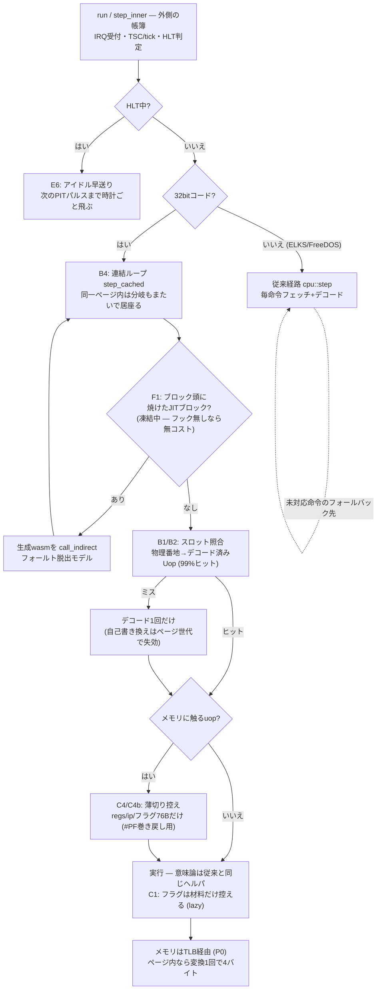

# CPU最適化の台帳 — 地図

ここは**地図だけ**: 現在地の数字・北極星・全量カタログ・測定の規律・寝かせ台帳。

- 日付つきの実験の経過と謎解きは **[perf-log.md](perf-log.md)** (物語、追記専用)
- 横断の教訓は **[pitfalls.md](../explanation/pitfalls.md)** (踏んだ罠の型)
- 判断の理由は **ADR**: [0007](../adr/0007-cpu-optimization-steps.md) (段階方針) /
  [0008](../adr/0008-template-jit.md) (JIT設計とFシリーズのロードマップ) /
  [0009](../adr/0009-pgo-shelved.md) (PGOを寝かせた議論)

## 現在地 (2026-08-12夜、test386互換込み)

| 経路 | シェル到達 | 実効MIPS |
|---|---|---|
| ネイティブ vmlinux (580M) | 8.9〜9.3s (交互A/B、S1〜S3込み) | **~64** |
| ネイティブ bzImageフル (970M) | 12.0〜13.0s | ~76〜81 |
| wasm headless vmlinux (600M) | 14.0〜14.5s | **~43** |
| ブラウザ vmlinux | **15s** (タブ税修正後、残る税~7%) | ~40 |
| ブラウザ bzImageフル | 23s | — |
| スナップショット復元 | ~1s | 起動しない、が最速 |

- 出発点は13 MIPS — **約5倍**。1命令~40サイクルの壁は実測で「構造」と確定
  ([perf-log.md](perf-log.md) 2026-08-10、pitfalls 5)
- **互換の代金 = 約+10%** (2026-08-12、交互A/B 5周: 互換前8.2〜8.3s → 後9.0〜9.4s、
  580M不変)。毎命令のセグメントlimit検査・A/D反映チェック・guard拡大の合算。
  取り返し候補は S1 (下のカタログ)。詳細は [perf-log.md](perf-log.md) 2026-08-12
- **JIT (wasm) は凍結中** (カバレッジ機構完成・収支微赤字の地点で。ADR-0008)。
  ネイティブJIT (Cranelift) はTier 7の入口で別ADR
- 目標: フルブート10秒 (Tier 3d)。出口条件~100 MIPSで一旦Tierへ (ADR-0007)

## 北極星: v86の実測 (2026-08-12 — 目標はこの数字)

[v86](https://github.com/copy/v86) (x86→wasm JITを常用する同類の完成形) に、
rustx86と**同じ** vmlinuz-lts + initramfs-mini を食わせて同条件で測った
(tools/webtest/v86-bench.mjs、命令数はv86の命令カウンタAPIの実測):

| 同一カーネル・同一M1・同時刻 | シェル到達 | 実行命令数 | 実効MIPS |
|---|---|---|---|
| **v86** | **4.4〜5.0s** | 805〜807M | **160〜185** |
| rustx86 wasm (インタプリタ) | 14.5s | 600M | 41 |
| rustx86 ネイティブ (インタプリタ、冷間) | 7.3s | 580M | ~79 |

- **wasmで登れる山の高さは実在する** — 同じ土俵で約4倍差。wasm JIT凍結解除の
  判断のとき、185 MIPSが「登れると証明済みの高さ」になる
- v86の方が**多く実行して速い** (807M vs 600M — P4級CPU実装で通る道が違う)。
  命令数の差は意味の差ではなく実装機能の差
- Cranelift (F1c) の目標はこの**上** — wasm税の無いネイティブで185を下回る理由はない

## 道のり (13 → 79 MIPS、ネイティブvmlinux基準)

| 手 | 中身 | 結果 | PR |
|---|---|---|---|
| P0 | TLB・幅アクセス単一変換・REP一括 | 13 → 23.5 MIPS | Tier 3b期 |
| E6/E1/E2 | HLT早送り・vmlinux直接ロード (-40%命令)・スナップショット起動 | 起動の55%を実行しない | [#37](https://github.com/yoshiharu-ishii/rustx86/pull/37) |
| B1/B2 | デコード済み命令キャッシュ (dcache) + カバレッジ99% | -25%、wasm約2倍 | [#38](https://github.com/yoshiharu-ishii/rustx86/pull/38) |
| C4+B4 | 条件付き控え + **ブロック連結** (同一ページ内は分岐もまたぐ) | **-43%**、66 MIPS到達 | [#40](https://github.com/yoshiharu-ishii/rustx86/pull/40) |
| C1 | lazy flags (cc_op方式 — JITの土台を兼ねる) | -3〜4% | [#46](https://github.com/yoshiharu-ishii/rustx86/pull/46) |
| C4b | 控えの薄切り (Cpu丸ごと400B→触る76Bだけ) | **-17%**、79 MIPS / wasm 63 | [#47](https://github.com/yoshiharu-ishii/rustx86/pull/47) |
| F1a〜F1b-3 | wasm JIT (骨格→ロード→ストア→スタック形+カバレッジ機構) | 決定性3ISA証明・収支は微赤字で凍結 | [#54](https://github.com/yoshiharu-ishii/rustx86/pull/54)〜[#62](https://github.com/yoshiharu-ishii/rustx86/pull/62) |
| — | ブラウザのタブ税×1.5 (setTimeoutの4msクランプ) 解消 | ブラウザ21→**15s** | [#68](https://github.com/yoshiharu-ishii/rustx86/pull/68) |

戦死者 (測って悪化・差なし — 理由は各カタログ行): B3ペア融合 (+20〜28%)、
B5ブロック配列化 (+8%)、C5 tick一括払い (+10%)、C7 dTLBキャッシュ (ワッシュ)、
D2 TLBサイズ、panic=abort、E3 quiet、C6フェッチ窓。
**教訓: 現代CPUのOoOは毎命令の照合も帳簿も既に隠蔽している — インタプリタ内の
再配置は40サイクル/命令の壁を動かせない** ([pitfalls.md](../explanation/pitfalls.md) 5)。

## いまの実行経路 — どこにどの最適化が住んでいるか



## 全量カタログ — 思いつく限り全部並べて、上から順につぶす

案として小出しにせず**全部載せる**。1件ずつ交互A/Bで測り、状態を更新する。
状態: ✅済 / 🔬未計測 / 💤寝かせ (前提が変われば再訪) / 🔒前提待ち / ❄️凍結 (判断つき)。

### A. ビルド・ツールチェーン

| # | 案 | 期待 | 状態 | メモ |
|---|---|---|---|---|
| A1 | codegen-units=1 + LTO | 数% | ✅済 | 交互A/B -2〜3%。Cargo.tomlに常設 |
| A2 | wasm-opt -O3/-O4 | wasm数% | 💤 | wasm-packが既定で適用済み。-O4は差がノイズ (2026-08-10) |
| A3 | PGO | -25% | 💤 | **効いたが寝かせ (ユーザー判断)** — 運用判断を開発に持ち込まない。議論と復帰条件は [ADR-0009](../adr/0009-pgo-shelved.md)、実験はタグ [exp/pgo-build](https://github.com/yoshiharu-ishii/rustx86/releases/tag/exp%2Fpgo-build) |
| A4 | panic=abort | 数% | 💤 | 交互A/B 8周ワッシュ (2026-08-12)。A1が既にunwind経路を最適化済みと推測。不採用 |

### B. ディスパッチとデコード

| # | 案 | 期待 | 状態 | メモ |
|---|---|---|---|---|
| B1 | デコード済み命令キャッシュ (P1a) | 2〜3倍 | ✅済 | -25%、wasm ~2倍。命令数不変 |
| B2 | カバレッジ拡大 (99%まで) | — | ✅済 | 実測上位16種追加で93.7→99.0%。ブラウザ45→38s — 間接分岐が高いwasmほど効く |
| B3 | 頻出ペアの融合 | 10〜30% | 💤 | **B4の後では取り分が残っていない** — 4変異体全部が20〜28%悪化 (2026-08-10)。タグ [exp/speed-b3](https://github.com/yoshiharu-ishii/rustx86/releases/tag/exp%2Fspeed-b3)。JITの中では前提が変わるので再訪 |
| B4 | 基本ブロック連結 | 10〜20% | ✅済 | 期待超え **-43%**。同一ページ内は分岐もまたいで続行。時計・割込み・照合は1命令粒度のまま = 命令数不変 |
| B5 | ホットループのトレース化 | 10〜30% | 💤 | 交互A/B 6戦全敗 (+8%)、x86ホストでも+4%で再現 — 表アクセスはボトルネックではない。タグ [exp/speed-b5-blocks](https://github.com/yoshiharu-ishii/rustx86/releases/tag/exp%2Fspeed-b5-blocks) |
| B6 | matchを関数ポインタ表に | 0〜10% | 💤 | B3/B5の教訓 (OoOがディスパッチを隠す) から期待薄に降格 |
| B7 | threaded / tail-call dispatch (`become`) | 0〜数% | 💤 | M1のcomputed goto実測+10%どまり・Rohou CGO'15 (ITTAGE世代でdispatchミスは支配的でない)。becomeはnightly。やるならミス予測率実測 (kperf系) が先 ([ADR-0021](../adr/0021-broad-sweep-round.md)) |

### C. 実行の質

| # | 案 | 期待 | 状態 | メモ |
|---|---|---|---|---|
| C1 | lazy flags (cc_op方式) | 10〜25% | ✅済 | 実測-3〜4% (期待はB4前の前提)。JITのフラグモデルの土台として採用 |
| C2 | RMW命令の変換1回化 | 3〜8% | ✅済 | dcache経由 (99%) で達成 |
| C4/C4b | 条件付き控え+薄切り | — | ✅済 | -5%と**-17%** (memmove 11%の正体)。命令数不変 |
| C5 | tick判定のブロック単位化 | 数% | 💤 | +10%悪化 (2026-08-11)。帳簿はストアバッファが隠していた |
| C7 | dTLB最終結果キャッシュ | 3〜5% | 💤 | native/wasmともワッシュ (2026-08-12)。TLBヒット経路もOoOが隠す。タグ [exp/c7-dtlb](https://github.com/yoshiharu-ishii/rustx86/releases/tag/exp%2Fc7-dtlb) |
| C8 | condition/setccの分岐レス化 | 1〜2% | 💤 | 微益。F1では生成コード側の話 |
| C9 | dbg.onの単相化 (const generic) | 1〜3% | 💤 | 改修が広い割に薄い |
| C10 | INSTRUCTIONS_PER_TICK 64→256 | 数% | 🔒意味変更 | 命令数基準の引き直しを伴う。案B (ADR-0008) と同じ箱 |
| C11 | cold外しの総ざらい (最頻armのインライン低速路12箇所・fill/fallback外出し・稀uop arm移送・translate_forのhot/cold分離) | 2〜5% | ✅済 **-19%** (8勝0敗、105 MIPS温間、PR #170) | #[cold]化5勝2敗1分の続編。fill経路には**4MiBのvec!確保コード**がホットループ本体に同居 ([ADR-0021](../adr/0021-broad-sweep-round.md) バッチC) |
| C12 | 鎖の直短縮バッチ (set_ip32・execのipレジスタ返し・slot計算のcarry化) | 数% | 💤 | **実測ワッシュ** (2026-08-16、8周1勝6敗1分+2%)。バッチC後の世界では鎖の微調整はOoOの影 — 判別則(4)の3度目。タグ exp/chain-batch |
| C13 | jcc conditionの単一ディスパッチ化 | 1〜2% | 💤 | C12と同バッチで実測ワッシュ (タグ exp/chain-batch)。cc_sign実体化は未試行のまま同タグへ |
| C14 | **dead-flags elimination** — デコード時にフラグ死活を解析、死んだ定義はlazy storeも省く | 数% | 🔒観測粒度待ち | 机上監査で降格 (2026-08-16): 毎命令が割り込み受付点=EFLAGSの非同期観測点なので、省いたフラグをcosim/lockstepが即検出する。QEMU/Box64はTB粒度だから許される。C10と同じ箱 |

### D. メモリとデータ配置

| # | 案 | 期待 | 状態 | メモ |
|---|---|---|---|---|
| D1 | Machineのホット項目を先頭64Bに | 0〜5% | 💤 | 実測済みワッシュ (2026-08-13、タグ exp/hotstate、8周3勝5敗±0)。毎命令触るラインは散っていても常時L1在住 |
| D2 | TLBスロット数調整 | 0〜5% | 💤 | 1024〜16384をスイープ、交互A/Bで4096が最良。固定長配列化も差なし |
| D3 | wasm境界チェック削減 | wasm 5〜15% | 💤 | **実測+8.4%全勝 (PR #119) → core不可侵の原則でrevert (PR #120)**、タグ exp/wasm-d3-bounds。ビルド層・JS層の蛇口も2026-08-13に乾いた (perf-log) |
| D4 | Entry痩身 32→24B (Rm番兵化+gen u16) | 0〜数% | 💤 | **実測ワッシュ** (2026-08-16、2勝5敗1分、タグ exp/entry-slim)。#111の再現 — C11の勝ちはI-cache (コード) で、Entry表の熱い部分は元からキャッシュ在住 |
| D5 | victim TLB (直写像の後ろに8エントリ全連想) | 数% | 💤 | **census死亡** (2026-08-16): ミス率0.2238% (596k/266M)、総コスト~0.16%で床の25分の1。前提が変わる=ミス率が桁で上がるWLが来たら再訪 |

### E. 実行量そのものを減らす

| # | 案 | 期待 | 状態 | メモ |
|---|---|---|---|---|
| E1 | vmlinux直接ロード | -40% | ✅済 | 971M→580M |
| E2 | スナップショット起動 | 起動~1s | ✅済 | 「実行しない」が最速 |
| E3 | cmdline quiet | -5〜15%? | 💤 | 命令数変化なし。printkはブートの主役ではなかった |
| E4 | earlyprintk (無言150Mの体感) | 体感 | 🔬 | 命令数は減らない |
| E5 | 自前スリムカーネル (config絞り) | -30〜50%? | 💤 | 580M自体を削る。再現ビルドの手間と相談 |
| E6 | HLT早送り | — | ✅済 | P0の成果 |
| E7 | HLT時計warp (仮想時刻を次のタイマ期限へ跳ばす) | 体感 | 🔬 | QEMU icountと同型で**命令数決定性を保つ**。定規には効かず、ブラウザのアイドルCPU使用率に効く製品品質玉 (ADR-0021 バッチD3) |

### F. 大物・研究枠

| # | 案 | 期待 | 状態 | メモ |
|---|---|---|---|---|
| F1 | テンプレートJIT (wasm) | 〜4倍 (北極星実証) | ❄️wasm凍結 | F1a〜F1b-3で骨格・脱出モデル・カバレッジ機構 (18.1%) まで完成、3ISAビット同一。収支微赤字の地点で凍結 (2026-08-11 ユーザー決定)。経過は [perf-log.md](perf-log.md)、ロードマップと凍結解除条件は [ADR-0008](../adr/0008-template-jit.md) |
| F1c | Cranelift ネイティブJIT | 185 MIPS超 | ❄️凍結 | 2026-08-13 [ADR-0013](../adr/0013-f1c-freeze.md)。関門〜予算退出まで完成、相対-9〜13%・カバレッジ46%だが**リンク税+25%で絶対は素のcoreに+19%負け**。実装は `f1c-final` タグ、実験は `exp/f1c-*`。復帰条件はADR (定常WL/連鎖を削る深さ/税の消滅) → **F1dが構造で満たす** |
| **F1d** | **テンプレートJIT (AArch64手書き+dynasmrt、Craneliftなし)** | 185+ MIPS | 🔬**進行中** | a骨格→bロード→cストア/スタックまで実装 (PR #174/#175/次)。**全段でJIT on/off指紋ビット同一**。カバレッジ34%・平均ブロック5.5命令・jboot 11.1s vs interp 10.0s (+11%赤字)。受け口税ゼロ (チェーン入口+taken着地のみ)。次: TLBインライン・入場税。Stage 2でブロック粒度 (案B) とC14解禁、Stage 3でwasm解凍 |
| F2 | 投機的な先行デコード | 数% | 💤 | 複雑さに見合わない |
| F3 | ホストフラグの流用 | — | 💤 | F1cの中でのみ意味を持つ |

## 起動経路の測り方

「遅くなった?」と思ったら、まず**どちらの経路か**と**熱ダレ**を疑う
(ベンチ後は同じバイナリが2倍遅くなる。冷えてから測る)。

| 経路 | 中身 | 命令数 |
|---|---|---|
| bzImage (vmlinuz) | ゲスト内で自己解凍ステブが走る。**既定** — 本物のフル起動 | 1000M (native 970M) |
| vmlinux | 非圧縮ELFをホスト側で展開して直接ロード。計測・比較用 | 600M (native 580M) |

```bash
cargo run --release --example bootphase                        # ネイティブ bzImage
cargo run --release --example bootphase -- images/vmlinux-lts  # ネイティブ vmlinux
node tools/webtest/headless.mjs                                # wasm bzImage
KERNEL=vmlinux node tools/webtest/headless.mjs                 # wasm vmlinux
```

ブラウザは `http://localhost:8001/` (既定bzImage) / `?kernel=vmlinux`。
Linuxを選び「再起動」→ 右上ゲージが**アイドル**になるまでがシェル到達。

## 測定の規律 (これを破った測定は信用しない)

- **交互A/B** — M1は熱ダレで数分のうちに平気で2割ずれる。
  新旧バイナリを交互に走らせた差だけを信じる ([pitfalls.md](../explanation/pitfalls.md) 6)
- **命令数は決定的** — 同じイメージなら到達命令数は毎回同じ。増加は速度ではなく
  **意味の後退**の印。OS起動回帰が上限を見張る
- **プロファイルの数字は現場ではない** — 容疑者リストであり、判決は壁時計
  ([pitfalls.md](../explanation/pitfalls.md) 10)
- **判定はネイティブの定規で下す** (2026-08-14 確立)。wasmはコード配置と
  V8のコンパイル判断で**触っていない経路が数%動く** — MMX追加時、wasmの
  交互A/Bは+4.9% (5勝0敗) を示したが、同じ変更のネイティブ交互A/Bは
  ワッシュ・命令数ビット同一だった。wasmはネイティブの約2倍と見込み、
  wasm固有の最適化を測るときだけwasmの定規を持ち出す

## 互換税の取り返し (2026-08-12 実測済み)

| # | 案 | 結果 |
|---|---|---|
| S1 | **平坦セグメントの高速路**: flat_rw (base=0・limit=4GB・書けるデータ) なら data_addr が1分岐で素通し | **-2%** (単独) |
| S2 | flush_ad の空チェックをインライン化 (実仕事だけ #[cold] 関数へ)・data_addr に #[inline] | S1と合算で **-3〜4%** |
| S3 | TLBエントリの旗をbaseの下位12bitへ詰めて16→12バイト (4096スロットの器) | 合算 **-2〜4%** (S3単独の寄与は熱ノイズ内。構造として採用) |

**見立てが外れた**: 互換税+10%の大半は検査本体ではなかった (S1単独-2%)。
残り~6%はコード増によるI側の圧と推測 — 追わない。**F1c (Cranelift) は
検査ごと生成コードに畳み込む**ので、本丸はそちら (B5教訓の再演を避ける)。

## ホットパス付帯処理の一掃 (2026-08-13の作戦 — 15.1s→9.5s、**100 MIPS達成**)

JIT凍結・削除 (ADR-0013) の日に一気に進んだ系譜。共通原理は
**「OoOが隠すのは独立な帳簿だけ。次の値 (ip・分岐先・guard判定・変換) を
作る仕事は、名前が付帯処理でも直列であり、削れば効く」** (ADR-0014)。

| # | 手 | 結果 | 記録 |
|---|---|---|---|
| 受け口の税 | JIT受け口 (Entry+8B・at_head帳簿・入口分岐) の削除 | **-22% (6周全勝)** | PR #97 |
| guard-gate | 控えのゲートを pe→pg\|\|cpl3\|\|vm86 に (解凍ステブの無駄払い停止) | -2% (6勝2敗、構造採用) | PR #102 |
| batch1 | Entryメタデータ化 (len_flags: F_MEM/F_CTL)・advance_ip32・cs_base掴み置き・hitsカウンタopstats化 | **-8% (7勝1敗)** | PR #103、ADR-0014 |
| translate-first | mem系uopを「変換成功を確定してから実行」に — 成功路のguard控え (76B複写) を廃止。mov32→スタック+load系 | **-5% (8勝0敗)** | PR #106 |
| 〃 増分3 | RMW/8/16bit/Leaveへの拡張 | **+17%悪化 (0勝8敗)** — armの嵩3倍でexec肥大 (B3と同族)。#[cold]化で再訪 | タグ exp/translate-first-rmw |
| SoA分割・跨ぎ連結・SLOTS掃引・境界検査・16bit mov語彙 | 全部ワッシュ | 帳簿・照合・検査は既にOoOの影 (台帳・各タグ) |

負けとワッシュの共通項も原理の裏面: **回数を測っても単価が影の中なら動かない**
(跨ぎ連結)、**機構を足せば嵩で払う** (増分3)。計測はノイズ床±4% (pitfalls 11)
の上で、バッチ実装→合算判定→勝てば二分 (ADR-0014の方法)。

## 寝かせている案の台帳 (捨てない — 前提が変われば再訪する)

大きいものはカタログの状態欄 (💤/❄️) とタグに集約した。カタログ外の小ネタ:

- **観測用BTreeSetの削除だけで速くなる説**: プロファイル27%は幻だった
  (無駄の削除としては正しいので実施済み)
- **earlyprintk=serial**: 無言150Mの体感改善 (未検証、E4)
- **MSR 0x8b (microcode) のunchecked WRMSR警告**: rdmsr_safeのfixup対象として
  潰せるはず (実害なし)
- 16bit経路は45.6 MIPS (32bit化の税で半減)。16bit機の体感には足りているので
  投資しない — 理由はREADMEのベンチマーク節
