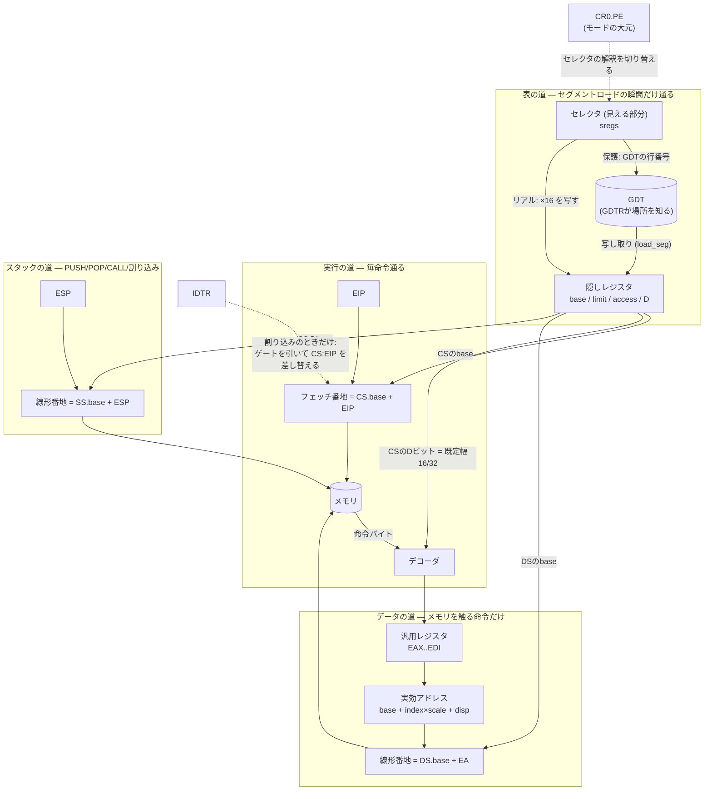
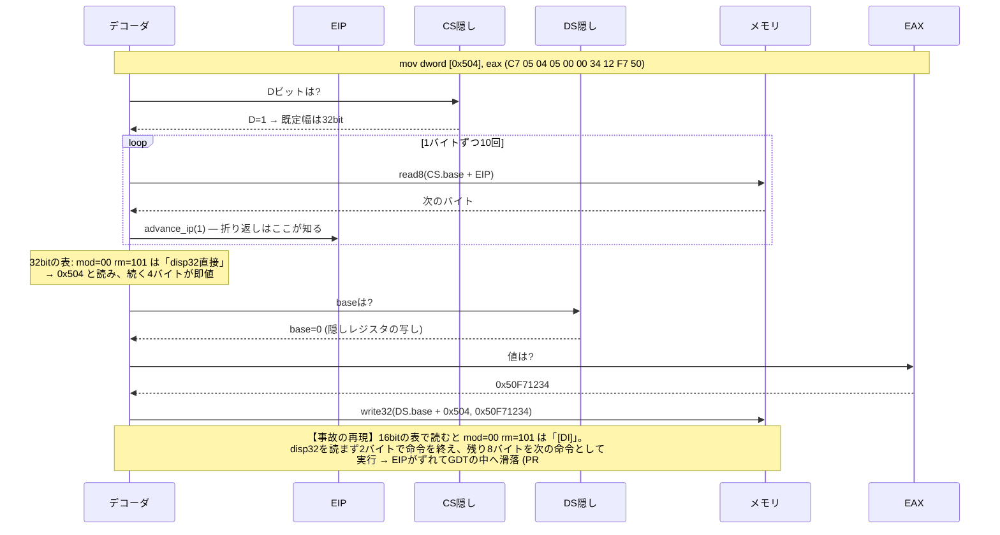

# レジスタ一覧 — いま何があり、何を意味し、何がまだ無いか

CPUの部品は8本の汎用レジスタから始まって、プロテクトモードに入った今、
**30個近い**になった。特権リングはさらに増やす。頭の中の在庫管理は
ここで限界なので、一覧を地図として置く。

書き方の約束: **「何を決めるレジスタか」を一行で言う**。ビットの網羅は
インテルのマニュアルの仕事で、ここは「なぜ存在するか」と「うちの実装が
どこまでか」だけを持つ。

## 設計の約束 (全レジスタ共通)

1. **幅は最初から広く持つ** — 汎用は初日から `u32`、EIPも `u32`。
   8086としては上位を使わないだけ ([ADR-0001](adr/0001-16bit-cpu-and-cosim.md))
2. **意味の分岐は持ち主を1箇所にする** — IPの折り返しは `ip_mask()`、
   セグメントのbaseは `seg_base()` だけが知っている
3. **新しい状態には覗き窓を同じPRで付ける** — デバッガ (CLI `info` /
   ブラウザのMode欄) に出ないレジスタを作らない

## 関係図 — レジスタは3本の道でメモリに繋がる

一覧の前に配線を見る。**すべてのレジスタは「メモリに触るための3本の道」の
どこかに居る**。そして隠しレジスタが3本全部に base を配っている —
これがセグメント機構の骨格である。



読みどころ:

- **表の道は細い** — GDTを通るのはセグメントロードの瞬間だけ。以後は写し
  (隠しレジスタ) しか見ない。だからGDTを書き換えても走行中のコードは気づかない
- **CR0.PE が変えるのは1箇所だけ** — セレクタの解釈 (×16か、行番号か)。
  他の配線は両モードで同じ。「リアルモードは保護モードの特殊ケース」の図示
- IDTRは平時は遊んでいて、割り込みの瞬間だけ CS:EIP を差し替えに来る

## 汎用レジスタ (`Cpu::regs: [u32; 8]`)

| 名前 | 由来 | 暗黙の役割 (命令が勝手に使う) |
|---|---|---|
| EAX | Accumulator | 乗除算・入出力・moffs転送の相手 |
| ECX | Counter | LOOP・REP・シフト回数 |
| EDX | Data | 乗除算の上位半分、IN/OUTのポート番号 |
| EBX | Base | XLATの表の基底 |
| ESP | Stack Pointer | PUSH/POPが動かす (**まだ16bit演算** — 下記) |
| EBP | Base Pointer | スタックフレームの基準。既定セグメントがSSになる |
| ESI / EDI | Source/Dest Index | ストリング命令の読み元/書き先 |

8bit (AL/AH…) と16bit (AX…) は同じ器の部分ビュー。`set_reg16` は上位16bitを
保存する — この設計のおかげで32bit化で配線替えが要らなかった。

**正直な注記**: `push32` は値を32bitで積むが、**SPの演算はまだ16bit**
(`reg16(SP)`)。スタックが64Kを越えるのはSSのBビット対応と同時にやる。

## EIP (`Cpu::ip: u32`)

次に実行する命令の場所。**16bitコードでは64Kで折り返す** — 幅を知るのは
`ip_mask()` / `set_ip()` / `advance_ip()` の3つだけ。フォールトは
**失敗した命令自身**を指してから配送される (再実行できる形)。

## EFLAGS (`Cpu::flags: u32`)

| ビット | 名 | 何を言うか | 実装 |
|---|---|---|---|
| 0 | CF | 桁あふれ (符号なし) | ✅ |
| 2 | PF | 下位8bitの偶数パリティ | ✅ |
| 4 | AF | BCD補正用の桁上がり | ✅ |
| 6 | ZF | 結果ゼロ | ✅ |
| 7 | SF | 結果の符号 | ✅ |
| 8 | TF | 1命令ごとにINT 1 (シングルステップの正体) | ✅ |
| 9 | IF | ハードウェア割り込みを受けるか | ✅ |
| 10 | DF | ストリング命令の向き | ✅ |
| 11 | OF | 桁あふれ (符号つき) | ✅ |
| 12-13 | IOPL | I/O命令を許す特権の深さ | ⬜ リングと同時 |
| 14 | NT | ネストしたタスク | ⬜ 使う予定なし |
| 18 | AC | アラインメント検査 (486〜) | **⬜ 意図して無い** |

ACを**restore時に必ず落とす** (`& 0x0FD5`) のには前科がある: POPFDがACを
素通ししたとき、FreeDOSは「ACが立つ→486だ」と誤認してCMOVを使い出した。
**フラグの1bitはCPUの世代の自己申告**でもある。

## セグメントレジスタ (`sregs: [u16; 6]` + `hidden: [SegHidden; 6]`)

1本が二層でできている。**これがプロテクトモードの正体**
([ADR-0006](adr/0006-hidden-segment-registers.md))。

| 層 | 中身 | いつ変わるか |
|---|---|---|
| 見える部分 (セレクタ) | リアル: 番地の材料 (×16) / 保護: **GDTの行番号 + 下位2bitがRPL** | MOV/POP/far転送 |
| 隠し部分 (base/limit/access/D) | 番地とアクセス可否の**実効値** | セグメントロード時にGDTから写す |

| 名 | 暗黙の役割 | 実装 |
|---|---|---|
| ES | ストリング命令の書き先 | ✅ |
| CS | コード。**Dビットが既定の命令幅を決め、下位2bitが将来CPLになる** | ✅ |
| SS | スタック。EBP/ESP経由のアクセスの既定 | ✅ |
| DS | データの既定 | ✅ |
| FS / GS | 386で追加の自由席 (LinuxはTLS/per-CPUに使う) | **⬜ 器だけ。定数もロード命令 (0F A0系) も未実装** |

## 記述子表レジスタ

| 名 | 何を指すか | 実装 |
|---|---|---|
| GDTR (`gdtr_base/limit`) | セグメント記述子の表 | ✅ LGDT |
| IDTR (`idtr_base/limit`) | 割り込みゲートの表 | ✅ LIDT |
| LDTR | プロセスごとの記述子表 | ⬜ LDTセレクタは即panic (正直に断る) |
| TR | **TSS** (タスク状態セグメント) の場所 | ⬜ **リングの前提** — 下記 |

## 制御レジスタ

| 名 | 何を決めるか | 実装 |
|---|---|---|
| CR0 | bit0 PE=保護モード / bit31 PG=ページング | ✅ PE + PG |
| CR2 | ページフォールトを起こした番地 | ✅ (観測用。#PF配送はまだ) |
| CR3 | ページテーブルの物理番地 | ✅ LGDT同様 MOV CR3 で積む |
| CR4 | 486以降の拡張スイッチ | ⬜ 予定なし (486機能を足すまで) |

## 特権リングが足すもの (次の作業の地図)

リングは「新しいレジスタ」より**既にあるビットの意味が目を覚ます**話が主:

| 部品 | 正体 | 状態 |
|---|---|---|
| **CPL** | 独立したレジスタではない。**いま走っているCSセレクタの下位2bit** | 材料は既にある |
| RPL / DPL | セレクタの下位2bit / 記述子のaccessバイト bit5-6 | **accessは隠しレジスタに写し済み** — チェックを書くだけ |
| **TR + TSS** | リング3→0の瞬間に**スタックを差し替える**ための SS0:ESP0 の置き場 | ⬜ 新規。これだけが本当に新しい部品 |
| IOPL | リング3にIN/OUTを許すか | ⬜ EFLAGSの寝ているビット |
| far call/retf の保護モード形 | ゲート経由の呼び出しとリング遷移 | ⬜ 16bit形のみ実装済み |

## アドレス変換の三段 (ページングが入って完成した)

保護モードのアドレスは3層になった。**変換の持ち主はそれぞれ1箇所**:

| 段 | 変換 | 持ち主 |
|---|---|---|
| 論理→線形 | セレクタ → 隠しレジスタの base を足す | `Cpu::lin()` |
| 線形→物理 | CR3のページテーブルを2段引く (PG off なら素通し) | `Machine::translate()` |
| 物理→RAM | RAMを超えたら折り返さず未マップ (0xFF) | `read_phys8()`、大きさは `MachineProfile` |

TLBは持たない。決定的なので毎回歩いても結果は同じで、速度が問題になるまで
足さない (「測ってから足す」)。A20ゲートは、保護モードでは線形アドレスが
そのまま20bitを越えて伸びるので、リアルモードの1MB折り返し (`lin` の中) 以外に
特別扱いは要らなくなった。

## 実装しないと決めているもの

- **DR0-7 (デバッグレジスタ)** — 実機がデバッガをCPUに焼き込んだもの。
  うちは決定性を持つエミュレータなので**外側のデバッガ** (巻き戻し・
  ウォッチポイント) の方が強い。ゲストOSが触りに来たら考える
- **x87 FPU** — 命令はno-opで受けている。ELKSもFreeDOSも要求しなかった。
  Linuxが要求した時点で判断する

## 1命令が何本のレジスタに触るか

配線図は「ありうる道」を全部描くので、**1本の命令が実際に歩く道**も
1つ置く。題材は抽象的なMOVではなく、IDT実装 (PR #26) で**実際にIPずれ
事故を起こした命令**にする — 正常系と事故が同じ図で語れるからである。



たった1本のメモリ書き込みが、CS隠し (幅の決定) → EIP (10回の歩進) →
DS隠し (baseの写し) → EAX → メモリ、と**5つの部品に触っている**。
そして最後の注記が要点で、デコーダが引く「表」が16bitと32bitで違うため、
幅を間違えた瞬間に**命令の切れ目そのものがずれる**。倒れた場所が
犯行現場ではなくなる仕組みが、この図の中にある。

## 覗き窓

全部デバッガで見られる (見られないレジスタは作らない):

```
$ cargo run --release --example dbg -- asm/pm_hello.bin
c 20000
info
  mode=protected  CR0=00000001  GDTR=00007c38+0017  IDTR=00000000+0000
    CS=0008 -> base=00000000 limit=ffffffff 32bit access=9a
```

ブラウザはツールバーの「デバッガ」→ Mode 欄。
